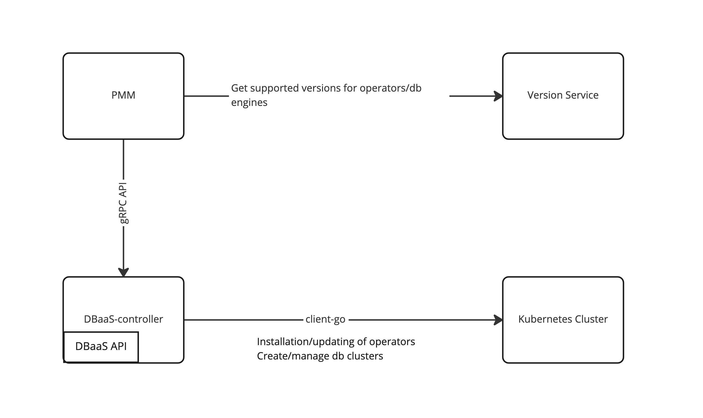
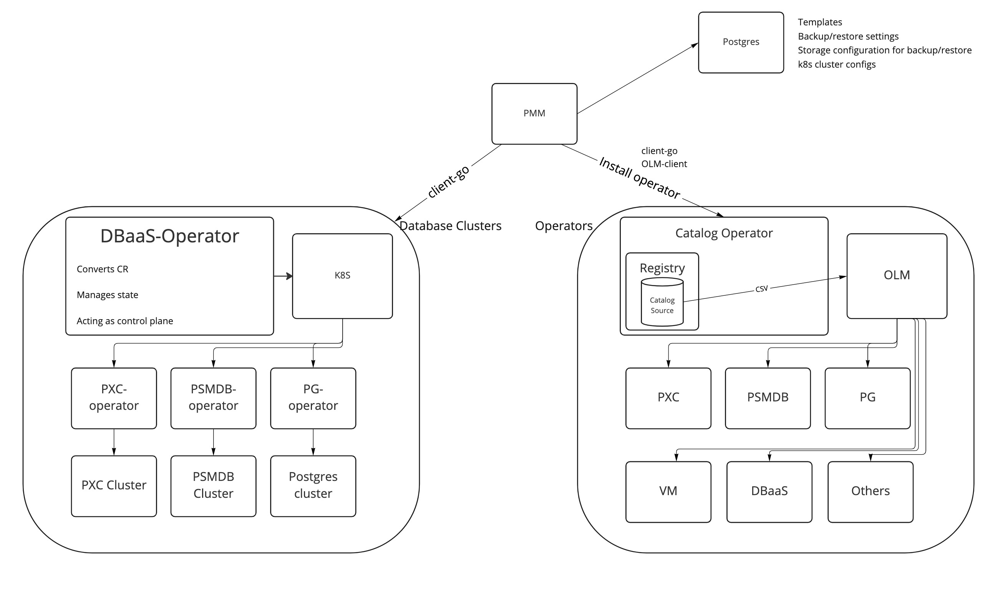
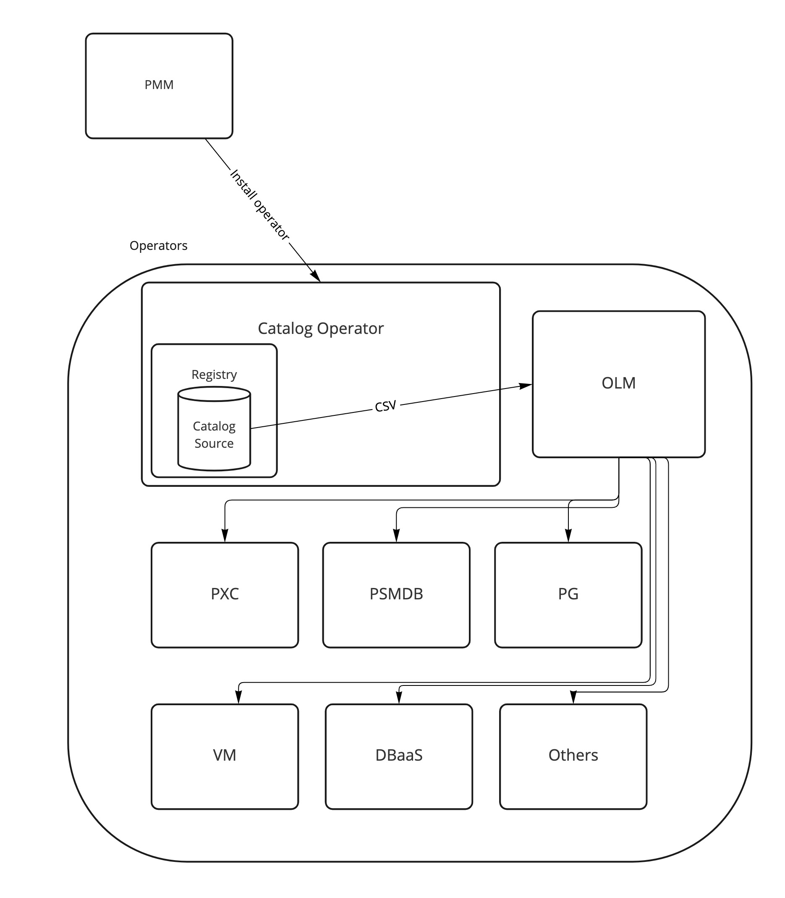
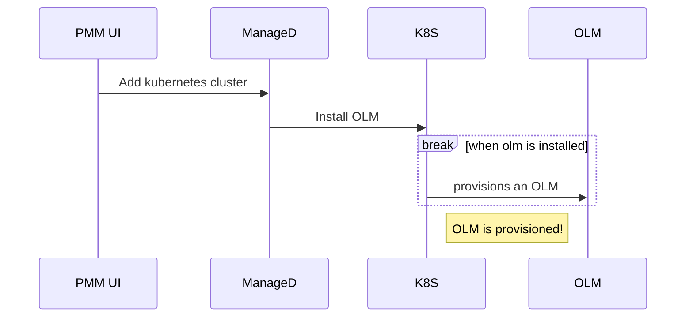
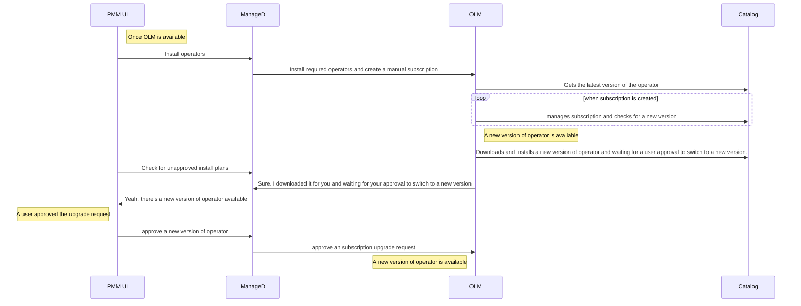
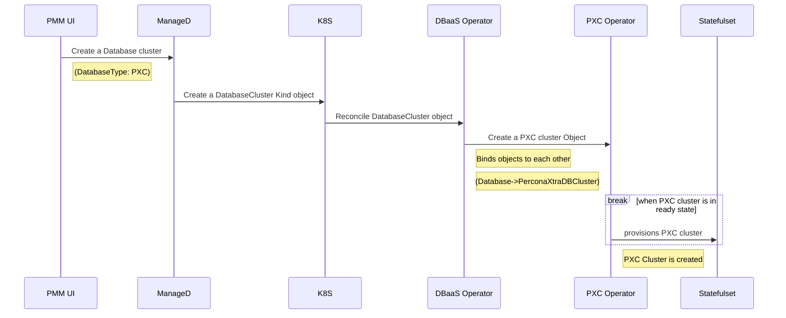
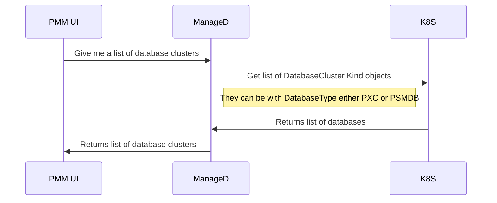

# Kubernetes-native implementation for PMM/DBaaS

## Summary

PMM DBaaS has a lot of functionality to install/manage operators and CRUD operations for either a Percona XtraDB or a Percona Server For MongoDB cluster. However, the current implementation is not extensible enough and lacks scalability features.

This proposal introduces architectural changes that are required to make DBaaS more extensible and more native for K8S.

## Motivation

The current architecture for DBaaS has the following components:

1. PMM that exposes REST API for UI and some automation
2. DBaaS controller that exposes gRPC API to PMM and works with Kubernetes clusters



As a proof of concept, this architecture covers everything. However, it has the following issues:

1. Non-native Kubernetes API to work with clusters. DBaaS controller has only gRPC API and this creates additional friction for community users to work with the controller. One needs to generate a gRPC client to communicate with the DBaaS controller. 
2. DBaaS controller has a set of CRUD endpoints for each database type (e.g. PXC and PSMDB). It adds additional room for bugs/inconsistencies and has the following issues:
    * There’s no simple and generic API for any database cluster
    * PMM needs to make two requests to get a list of created clusters (one for PSMDB and one for PXC clusters). In case we need to add support for another database, DBaaS controller would have an additional set of CRUD endpoints and PMM whould also call the list method for the new database type.

3. DBaaS controller suffers from insufficient test coverage and integration testing because of the reasons mentioned above. Yet we can create an integration testing framework and increase coverage, but in that case it’ll require a substantial effort.
4. Currently, DBaaS controller has only basic features such as CRUD operators for the database cluster and a lack of backup/restore features and additional configuration. There’s no way to specify additional parameters (Database configuration options, load balancer rules, storage class, backup schedule)
5. DBaaS logic is coupled with PMM release lifecycle. Using operator and OLM we can make DBaaS released independent from PMM release lifecycle. 
6. The current implementation requires to implement 5 endpoints to add a new database/operator support (Create, Update, List, Restart, Delete). However, following operator pattern a software engineer needs to implement reconcile logic. 
7. Listing database clusters on the current solution has performance issues. Firstly, it requires making one request per database cluster type to list them (e.g. `kubectl get pxc` to get PXC clusters and `kubectl get psmdb` to get PSMDB clusters. For any new database cluster it required to run an additional request against Kubernetes cluster). Secondly, it requires its own implementation of working with client-go caches. Using the operator provides cache integration out-of-the-box and having cr bound to underlying operator's CR (e.g. for PXC and PSMDB) will provide a one call to get all database clusters created. 

Moving to OLM and a DBaaS operator will improve this situation because of the following reasons

1. It'll be better for the Percona community because the operator pattern as well as OLM are widely spread industry standards. Using standard tools requires no additional learning, hence, better developer/user experience of using the product and contributing to it. From the implementation standpoint we do not need to implemnent custom CLI tools to manage DBaaS/Database clusters because it will be integrated with kubectl. 
2. It'll be easier to implement an independent release cycle by removing all hardcoded parameters from PMM and integrating it with dbaas-operator. The dbaas-operator knows about supported databases and it can return available databases engines via `kubectl get dbengines` command
3. DBaaS-operator can be easily added to any other service because it contains everything dbaas-specific such as database configuration templates, supported engines, database cluster sizes and other features. 
4. OLM provides a robust way to manage operator lifecycle (Install/Update/Delete operator, resolving conflicts, managind dependencies of one operator from another and so on). It's preinstalled 

## Goals

1. Make DBaaS Kubernetes native will make it a first-class citizen in the Kubernetes ecosystem. End users can use kubectl to work with PMM/DBaaS to edit/manage database clusters. 
2. Provide a simplified way to create templates for a database cluster creation with sane defaults.
3. Reduce the complexity of managing operator's installation/management. OLM will implement lifecycle management for operators and we can drop code that does the same for PMM.


## Non-goals

1. Bloat the size of PMM docker container
2. Overcomplicate the overall development process
3. Change REST API design. It'll be changed by providing an additional proposal 


## Proposal

The main idea is to move from the dbaas-controller that manages operators’ installation/updating its version database creation/management inside Kubernetes to a `dbaas-operator` and [OLM](https://olm.operatorframework.io/). The high-level architecture is described below.



In that case, the `dbaas-operator` provides Kubernetes native implementation of the creating/managing database clusters and acts like `unified operator to create any database cluster`. OLM installs and updates a version of the operators (psmdb, pxc, dbaas, victoria metrics).

### Working with the operators

An Operator catalog is a repository of metadata that Operator Lifecycle Manager (OLM) can query to discover and install Operators and their dependencies on a cluster. OLM always installs Operators from the latest version of a catalog. We can store Percona operators as well as Community operators inside Percona Catalog as shown below.


Catalog also gives us the benefits of using CatalogSource and ClusterServiceVersion. ClusterServiceVersion (CSV) can solve the issue by getting the current version of installed operators via OLM API. Currently, we rely on the API version of Percona Operators by requesting `api-versions` via `kubectl` and using the latest API version as an operator’s version. However, there'll be no way to get information about the version after the 1.13 release of PSMDB and the 1.12 release of PXC operator. In that case, we can request an operator image and split the version information from the tag, but in the case of the overridden image tag, we can have discrepancies between versions. With OLM we’ll have a single source of truth for the installed operator version. [Read more](https://olm.operatorframework.io/docs/concepts/crds/clusterserviceversion/)

Example for PXC operator (It's only 1.10 available on operatorhub, however it demonstrates the idea)

```bash
kubectl get csv -n my-percona-xtradb-cluster-operator
NAME                                      DISPLAY                                   VERSION   REPLACES                                 PHASE
percona-xtradb-cluster-operator.v1.10.0   Percona Distribution for MySQL Operator   1.10.0    percona-xtradb-cluster-operator.v1.9.0   Installing
```

In that case, PMM DBaaS will provide a consistent way to get operator version. In addition, OLM can manage a complex upgrades for operators via [InstallPlan](https://olm.operatorframework.io/docs/concepts/crds/installplan/), [OperatorGroup](https://olm.operatorframework.io/docs/concepts/crds/operatorgroup/) or [UpgradeGraph](https://olm.operatorframework.io/docs/glossary/#update-graph).

A high-level architecture diagram of OLM


High-level sequence diagram that illustrates registering of K8s cluster


High-level sequence diagram that illustrates an Installation and upgrading process inside PMM/DBaaS in terms of end user


This process makes version service usage for supported versions of operators obsolete because it gets the latest version of available operator from the catalog. However, the catalog can be managed by our team and we'll push only supported versions of operators to the catalog. This also will improve integration testing for unreleased versions of operators.

### Working with the databases

The second part of the proposal is implementing the generic and simplified API to create database clusters via k8s operator. The proposal discusses the drawbacks of the current implementation in the Motivation section and moving to the `dbaas-operator` will have the following benefits

1. Kubernetes native way to work with database clusters via unified and general specifications.
2. PMM DBaaS does not need to care about the state of a managed database.
3. PMM/DBaaS should manage clusters that were created via PMM/DBaaS. Yet, it manages clusters that were created via Percona operators now. `dbaas-operator` uses its own custom resources to specify database clusters managed by PMM/DBaaS. Also, it opens room for additional features such as CR templates to create a database cluster and update a version of a template using the same annotations spec.
4. Installation and upgrading of `dbaas-operator` will be managed by OLM as proposed above.
5. `dbaas-operator` opens a possibility to create an easy to use integration testing framework using codecept.js/playwright or even simple bash scripts. Integration testing can be covered by development team. It can use Github actions as a pipeline to run additional tests to check create/load/run queries against exposed/non-exposed database clusters.
6. PMM/DBaaS will have native integration with `dbaas-operator` via `client-go` package that will improve the overall performance on large-scale clusters

The sequential diagram illustrates a creation of PXC cluster



Listing DatabaseClusters



#### Communication speed benchmarks

Currently [dbaas-controller](https://github.com/percona/dbaas-controller) implements proxy api to k8s Percona operators thus `dbaas-controller` needs to call k8s and gets data from k8s operators. That could be expensive call to k8s as api returns full spec and in case of 100 or 1000 of server it could be quite large and time consuming response.

Also if there is no good connection to the k8s cluster situation would be much worse.

Here are some measurements made against PMM in different setups (local PMM -> Remote k8s, Remote PMM inside the same cluster, Direct API calls against K8S)

**Local PMM connected to LKE cluster 

```
➜  ~ time curl  -s -k -o file1.out --request POST --url http://localhost:81/v1/management/DBaaS/DBClusters/List --header 'accept: application/json' -u "admin:admin" --header 'content-type: application/json' --data '{
     "kubernetes_cluster_name": "lke84438"
}'
9.08s
➜  ~ time curl  -s -k -o file1.out --request POST --url http://localhost:81/v1/management/DBaaS/DBClusters/List --header 'accept: application/json' -u "admin:admin" --header 'content-type: application/json' --data '{
     "kubernetes_cluster_name": "lke84438"
}'
9.08s
➜  ~ time curl  -s -k -o file1.out --request POST --url http://localhost:81/v1/management/DBaaS/DBClusters/List --header 'accept: application/json' -u "admin:admin" --header 'content-type: application/json' --data '{
     "kubernetes_cluster_name": "lke84438"
}'
11.06s
➜  ~ time curl  -s -k -o file1.out --request POST --url http://localhost:81/v1/management/DBaaS/DBClusters/List --header 'accept: application/json' -u "admin:admin" --header 'content-type: application/json' --data '{
     "kubernetes_cluster_name": "lke84438"
}'
10.19s
➜  ~
➜  ~ time curl  -s -k -o file1.out --request POST --url http://localhost:81/v1/management/DBaaS/DBClusters/List --header 'accept: application/json' -u "admin:admin" --header 'content-type: application/json' --data '{
     "kubernetes_cluster_name": "lke84438"
}'
```

** Same as above but uses dbaas-operator and communicates via client-go library**

```

## Listing 10 clusters
➜  ~ time curl  -s -k -o file1.out --request POST --url http://localhost/v1/management/DBaaS/DBClusters/List --header 'accept: application/json' -u "admin:admin" --header 'content-type: application/json' --data '{
     "kubernetes_cluster_name": "lke84438"
}'
1.02s
➜  ~ time curl  -s -k -o file1.out --request POST --url http://localhost/v1/management/DBaaS/DBClusters/List --header 'accept: application/json' -u "admin:admin" --header 'content-type: application/json' --data '{
     "kubernetes_cluster_name": "lke84438"
}'
0.99s
➜  ~ time curl  -s -k -o file1.out --request POST --url http://localhost/v1/management/DBaaS/DBClusters/List --header 'accept: application/json' -u "admin:admin" --header 'content-type: application/json' --data '{
     "kubernetes_cluster_name": "lke84438"
}'
1.07s
➜  ~ time curl  -s -k -o file1.out --request POST --url http://localhost/v1/management/DBaaS/DBClusters/List --header 'accept: application/json' -u "admin:admin" --header 'content-type: application/json' --data '{
     "kubernetes_cluster_name": "lke84438"
}'
0.90s
➜  ~ time curl  -s -k -o file1.out --request POST --url http://localhost/v1/management/DBaaS/DBClusters/List --header 'accept: application/json' -u "admin:admin" --header 'content-type: application/json' --data '{
     "kubernetes_cluster_name": "lke84438"
}'
0.90s

```
The environment for the benchmark above uses the same testing environment

1. PMM
2. Remote kubernetes cluster
3. Communicates either via dbaas-controller (first two test runs) or via dbaas-operator (the last test run)

Note: Communication with dbaas-operator via client-go made without caches, however, using [client-go caches](https://pkg.go.dev/k8s.io/client-go/tools/cache) as well as [Limit and Continue](https://pkg.go.dev/k8s.io/apimachinery/pkg/apis/meta/v1#ListOptions) will improve performance for large scale deployments (more than 500 clusters created)


### User Stories

#### Story 1
As an SRE person, I should be able to register the Kubernetes cluster using a service account without admin access to the cluster.

#### Story 2
As an SRE person, I should be able to understand what’s going wrong during the bootstrapping DBaaS feature inside of PMM in case of insufficient permissions so that I can debug and solve my issues. (E.g. No permissions to run kube-state-metrics, pxc, or psmdb operator).

#### Story 3
As an SRE person, I should be able to rename a Kubernetes cluster once it was provisioned automatically so that I can keep my naming conventions.

#### Story 4
As an SRE person, I should be able to specify which database operators I need to install in the cluster.

#### Story 5
As an SRE person, I should be able to create logical spaces to deploy databases so that I can easily split my environments. (e.g. dev namespace goes to the dev environment and the staging namespace goes to the staging environment. For the production environment I should be able to register and setup an additional cluster.)

#### Story 6
As an SRE person, I should be able to create a resource template for a database engine so that I don’t need to manually provide it every time.

#### Story 7
As an SRE person, I should be able to create an engine configuration template for a database engine.

#### Story 8
As an SRE person, I should be able to manage database engine versions that are allowed to use because I need to control which versions are used in my environment.

#### Story 9
As an SRE person, I should be able to specify a backup schedule template for a database cluster.

#### Story 10
As an SRE person, I should be able to configure storage for backups.

#### Story 11
As a user, I should be able to deploy a database with the recommended defaults

#### Story 12
As a user, I should be able to deploy a database with the selected version or cluster size

#### Story 13
As a user, I should be able to select a resource template to deploy a database

#### Story 14
As a user, I should be able to select a resource template and database engine configuration template to deploy a database

#### Story 15
As a user, I should be able to edit a database cluster (If I have sufficient permissions)

#### Story 16
As a user, I should be able to delete a database cluster (If I have sufficient permissions)

#### Story 17
As a user, I should be able to create a database cluster from a provided backup file.

#### Story 18
As a DBA, I should be able to edit database configuration parameters.

#### Story 19
As a DBA(?), I should be able to view cluster resources available before creating a database.

## Design Details

### Air gapped environments
The design does not support air gapped environments because of internet connectivity dependency.

### OLM installation
PMM always installs the latest version of OLM using the following process:

1. Get the latest release from Github
2. Download crds.yaml and olm.yaml
3. Apply crds.yaml and olm.yaml against Kubernetes cluster

### Installation of dbaas-catalog

PMM uses [Percona DBaaS catalog](https://github.com/percona/dbaas-catalog/blob/main/docs/design/Percona-DBaaS-Platform-design.md). Percona DBaaS catalog is a repository of metadata that Operator Lifecycle Manager (OLM) can query to discover and install Operators and their dependencies on a cluster. OLM always installs Operators from the latest version of a catalog. It installs the following operators from this catalog:

1. Percona XtraDB Cluster Operator
2. Percona Server MongoDB Operator
3. Victoria Metrics Operator
4. DBaaS operator

Any additional operators should be added to the catalog. Installation of an operator has the following steps:

1. PMM should have DBaaS operator installed
2. PMM creates [Operator Group](https://docs.openshift.com/container-platform/4.8/operators/understanding/olm/olm-understanding-operatorgroups.html) if it does not exist
3. PMM creates [subscription](https://olm.operatorframework.io/docs/concepts/olm-architecture/) for the selected operator

**Using OLM with pre-installed operators**

1. PMM gets versions of installed operators
2. PMM creates subscription with specified versions
3. OLM installs [specific version](https://olm.operatorframework.io/docs/tasks/install-operator-with-olm/#example-install-a-specific-version-of-an-operator)
4. Operator restarts and continues to work normally but now OLM manages installation of new versions


### CR design for dbaas-operator 

Go struct that represents the payload to create/list database clusters
```go
const (
        PXCEngine   EngineType = "pxc"
        PSMDBEngine EngineType = "psmdb"

        LoadBalancerMongos   LoadBalancerType = "mongos"
        LoadBalancerHAProxy  LoadBalancerType = "haproxy"
        LoadBalancerProxySQL LoadBalancerType = "proxysql"
)
type (
        // EngineType stands for the supported database engines. Right now it's only pxc
        // and psmdb. However, it can be ps, pg and any other source
        EngineType string
        // LoadBalancerType contains supported loadbalancers. It can be proxysql or haproxy
        // for PXC clusters and mongos for PSMDB clusters.
        //
        // Once PG support will be added, it can be pg-bouncer or something else.
        LoadBalancerType  string
        // DatabaseSpec defines the desired state of Database
        DatabaseSpec struct {
                // Database type stands for supported databases by the PMM API
                // Now it's pxc or psmdb types but we can extend it
                Database EngineType `json:"databaseType"`
                // DatabaseVersion sets from version service and uses the recommended version
                // by default
                DatabaseImage string `json:"databaseImage"`
                // DatabaseConfig contains a config settings for the specified database
                DatabaseConfig string `json:"databaseConfig"`
                SecretsName    string `json:"secretsName,omitempty"`
                Pause          bool   `json:"pause,omitempty"`
                // ClusterSize is amount of nodes that required for the cluster.
                // A database starts in cluster mode if clusterSize >= 3.
                ClusterSize int32 `json:"clusterSize"`
                // LoadBalancer contains a load balancer settings. For PXC it's haproxy
                // or proxysql. For PSMDB it's mongos.
                LoadBalancer LoadBalancerSpec `json:"loadBalancer,omitempty"`
                Monitoring   MonitoringSpec   `json:"monitoring,omitempty"`
                DBInstance   DBInstanceSpec   `json:"dbInstance"`
                Backup       BackupSpec       `json:"backup,omitempty"`
        }
        // LoadBalancer contains a load balancer settings. For PXC it's haproxy
        // or proxysql. For PSMDB it's mongos.
        LoadBalancerSpec struct {
                Type                     LoadBalancerType                        `json:"type,omitempty"`
                ExposeType               corev1.ServiceType                      `json:"exposeType,omitempty"`
                Image                    string                                  `json:"image,omitempty"`
                Size                     int32                                   `json:"size,omitempty"`
                Configuration            string                                  `json:"configuration,omitempty"`
		LoadBalancerSourceRanges []string                                `json:"loadBalancerSourceRanges,omitempty"`
                Annotations              map[string]string                       `json:"annotations,omitempty"`
                TrafficPolicy            corev1.ServiceExternalTrafficPolicyType `json:"trafficPolicy,omitempty"`
                Resources                corev1.ResourceRequirements             `json:"resources,omitempty"`
        }
        MonitoringSpec struct {
                PMM                      *PMMSpec                    `json:"pmm,omitempty"`
                ImagePullPolicy          corev1.PullPolicy           `json:"imagePullPolicy,omitempty"`
                Resources                corev1.ResourceRequirements `json:"resources,omitempty"`
                RuntimeClassName         *string                     `json:"runtimeClassName,omitempty"`
                ContainerSecurityContext *corev1.SecurityContext     `json:"containerSecurityContext,omitempty"`
        }
        PMMSpec struct {
                Image         string `json:"image,omitempty"`
                ServerHost    string `json:"serverHost,omitempty"`
                ServerUser    string `json:"serverUser,omitempty"`
                PublicAddress string `json:"publicAddress,omitempty"`
                Login         string `json:"login,omitempty"`
                Password      string `json:"password,omitempty"`
        }
        DBInstanceSpec struct {
                CPU              string  `json:"cpu,omitempty"`
                Memory           string  `json:"memory,omitempty"`
                DiskSize         string  `json:"diskSize,omitempty"`
                StorageClassName *string `json:"storageClassName,omitempty"`
        }
```
Since, the main focus for the PMM/DBaaS is to support AWS EKS clusters. The main focus is supporting managed kubernetes clusters as a main provider. However, the requirements can be changed and PMM/DBaaS may support bare-metal or EC2 setups. That adds additional constraints on the architecture. Everything related to the current implementation of k8s provider is located under `managed/services/dbaas` folder. However, it would be great to have `managed/services/dbaas/provider.go` file with the following interface

```go
// Provider is the interface that a developer should implement to add support of any other provider that required for DBaaS.
// Currently, PMM supports only K8s/EKS provider but bare-metal setup or using EC2 instances support can be adopted by implementing this inteface
type Provider interface {
  // ProvisionCluster provisions a specified cluster. In this case, it'll install
  // all required operators that we need (pxc, psmdb, dbaas-operator and victoria metrics
  // operator via OLM
  ProvisionCluster() error
  // CleanupCluster cleans up cluster and removes VMAgent operator
  // and, or, dbaas-operator, pxc operator and psmdb operator via --force tag.
  // At the moment PMM should remove VMAgent operator only and keep everything that related to databases
  // untouched and the end user can decide what to clean
  CleanupCluster() error
  // CreateDatabase cluster creates a cluster by using Database struct
  // and it'll make a request to dbaas-operator to create a database
  CreateDatabase(Database) error
  // EditDatabase edit's deployed database CR specs by using Database struct
  EditDatabase(Database) error
  // UpgradeDatabase upgrades database to a desired version
  UpgradeDatabase(Database) error
  // DestroyDatabase destroys a database from the cluster
  DestroyDatabase(Database) error
  // UpdateClusterDependencies upgrades cluster dependencies. For k8s it upgrades dbaas and database operators versions and CR configuration
  UpdateClusterDependencies() error
}
```
Every additional provider should implement this interface. Kubernetes related implementations

#### Further steps with OLM and dbaas-operator

Since PMM used OLM to install/update operators, PMM can get the information about supported database engines from dbaas-operator. That will help us to make releases of PMM/DBaaS independent from PMM release cycle. As an additional feature, SRE or Admin can select database engines she wants to use and PMM will provision it accordingly


### Templates

There are number of possible template use cases:
- as a DBA I would like to template Cluster and DB parameters for number of different environments
- as a SRE I would like to template k8s and cloud infrastructural parameters

When DBA would like to have more control over DBs and DB Clusters (versions, sizing, backups, configs, parameters), SRE would like to control over Kubernetes and Cloud infrastructure (networking, storage, secrets) and how that infrastructure connected to applications (affinity, networking, rbac).

Percona Kubernetes operators have CRs that include both parts of those requirements:
- configs, sizing, backup parameters, cluster parameters (sharding, replsets)
- toleration, affinity, annotations, storage classes, networking

All those template requirements are subset of Kubernetes CR objects that are supported by operators and kubernetes addons (such as special annotations).

To define similar properties for different environments, clusters, namespaces - templates could also have different visibility:
- namespace
- environment
- cluster
- set of clusters

And that visibility would probably define where those will be stored:
- template for a namespace (prod/staging namespaces): as object in a namespace
- environment templates: template with environment labels to select from
- cluster wide templates: as object in a cluster for all namespaces
- global templates: in a external storage in CI/CD, or in PMM as app that manages many clusters

#### DatabaseCluster templates

`dbaas-operator` would provide simplifier interface to abstract internal mechanics of kubernetes and different clouds, so templates for it's interface are probably more related to Developer's and DBA's use case. And that makes `dbaas-operator` a more simpler interface that is just a subset of bigger CR template.

As these kind of templates are more higher level, they would take priority over more low level templates and could be defined later when more business logic on operating templates would be defined.


Proposal on a current stage is to propagate low level templates (Database Engine defined by SRE/DBA in a cluster) to a higher level for the know fields. When middle level and high level templates (DBA, Dev) business logic would be better known, it will just a simple layer on top low level template and be presented to the user instead.


#### Database Engine Templates

These templates provide possibility to template full Database operator CR even for the fields that `dbaas-operator` don't really care or even don't know (annotations, parameters for the future CSI drivers and etc).

1. SRE/DBA creates DB templates (through UI/API/YAML) and they are stored in the Kubernetes cluster.
2. UI requests [PMM API](proposal.md#pmm-rest-api-high-level-design) `GET /dbaas/templates`
3. PMM gets templates from k8s cluster
4. User chooses template in UI.
5. UI parses and present fields from template that are recognized
6. User creates database with or without modifications to the values from template
7. UI call PMM with results of user choices `POST /dbaas/dbclusters`

Priority:
  1. changes from PMM UI configured by user
  2. chosen template
  3. defaults from `dbaas-operator`

`dbaas-operator` merges all those 3 sources according to priority and produces CR (custom resource) for specific engine.

Corner cases:
- user uses PMM UI and there are no default template (or none selected)
  - PMM uses old scheme with version service and some default values
- user uses k8s directly without PMM and there neither default templates and submits nor optional fields
  - `dbaas-operator` uses default CR that comes from alm-examples of CSV

There are might be couple of ways for `dbaas-operator` to know about templates.

Also this use case defaults to namespace and cluster visibility. So if there would be a need to have similar template for different clusters/namespaces - SRE need to copy them over to the another cluster/namespace and apply there (or use automation for it).

**New parameter in API**
```go
          // Optional unique template name for specified EngineType
	  TemplateName string `json:"templateName,omitempty"`
```
`dbass-operator` receives `TemplateName` parameters and get template from k8s by combining engine type and template name. Or would implement additional controller for templates and track them.

That is a possible way is to extend `dbaas-operator` with template functionality. But there are too many questions open:
- what type to choose (string, unstructured)
- how to validate that parameters in template are correct
- how to track template versioning if it will be a controller
- how to extend templates when adding new Database operators

So instead of committing to the API, annotations could solve the problem for now.

**Annotations**

It could be a good solution to not blow up API and keep it simple by making that convention with annotations and later decide to keep it or to switch to something else. Annotations are more flexible and are conventions instead of hard contract, thus we could avoid migrations/mutations later.

Annotations that PMM or user could set for `dbaas-operator` that related to the templates:
- `dbaas.percona.com/dbtemplate-kind: PSMDBtemplate`: is CustomResource (CR) Kind that implements template
- `dbaas.percona.com/dbtemplate-name: prod-app-X-small`: `metadata.name` identifier for CR that provides template
- `dbaas.percona.com/origin: pmm`: who created CR for `database-operator`: pmm, user, sre, dba, ci

If one of those 2 parameters (kind, name) are not set - `dbaas-operator` wouldn't be able to identify template and thus would ignore another one.

Annotations that are set by `dbaas-operator` for any engine to provide additional information about inputs for template:
- all annotations from the template should be propagated to CR of the DB Cluster CR.
- `dbaas.percona.com/dbtemplate-kind: PSMDBtemplate`
- `dbaas.percona.com/dbtemplate-name: prod-app-X-small`
- `dbaas.percona.com/origin: pmm`
- `dbaas.percona.com/dbtemplate-default: yes`: default CR was created without origin and parameters

**Labels**

All the labels of the DB Template should be propagated to the DB Cluster CR.

**Database Engine Templates implementation**

On a first phase to simplify template creation it might be better to restrict templates to simple k8s custom objects without operator that handles them. Architecture for interacting and layering for some additional operators is not yet defined.

To simplify implementation of `dbaas-operator` it is better to build templates with exactly the same definitions as the corresponding CR of DB Cluster instances. So `dbaas-operator` would just blindly merge template with user input without validating and knowing details of template implementation. Thus templates should have exactly same CRD as CRD for DB clusters. CRD for templates are needed to avoid errors as templates would be validated by k8s.

Here are CRDs for DB Clusters:
- PSMDBtemplate: [psmdbtpl.dbaas.percona.com.crd.yaml](psmdbtpl.dbaas.percona.com.crd.yaml)
- PXCtemplate: [pxctpl.dbaas.percona.com.crd.yaml](pxctpl.dbaas.percona.com.crd.yaml)

Example of CRs for templates:
- [psmdbtpl.dbaas.percona.com.cr.yaml](psmdbtpl.dbaas.percona.com.crd.yaml)
- [pxctpl.dbaas.percona.com.cr.yaml](pxctpl.dbaas.percona.com.crd.yaml)

CRs should have these annotations:
- `dbaas.percona.com/dbtemplate-origin: sre`: who created template: sre, dba and etc
- TBD

CRs should have these labels:
- `IsDefaultTpl: "yes"`: yes, or no
- `dbaas.percona.com/engine: psmdb`: engine type
- `dbaas.percona.com/template: "yes"`: indicates that this is a template
- TBD

There could be more labels to identify env, teams and defaults for teams. That logic could be defined later and probably defined in a separate document with versions of apps that could understand such convention.

Here is example of 2 templates creation:
```sh
minikube start

kubectl apply -f pxctmpl.dbaas.percona.com.crd.yaml
customresourcedefinition.apiextensions.k8s.io/pxctemplates.dbaas.percona.com created

kubectl apply -f psmdbtpl.dbaas.percona.com.crd.yaml
customresourcedefinition.apiextensions.k8s.io/psmdbtemplates.dbaas.percona.com created

kubectl apply -f pxctpl.dbaas.percona.com.cr.yaml
pxctemplate.dbaas.percona.com/prod-app-n-large created

kubectl apply -f psmdbtpl.dbaas.percona.com.cr.yaml
psmdbtemplate.dbaas.percona.com/dev-app-x created

kubectl get psmdbtpl,pxctpl
NAME                                        ENDPOINT   STATUS   AGE
psmdbtemplate.dbaas.percona.com/dev-app-x                       31s

NAME                                             ENDPOINT   STATUS   PXC   PROXYSQL   HAPROXY   AGE
pxctemplate.dbaas.percona.com/prod-app-n-large

```

PMM could get templates by selecting specific dbaas resources:
```sh
kubectl api-resources --api-group=dbaas.percona.com
NAME             SHORTNAMES   APIVERSION                   NAMESPACED   KIND
psmdbtemplates   psmdbtpl     dbaas.percona.com/v1alpha1   true         PSMDBtemplate
pxctemplates     pxctpl       dbaas.percona.com/v1alpha1   true         PXCtemplate

kubectl api-resources --api-group=dbaas.percona.com --verbs=list --namespaced -o name | xargs -n 1 kubectl get -l 'dbaas.percona.com/engine in (psmdb,pxc)',dbaas.percona.com/template="yes"
NAME        ENDPOINT   STATUS   AGE
dev-app-x                       7s
NAME               ENDPOINT   STATUS   PXC   PROXYSQL   HAPROXY   AGE
prod-app-n-large                                                  5m24s
```

### Test Plan

During moving from dbaas-controller to `dbaas-operator` we'll keep the same user experience for the end user

#### Prerequisite testing updates

1. Setup Github actions pipelines for dbaas-operator
2. Setup Github actions pipelines for dbaas-catalog

#### Unit tests

1. Add unit tests for PMM integration with dbaas-operator
2. Add unit tests for PMM CR generation
3. Add unit tests for PMM k8s client

#### Integration tests

1. Use current PMM integration tests for DBaaS during the migration to understand what goes wrong
2. Add additional tests for OLM integration


#### e2e tests

1. Add e2e tests for dbaas-operator to test create/upgrade/update/scale database cluster
2. Add e2e tests to ensure dbaas-operator works well with only one installed operator


