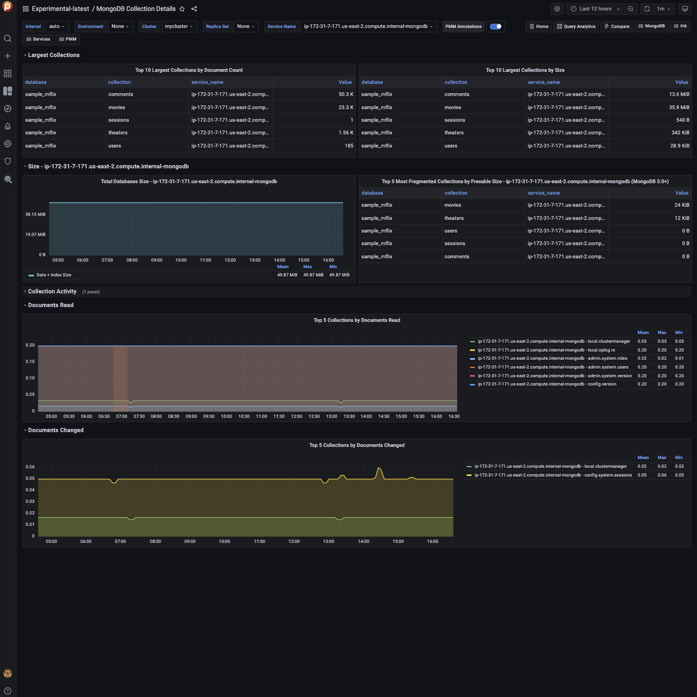

# Experimental MongoDB Collection Details

!!! caution alert alert-warning "Disclaimer"
    This is an Experimental Dashboard that is not part of the official Percona Monitoring and Management (PMM) deployment and might be updated. We ship this Dashboard to obtain feedback from our users.

This realtime experimental dashboard provides detailed information about the top collections by document count, size, and document read for MongoDB databases.

