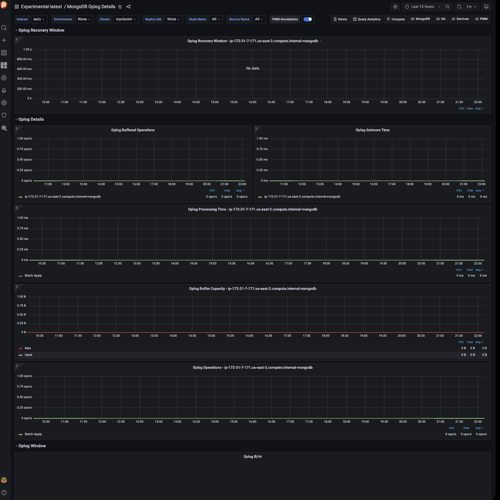

# Experimental MongoDB Oplog Details

!!! caution alert alert-warning "Disclaimer"
    This is an Experimental Dashboard that is not part of the official Percona Monitoring and Management (PMM) deployment and might be updated. We ship this Dashboard to obtain feedback from our users.

This realtime dashboard contains Oplog details such as Recovery Window, Processing Time, Buffer Capacity, and Oplog Operations.

