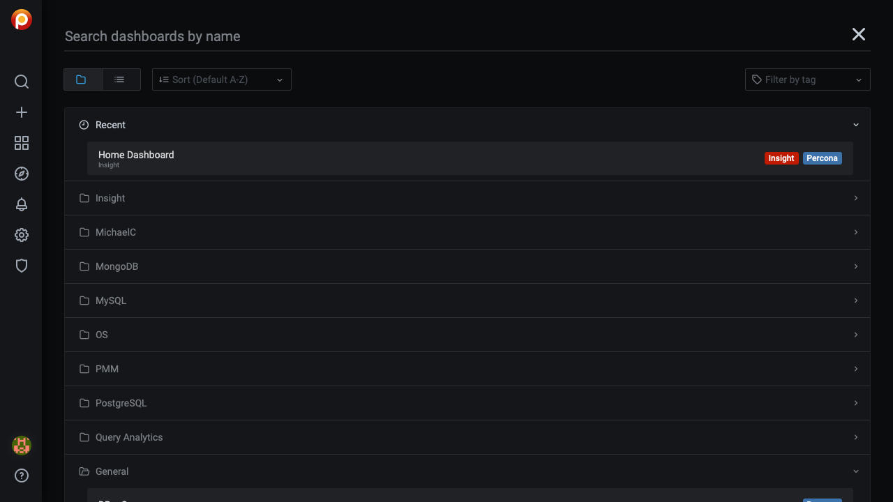
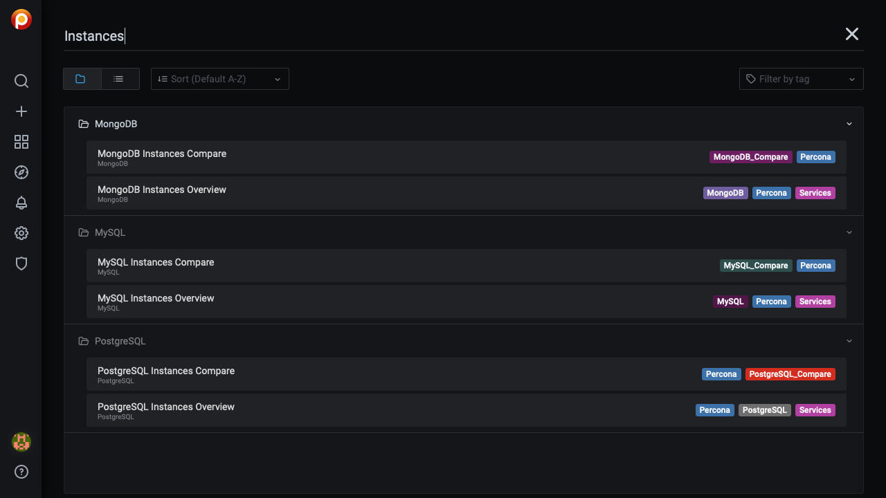

# Navigation

## Search for a dashboard by name

There are two ways to open the dashboard search page. (Each takes you to the same search screen.)

- Click the <i class="uil uil-search"></i> icon in the main menu.

- Click the dashboard name in the navigation bar (top row, to the right of the <i class="uil uil-apps"></i> icon). (To search within the current folder, click the folder name instead of the dashboard name.)

      

1. Click _Search dashboards by name_ and begin typing any part of the dashboard name (in this example, "_Instances_").

      

2. Click one of the search results to go to that dashboard. Change the search text to refine the list.

3. To abandon the search, click the <i class="uil uil-times"></i> icon at the end of the search bar.

## Open a dashboard with the menu

In the [main menu](../../reference/ui/ui_components.md#main-menu), the {{icon.dashboards}} _PMM Dashboards_ icon reveals a submenu containing links to all PMM dashboards grouped by service type. (This menu will replace the [shortcut menu](../../reference/ui/ui_components.md#shortcut-menu) which has links to commonly-used dashboards.)

