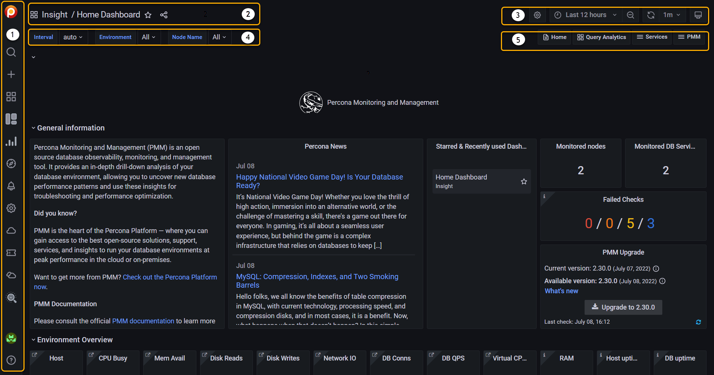

# UI components

!!! note alert alert-light "Key"
    1. [Main menu](#main-menu) (also *Grafana menu*, *side menu*)
    2. [Navigation bar](#navigation-bar)
    3. [View controls](#view-controls)
    4. [View selectors](#view-selectors) (dynamic contents)
    5. [Shortcut menu](#shortcut-menu) (dynamic contents)

## Main menu

The main menu is part of the Grafana framework and is visible on every page.

| Item (Top)                         | Name                 | Description
|:----------------------------------:|----------------------|-------------------------------
| {{icon.percona}}                   | Home                 | Link to home dashboard.
| <i class="uil uil-search"></i>     | Search               | Search dashboards by name.
| <i class="uil uil-star"></i>       | Starred              | Mark your favorite dashboards.
| <i class="uil uil-apps"></i>       | Dashboards           | Create dashboards or [folders][Folders], manage dashboards, import dashboards, create playlists, manage snapshots.
|       | Operating System (OS)    | Operating System dashboard
|     | MySQL      | MySQL dashboard
|     | MongoDB      | MongoDB dashboard
|     | PostgreSQL     | PostgreSQL dashboard
|     | ProxySQL     | ProxySQL dashboard
|     | HAproxy     | HAproxy dashboard
| | Query Analytics (QAN) | Query Analytics
| <i class="uil uil-compass"></i>    | Explore              | Run queries with [PromQL].
| <i class="uil uil-bell"></i>       | Percona Alerting             | [Alerting](../../alert/index.md), Create new alerts and manage your alert rules and alert templates.
| <i class="uil uil-cog"></i>        | Configuration        |
|        | Entitlements        |This tab is displayed after connecting PMM to Percona Portal, and shows all your Percona Platform account information. 
|        | Support Tickets        | Shows the list of tickets opened across your organization. This tab is only available after you connect PMM to Percona Platform.
|        | Environment Overview        | This tab is displayed after connecting PMM to Percona Portal. Shows the name and email of the Customer Success Manager assigned to your organization, who can help with any PMM queries. This tab will soon be populated with more useful information about your PMM environment. 
| <i class="uil uil-shield"></i>     | Server Admin         |
| <i class="uil uil-history"></i>    | Backup Management    | [Backup management and storage location configuration][BACKUP].
| {{icon.checks}}                    | PMM Advisor Checks  | Run health assessment checks against your connected databases and check any failed checks. 
| <i class="uil uil-database"></i>   | DBaaS                |

!!! hint alert alert-success "Tip"
    The DBaaS icon appears only if a server feature flag has been set.

    The Backup Management icon appears when *Backup Management* is activated in <i class="uil uil-cog"></i> *Configuration* → <i class="uil uil-setting"></i> *Settings* → *Advanced Settings*.

| Icon (Bottom)                            | Description |
|:----------------------------------------:|-------------|
| (Profile icon)                           | User menu   |
| <i class="uil uil-question-circle"></i>  | Help        |

## Navigation bar

| Item (left)                       | Description
|-----------------------------------|-------------------------
| <i class="uil uil-apps"></i>      | (Display only.)
| (Name) /                          | (Optional) Folder name.
| (Name)                            | Dashboard name.
| <i class="uil uil-star"></i>      | Mark as favorite.
| <i class="uil uil-share-alt"></i> | Share dashboard.

## View controls

| Item (right)                                    | Description
|-------------------------------------------------| --------------------
| <i class="uil uil-cog"></i>                     | Dashboard settings.
| <i class="uil uil-monitor"></i>                 | Cycle view mode.
| <i class="uil uil-clock-nine"></i> (time range) | Time range selector.
| <i class="uil uil-search-minus"></i>            | Time range zoom out.
| <i class="uil uil-sync"></i>                    | Refresh dashboard.
| (Time interval)                                 | Refresh period.

## View selectors

This menu bar is context-sensitive; it changes according to the page you are on. (With wide menus on small screens, items may wrap to the next row.)

| Item                          | Description
|-------------------------------|-------------------------------------------
| Interval                      | Data interval.
| Region                        | Filter by region.
| Environment                   | Filter by environment.
| Cluster                       | Filter by cluster.
| Replication Set               | Filter by replication set.
| Node Name                     | Filter by node name.
| Service Name                  | Filter by service name.
| PMM Annotations               | View [annotations](dashboards-panels/annotate/annotate.md).

## Shortcut menu

This menu contains shortcuts to other dashboards. The list changes according to the page you're on.

!!! note alert alert-primary ""
    This menu will be removed in future releases. Its function will be replaced by the {{icon.dashboards}} *PMM Dashboards* main menu entry.

| Item                                         | Description
|----------------------------------------------| ------------------------------
| <i class="uil uil-file-alt"></i> Home        | Home dashboard.
| <i class="uil uil-apps"></i> Query Analytics | Query Analytics.
| <i class="uil uil-bolt"></i> Compare         | Nodes compare.
| (Service Type)                               | Service type menu (see [Services menu](#services-menu)).
| <i class="uil uil-bars"></i> HA              | HA dashboards.
| <i class="uil uil-bars"></i> Services        | Services menu.
| <i class="uil uil-bars"></i> PMM             | PMM menu.

!!! hint alert alert-success "Tip"
    The *Compare* menu links to the Instances Overview dashboard for the current service type.

### Services menu

The **Services** menu choice determines the Service Type menu.

| Menu      | Item                           | Service type menu                       | Description
|-----------|--------------------------------|-----------------------------------------|-----------------------
| Services  |                                |                                         |
|           | MongoDB Instances Overview     | <i class="uil uil-bars"></i> MongoDB    | MongoDB dashboards.
|           | MySQL Instances Overview       | <i class="uil uil-bars"></i> MySQL      | MySQL dashboards.
|           | Nodes Overview                 | <i class="uil uil-bars"></i> OS         | OS dashboards.
|           | PostgreSQL Instances Overview  | <i class="uil uil-bars"></i> PostgreSQL | PostgreSQL dashboards.

!!! tip "Tip"
    - You can easily access all dashboards for monitored services from the **Main menu** via **Other Dashboards** in the **Services** sub menu.
    - Only the services being monitored by PMM will appear on the main menu.

### PMM menu

This item lists shortcuts to utility pages.

| Menu | Item
|------|---------------------
| PMM  |
|      | PMM Add Instance
|      | PMM Database Checks
|      | PMM Inventory
|      | PMM Settings

[Folders]: https://grafana.com/docs/grafana/latest/dashboards/dashboard_folders/
[PromQL]: https://grafana.com/blog/2020/02/04/introduction-to-promql-the-prometheus-query-language/
[BACKUP]: ../../backup/index.md
