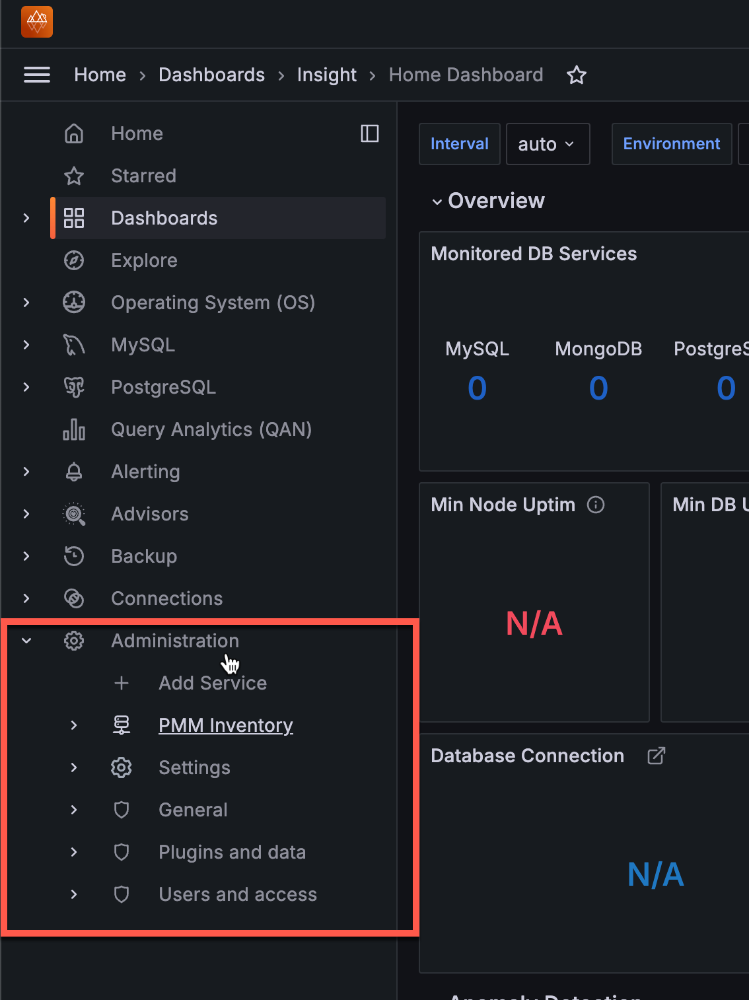

# Percona Monitoring and Management 3.0.0 Alpha

| **Release date** | April 30th, 2024                                                                                   |
| ----------------- | ----------------------------------------------------------------------------------------------- |
| **Installation** | [Installing Percona Monitoring and Management](https://www.percona.com/software/pmm/quickstart) |

Percona Monitoring and Management (PMM) is an open source database monitoring, management, and observability solution for MySQL, PostgreSQL, and MongoDB.

It enables you to observe the health of your database systems, explore new patterns in their behavior, troubleshoot them and execute database management operations—regardless of whether your databases are located on-premises or in the cloud.

## Release highlights

PMM version 3.x marks a new milestone for PMM, now built on a more secure foundation, with an enhanced user experience and easier deployment across a broader range of environments.

## Improved security

### Enhanced API authentication with Grafana service accounts

With the release of PMM 3.x, we've made a significant enhancement to the way API authentication is handled. PMM no longer relies on API keys as the primary method for controlling access to the PMM Server components and resources. Instead, PMM now leverages Grafana service accounts, which provide a more secure and manageable authentication mechanism compared to API keys.

The transition to service accounts brings the following advantages:

- Fine-grained access control, ensuring that each account gets access only to the necessary resources.
- Logging of all actions performed, providing better visibility and auditing.

When you install PMM 3.x, any existing API keys will be seamlessly converted to service accounts with corresponding service tokens. For more information about using service accounts in PMM, see [Service account authentication](../api/authentication.md).

### More options for deploying PMM rootless

In addition to Podman, PMM Server can also now be deployed rootless with Helm, Docker, Virtual Appliance, or Amazon AWS.

This setup prioritizes security by eliminating the need for root privileges to create, run, and manage containers. Running PMM Server as a non-root user means that you never have to give a user root permission on the host. This adds an extra layer of security, essential for protecting against potential security breaches.

For detailed instructions on deploying rootless PMM, check the [Setting up PMM Server](https://docs.percona.com/percona-monitoring-and-management/setting-up/index.html#set-up-pmm-server) topic.

### Enhanced PMM deployment on AMI and OVF environments

PMM is now deployed inside containers within AMI and OVF instances. These containers are managed via Podman and operate in rootless mode, which means they do not require root privileges to run. 

This approach significantly increases security and ensures a consistent and unified experience across different deployment types.

### More stable and quicker upgrades

 PMM 3, we're enhancing the stability and speed of the upgrade process by transitioning from RPM updates to exclusive container updates. This streamlined method resolves upgrade glitches, ensures smoother experiences for Docker, Podman, and OVF/AMI setups, and improves our testing workflows.

At the same time, we're maintaining the UI upgrade option by integrating [Watchtower](https://containrrr.dev/watchtower/), an external upgrading tool. When you click the **Upgrade Now** button on the Home Dashboard, Watchtower seamlessly replaces the PMM Server container and links the new one to the existing volume, preserving all data and settings intact.

With the Beta release, Watchtower commands will be seamlessly integrated into the Easy-Install script, allowing for a one-step setup of PMM alongside Watchtower. Until then, you can manually test the PMM installation by following the instructions for [installing PMM Server with Docker container](../install-pmm/install-pmm-server/index.md).

## Improved UX with Grafana latest release

PMM now integrates Grafana 10.4, which delivers the following important enhancements alongside all the advancements introduced since the previous Grafana 9.2.20 integration.

For the full list of changes included in this update, see [Grafana's 10.4 release blog](https://grafana.com/blog/2024/03/06/grafana-10.4-release-all-the-latest-features/).

### Improved navigation

With the 10.4 update, PMM now includes a revamped header with search, breadcrumbs, and a reorganized menu that groups related tools together, making it easier to navigate PMM's features and find what you need:

### Improved Alerting workflow

Leveraging the new Grafana user interface updates, we've taken the opportunity to refine the workflow for creating alerts from the **Alert Rules** and **Alert Rule Templates** pages.

You'll notice separate, more visible options for creating different types of alert rules, cutting down on unnecessary steps and making it easier to manage various alert rules, templates, and configurations:

### Simplified administration settings with dedicated menus

Administration settings are now easier to manage with the new **Administration** menu. This menu brings together all Grafana-related configurations and account management options that were previously scattered across the general **Configuration** section. This change helps administrators locate and manage Grafana-specific settings more efficiently.

Additionally, all PMM settings and inventory options are now grouped under a new **PMM Configuration** menu. This centralizes access to all PMM-related configurations, making it simpler for users to handle their PMM setup.

These improvements make navigating easier and more organized, so you can quickly find and adjust settings for Grafana and PMM.

For more details about all the changes coming Grafana v10.4, see [Grafana's release blog](https://grafana.com/blog/2024/03/06/grafana-10.4-release-all-the-latest-features/).

### Enhanced documentation structure

With PMM 3, we're undertaking a comprehensive overhaul of our documentation to make it more user-friendly and accessible.

To start, we've restructured the table of contents for easier navigation and updated the visual design of documentation topics to improve readability and provide a more modern user experience.

With each upcoming release, we'll review and update the content throughout the documentation. We'll also refine the structure of key sections like Installation, Upgrade, and Metrics to ensure a unified experience.

Check out the [PMM 3 documentation the Percona Lab website](https://pmm-doc-3-0.onrender.com/index.html) and [send us your feedback](https://docs.google.com/forms/d/1bkWACehjqlwA0AKf-qTJcXvYbOSYgze8iTPXjntqmNo/edit)!

### Oracle Enterprise Linux 9 images only

With Enterprise Linux 7 (EL7) approaching its end-of-life date, we've made sure that PMM 3 exclusively uses Oracle Enterprise Linux 9 (EL9) as the base system for all PMM images.

We began this transition from CentOS 7 to EL9 with the latest PMM 2 releases, and now with PMM 3, we are no longer building Docker containers, AMIs, or OVFs based on EL7.

By moving to EL9, we ensure that PMM is built on most recent library versions and stays compatible with new technologies. Moreover, EL9 grants access to faster upstream responses to issues, particularly those concerning security, so that your PMM setup remains up-to-date and secure.

Due to this change, PMM 3 cannot be started on host servers running EL7.

## Finalized DBaaS migration to Percona Everest

In previous PMM releases, the Database as a Service (DBaaS) functionality has been gradually transferred to Percona Everest, an open source cloud-native database platform that solves the challenge of public cloud DBaaS vendor lock-in.

With Percona Everest, you gain the ability to provision and oversee highly performant database clusters on the infrastructure you manage, whether it's your preferred cloud environment or on-premises. This empowerment extends to regaining control over critical aspects such as data access, database configuration, and the costs associated with cloud-based database operations.

While PMM 2.x versions continue to support existing DBaaS functionality, PMM 3 marks the complete migration, removing all references to DBaaS.

If you are an existing PMM user who relies on DBaaS functionality, we encourage you to explore [Percona Everest](https://www.percona.com/resources/percona-everest) and leverage its advanced features for database deployment. Percona Everest also integrates with PMM to provide monitoring capabilities for your database infrastructure. 

To learn more about integrating Percona Everest with PMM and adding monitoring endpoints, see [Add monitoring endpoints in the Everest documentation](https://docs.percona.com/everest/use/monitor_endpoints.html).

## Improvements

- [PMM-13059](https://perconadev.atlassian.net/browse/PMM-13059): Integrated Grafana 10.4.2, which introduces a revamped header with improved navigation, a refined alerting workflow, and a centralized Administration menu for easier access to all PMM configuration settings.

- [PMM-13037](https://perconadev.atlassian.net/browse/PMM-13037): Launched documentation overhaul with revamped table of contents, refreshed design, and ongoing content enhancements for improved usability and accessibility.

- [PMM-12545](https://perconadev.atlassian.net/browse/12545): Finished transferring DBaaS features to Percona Everest, a standalone solution for easy database deployment and management, seamlessly integrated with PMM for database monitoring.

- [PMM-12940](https://perconadev.atlassian.net/browse/PMM-12940): Implemented Watchtower which automatically replaces the PMM Docker Server container, simplifying upgrades for Docker, Podman, and OVF/AMI setups.

- [PMM-12523](https://perconadev.atlassian.net/browse/PMM-12523): PMM Server can now be deployed rootless using Podman, Helm, Docker, Virtual Appliance, or Amazon AWS, enhancing security by eliminating the need for root privileges.

- [PMM-12526](https://perconadev.atlassian.net/browse/PMM-12526): Replaced API keys with Grafana service accounts for enhanced API authentication, fine-grained access control, and improved logging and security.

- [PMM-8306](https://perconadev.atlassian.net/browse/PMM-8306): Deployed PMM as a rootless container managed by Podman within AMI and OVF instances, enhancing security and providing a consistent experience across different deployment types.

- [PMM-12677](https://perconadev.atlassian.net/browse/PMM-12677): Replaced outdated STT term in API with Advisor to enhance the API usability.
  
- [PMM-12619](https://perconadev.atlassian.net/browse/PMM-12619): Renamed the environment variables for consistency and enhanced usability.