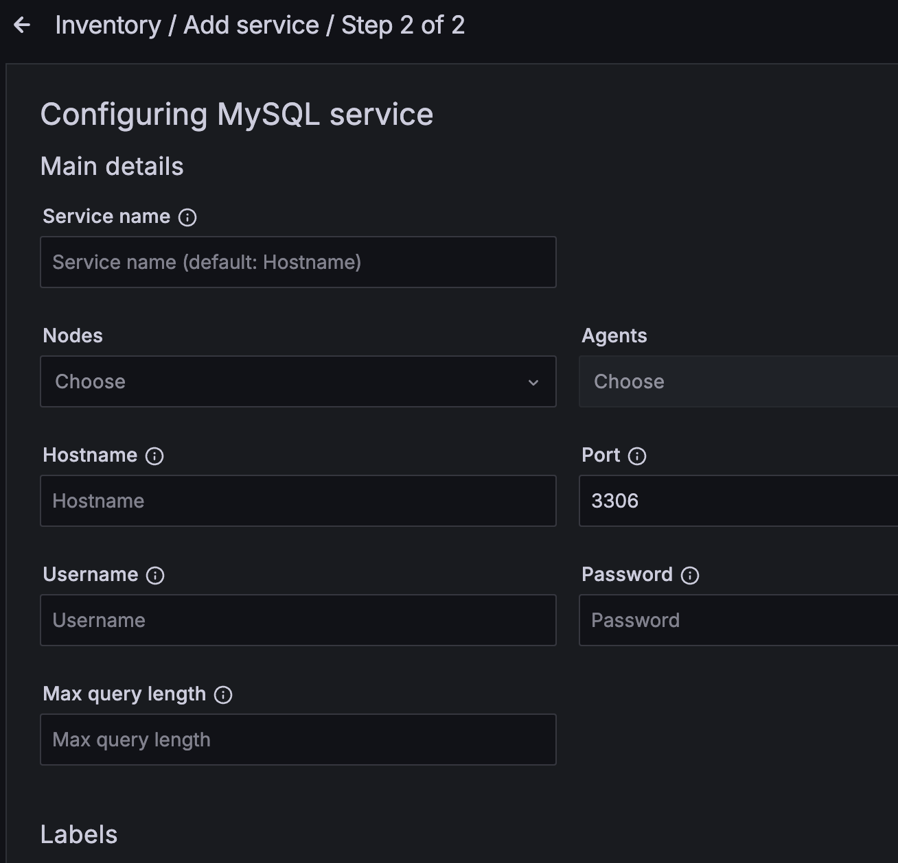
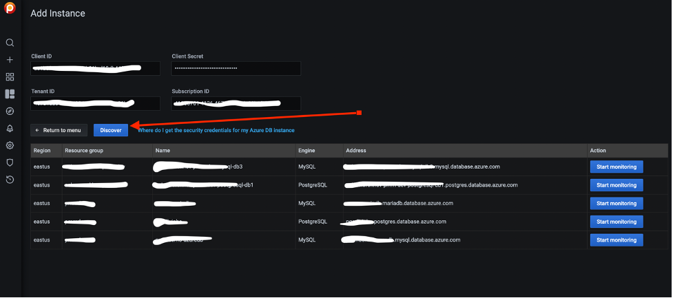
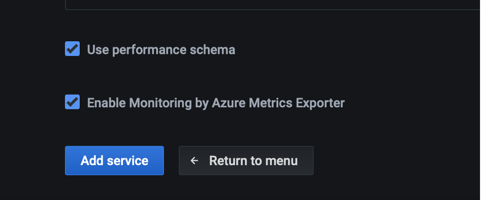

# Microsoft Azure

## Required settings

It is possible to use PMM for monitoring [Azure](https://azure.microsoft.com) database instances like other remote instances. In this case, the PMM Client is not installed on the host where the database server is deployed. By using the PMM web interface, you connect to the Azure DB instance. Discovery is not yet implemented in PMM but it is possible to add known instances by providing the connection parameters.

First of all, ensure that there is the minimal latency between PMM Server and the Azure instance.

Second, add a firewall rule to enable access from PMM Client like this:


## Setting up a MySQL instance

Query Analytics requires you to configure *Performance Schema* as the query source, because the slow query log is stored on the Azure side, and QAN agent is not able to read it.  Enable the `performance_schema` option under `Parameter Groups` in Azure MySQL databases.

When adding a monitoring instance for Azure, specify a unique name to distinguish it from the local MySQL instance.  If you do not specify a name, it will use the client’s host name.

Create the `pmm` user with the following privileges on the Azure MySQL database instance that you want to monitor:

```sql
GRANT SELECT, PROCESS, REPLICATION CLIENT ON *.* TO 'pmm'@'%' IDENTIFIED BY 'pass' WITH MAX_USER_CONNECTIONS 10;
GRANT SELECT, UPDATE, DELETE, DROP ON performance_schema.* TO 'pmm'@'%';
```

# Adding an Azure Instance

Follow the instructions for remotes instances explained [here](aws.md), Azure MySQL databases are similar to AWS RDS databases.

Example:



and be sure to set *Performance Schema* as the query collection method for Query Analytics.


# MariaDB.

MariaDB up to version 10.2 works out of the box but starting with MariaDB 10.3 instrumentation is disabled by default and cannot be enabled since there
is no SUPER role in Azure-MariaDB. So, it is not possible to run the required queries to enable instrumentation. Monitoring will work but Query Analytics
won't receive any query data.

# PostgreSQL

For PostgreSQL follow the same methods used for MySQL and MariaDB and enable `track_io_timing` in the instance configuration to enable Query Analytics.


For Query Analytics, set the server parameter:

```ini
pg_stat_statements.track = all
```

## To discover databases on Azure

You need to get the Client ID, Client Secret, Tenant ID and Subscription ID.


You can follow the steps here: <https://www.inkoop.io/blog/how-to-get-azure-api-credentials/>

Navigate to:

- Create an application in Azure Active directory. <https://portal.azure.com/#blade/Microsoft_AAD_IAM/ActiveDirectoryMenuBlade/Overview>
- Get the subscription ID.
- Get the tenant ID.
- Get the client ID.
- Get the client secret.

When you fill in all fields press the *Discover* button and you will see a list of available databases for monitoring.



You can monitor 6 types of databases:

- `Microsoft.DBforMySQL/servers`
- `Microsoft.DBforMySQL/flexibleServers`
- `Microsoft.DBforMariaDB/servers`
- `Microsoft.DBforPostgreSQL/servers`
- `Microsoft.DBforPostgreSQL/flexibleServers`
- `Microsoft.DBforPostgreSQL/serversv2`

You can find more details on how to create DB on Azure at:

- <https://docs.microsoft.com/en-us/azure/postgresql/>
- <https://docs.microsoft.com/en-us/azure/mysql/>

!!! hint alert alert-success "Tip"
    You must set `pg_stat_statements.track = all` in your PostgreSQL Server settings to use PMM Query Analytics. ([Read more.](postgresql.md#pg_stat_statements))


In the list of databases on the Discovery page click *Start Monitoring* to add the selected Azure Database to PMM.

Fill in all required fields and click *Add service*.



PMM can use 3 exporters to collect metrics:

- Azure Metrics Exporter – collect "system" metrics related to DB.

    - `node_cpu_average`
    - `azure_resource_info`
    - `node_filesystem_size_bytes`
    - `azure_memory_percent_average`
    - `azure_storage_percent_average`
    - `azure_storage_used_bytes_average`
    - `node_network_receive_bytes_total`
    - `node_network_transmit_bytes_total`

- `mysql_exporter` or `postgres_exporter` – to collect database related metrics.

- PMM Agent to collect queries related metrics using [`pg_stat_statements`](postgresql.md#pg-stat-statements) for PostgreSQL or Performance Schema for MySQL (MariaDB)
