# Setting up

There are three stages to installing and setting up PMM.

```plantuml
@startuml
skinparam rectangle {
    roundCorner 25
}
rectangle "Set up PMM Server" as SERVER
rectangle "Set up PMM Client" as CLIENT
rectangle "Add services" as SERVICES
SERVER -right->> CLIENT
CLIENT -right->> SERVICES
@enduml
```

## Set up PMM Server

Set up at least one PMM Server.

Choose from:

- [Docker](server/docker.md)
- [Virtual appliance](server/virtual-appliance.md)
- [Amazon AWS](server/aws.md)

## Set up PMM Client

On every node where there is a service to be monitored, set up PMM Client.

Choose from:

- [Docker](client/index.md#docker)
- [Linux package manager](client/index.md#package-manager) (`apt`, `apt-get`, `dnf`, `yum`)
- [Binary package](client/index.md#binary-package) (a `.tar.gz` file)

## Add services

You must configure your services and add them to PMM Server's inventory of monitored systems.

You do this on each node/service being monitored.

The set up depends on which type of service you want to monitor:

- [MySQL] (and variants: Percona Server for MySQL, Percona XtraDB Cluster, MariaDB)
- [MongoDB]
- [PostgreSQL]
- [ProxySQL]
- [Amazon RDS]
- [Microsoft Azure]
- [Google Cloud Platform] (MySQL and PostgreSQL)
- [Linux]
- [External services]
- [HAProxy]
- [Remote instances]

When you have configured everything correctly, you'll see data in the PMM user interface, in one of the [dashboards] specific to the type of service.

[MySQL]: client/mysql.md
[MongoDB]: client/mongodb.md
[PostgreSQL]: client/postgresql.md
[ProxySQL]: client/proxysql.md
[Amazon RDS]: client/aws.md
[Microsoft Azure]: client/azure.md
[Google Cloud Platform]: client/google.md
[Linux]: client/linux.md
[External services]: client/external.md
[HAProxy]: client/haproxy.md
[Remote instances]: client/remote.md
[dashboards]: ../details/dashboards/