# DBaaS

!!! caution alert alert-warning "Caution"
    DBaaS functionality is currently in [technical preview](../../details/glossary.md#technical-preview) and is subject to change.

## Software prerequisites

### Docker

**Red Hat, CentOS**

```sh
yum-config-manager --add-repo https://download.docker.com/linux/centos/docker-ce.repo
yum -y install docker-ce
usermod -a -G docker centos
systemctl enable docker
systemctl start docker
```

**Debian, Ubuntu**

```sh
apt-add-repository https://download.docker.com/linux/centos/docker-ce.repo
systemctl enable docker
systemctl start docker
```

### minikube

> Please install minikube 1.16.0

**Red Hat, CentOS**

```sh
yum -y install curl
curl -Lo /usr/local/sbin/minikube https://github.com/kubernetes/minikube/releases/download/v1.16.0/minikube-linux-amd64
chmod +x /usr/local/sbin/minikube
ln -s /usr/local/sbin/minikube /usr/sbin/minikube
alias kubectl='minikube kubectl --'
```

## Start PMM server and activate a DBaaS feature

> - To start a fully-working 3 node XtraDB cluster, consisting of sets of 3x HAProxy, 3x PXC and 6x PMM Client containers, you will need at least 9 vCPU available for minikube. (1x vCPU for HAProxy and PXC and 0.5vCPU for each pmm-client containers).
>
> - DBaaS does not depend on PMM Client.
>
> - You can pass the environment variable `--env ENABLE_DBAAS=1` to force the DBaaS feature when starting up pmm-server container. **You can omit the variable and enable the feature later using PMM UI**, please follow the link in step 3. below.
>
> - Add the option `--network minikube` if you run PMM Server and minikube in the same Docker instance. (This will share a single network and the kubeconfig will work.)
>
> - Add the options `--env PMM_DEBUG=1` and/or `--env PMM_TRACE=1` if you need extended debug details

1. Start PMM server:

    ```sh
    docker run --detach --publish 80:80 --publish 443:443 --name pmm-server percona/pmm-server:2
    ```

2. Change the default administrator credentials from CLI:

    (This step is optional, because the same can be done from the web interface of PMM on first login.)

    ```sh
    docker exec -t pmm-server bash -c 'ln -s /srv/grafana /usr/share/grafana/data; chown -R grafana:grafana /usr/share/grafana/data; grafana-cli --homepath /usr/share/grafana admin reset-admin-password <RANDOM_PASS_GOES_IN_HERE>'
    ```

3. ***IMPORTANT***: *Please follow instructions on* [**How to activate the *DBaaS* feature in Advanced Settings of PMM**](../../using/platform/dbaas.md#activate-a-dbaas-feature).

    You need to enable the feature using PMM UI if you omitted `--env ENABLE_DBAAS=1` when starting up the container.

## Create a Kubernetes cluster

> The DBaaS feature uses Kubernetes clusters to deploy database clusters. You must first create a Kubernetes cluster and then add it to PMM using `kubeconfig` to get a successful setup

### Minikube {: #minikube }

1. Configure and start minikube:

    ```sh
    minikube config set cpus 16
    minikube config set memory 32768
    minikube config set kubernetes-version 1.16.15
    minikube start
    ```

2. Get your kubeconfig details from `minikube`. (You need these to register your Kubernetes cluster with PMM Server):

    ```sh
    minikube kubectl -- config view --flatten --minify
    ```
	> You will need to copy this output to your clipboard and continue with [adding a Kubernetes cluster to PMM](../../using/platform/dbaas.md#add-a-kubernetes-cluster).

### Amazon AWS EKS {: #aws-eks }

1. Create your cluster via `eksctl` or the Amazon AWS interface. For example:

    ```sh
    eksctl create cluster --write-kubeconfig --name=your-cluster-name --zones=us-west-2a,us-west-2b --kubeconfig <PATH_TO_KUBECONFIG>
    ```

2. When the cluster is running, modify your kubeconfig file, if it's not utilizing the `aws-iam-authenticator` or `client-certificate` method for authentication with Kubernetes. Here are two examples that you can use as templates to modify a copy of your existing kubeconfig:

    - For the `aws-iam-authenticator` method:

        ```yml
        ---
        apiVersion: v1
        clusters:
        - cluster:
            certificate-authority-data: << CERT_AUTH_DATA >>
            server: << K8S_CLUSTER_URL >>
          name: << K8S_CLUSTER_NAME >>
        contexts:
        - context:
            cluster: << K8S_CLUSTER_NAME >>
            user: << K8S_CLUSTER_USER >>
          name: << K8S_CLUSTER_NAME >>
        current-context: << K8S_CLUSTER_NAME >>
        kind: Config
        preferences: {}
        users:
        - name: << K8S_CLUSTER_USER >>
          user:
            exec:
              apiVersion: client.authentication.k8s.io/v1alpha1
              command: aws-iam-authenticator
              args:
                - "token"
                - "-i"
                - "<< K8S_CLUSTER_NAME >>"
                - --region
                - << AWS_REGION >>
              env:
                 - name: AWS_ACCESS_KEY_ID
                   value: "<< AWS_ACCESS_KEY_ID >>"
                 - name: AWS_SECRET_ACCESS_KEY
                   value: "<< AWS_SECRET_ACCESS_KEY >>"
        ```

     - For the `client-certificate` method:

        ```yml
        ---
        apiVersion: v1
        clusters:
        - cluster:
            certificate-authority-data: << CERT_AUTH_DATA >>
            server: << K8S_CLUSTER_URL >>
          name: << K8S_CLUSTER_NAME >>
        contexts:
        - context:
            cluster: << K8S_CLUSTER_NAME >>
            user: << K8S_CLUSTER_USER >>
          name: << K8S_CLUSTER_NAME >>
        current-context: << K8S_CLUSTER_NAME >>
        kind: Config
        preferences: {}
        users:
        - name: << K8S_CLUSTER_NAME >>
          user:
            client-certificate-data: << CLIENT_CERT_DATA >>
            client-key-data: << CLIENT_KEY_DATA >>
        ```

3. Follow the instructions on [How to add a Kubernetes cluster](../../using/platform/dbaas.md#add-a-kubernetes-cluster) with kubeconfig from the previous step.

	> If possible, the connection details will show the cluster's external IP (not possible with minikube).

### Google GKE {: #google-gke }

**Prerequisites**

You should have an account on GCP [https://cloud.google.com/](https://cloud.google.com/).

1. Login into google cloud platform console [https://console.cloud.google.com/](https://console.cloud.google.com/)

2. Navigate to Menu --> Kubernetes Engine --> Clusters

    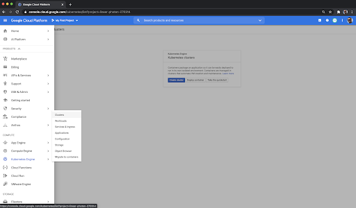

3. Click button Create cluster

    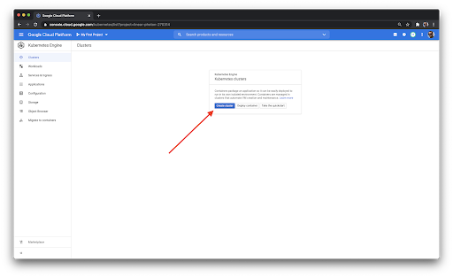

4. You can specify cluster option in form or simply click on “My first cluster” and button Create

    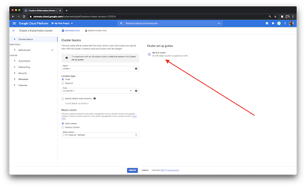

    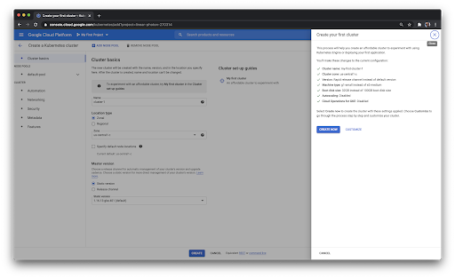

5. Wait until cluster created

    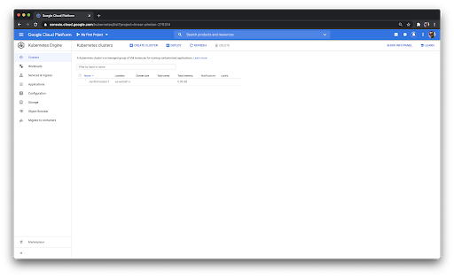

6. Click on button Connect in a the cluster’s row

    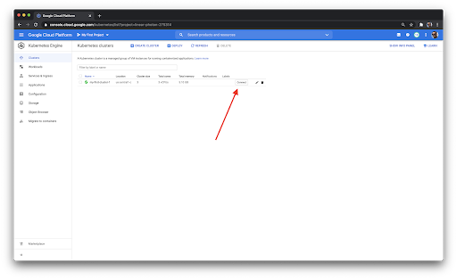

7. Click button Run in Cloud shell

    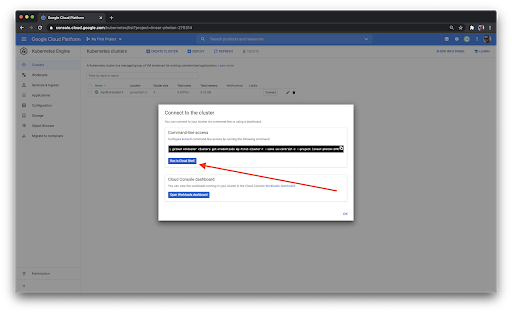

8. Click Authorize

    

    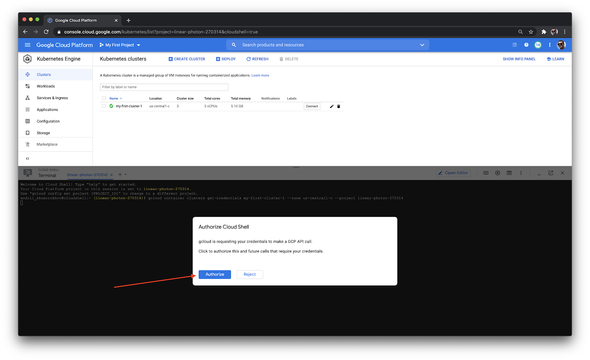

    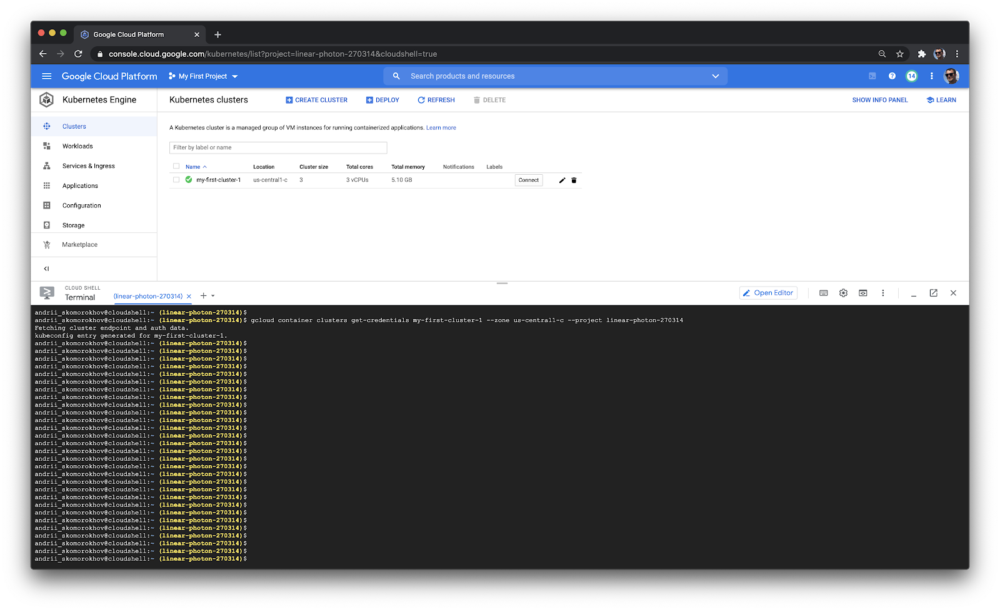

9. Set up PXC and PSMDB operators:

    ```
    curl -sSf -m 30 https://raw.githubusercontent.com/percona/percona-xtradb-cluster-operator/pmm-branch/deploy/bundle.yaml  | kubectl apply -f -
    curl -sSf -m 30 https://raw.githubusercontent.com/percona/percona-server-mongodb-operator/pmm-branch/deploy/bundle.yaml  | kubectl apply -f -
    ```

    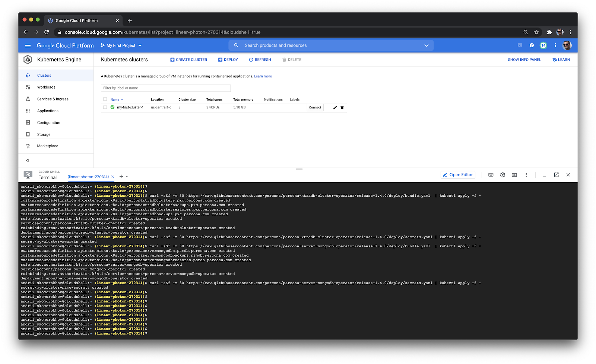

10. Check if it was set up successfully

    ```
    kubectl api-resources --api-group='psmdb.percona.com'
    kubectl api-resources --api-group='pxc.percona.com'
    ```

    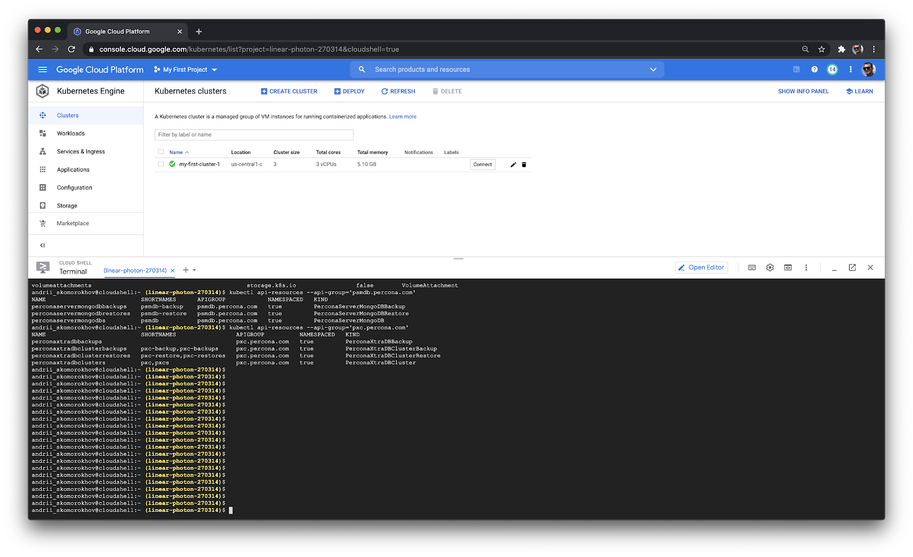

11. Check versions

    ```
    kubectl api-versions | grep percona.com
    ```

    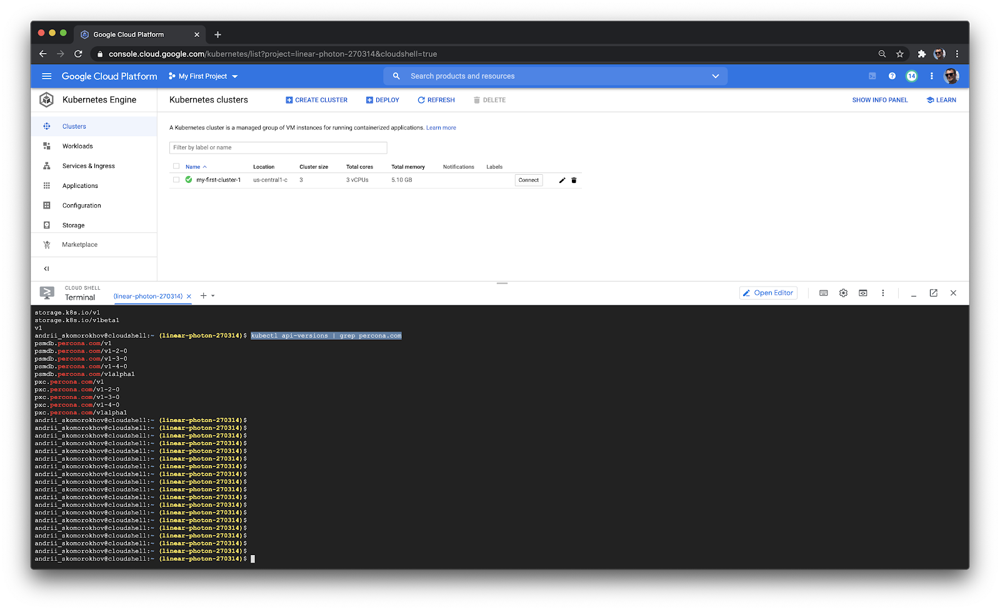

12. Create Service Account, copy and store kubeconfig - output of the following command
>>>>>>> main

    ```
    cat <<EOF | kubectl apply -f -
    ---
    apiVersion: v1
    kind: ServiceAccount
    metadata:
      name: percona-dbaas-cluster-operator
    ---
    kind: RoleBinding
    apiVersion: rbac.authorization.k8s.io/v1beta1
    metadata:
      name: service-account-percona-server-dbaas-xtradb-operator
    subjects:
    - kind: ServiceAccount
      name: percona-dbaas-cluster-operator
    roleRef:
      kind: Role
      name: percona-xtradb-cluster-operator
      apiGroup: rbac.authorization.k8s.io
    ---
    kind: RoleBinding
    apiVersion: rbac.authorization.k8s.io/v1beta1
    metadata:
      name: service-account-percona-server-dbaas-psmdb-operator
    subjects:
    - kind: ServiceAccount
      name: percona-dbaas-cluster-operator
    roleRef:
      kind: Role
      name: percona-server-mongodb-operator
      apiGroup: rbac.authorization.k8s.io
    EOF

    name=`kubectl get serviceAccounts percona-dbaas-cluster-operator -o json | jq  -r .secrets[].name`
    certificate=`kubectl get secret $name -o json | jq -r  '.data."ca.crt"'`
    token=`kubectl get secret $name -o json | jq -r  '.data.token' | base64 -d`
    server=`kubectl cluster-info | grep 'Kubernetes master' | cut -d ' ' -f 6`
    ```

    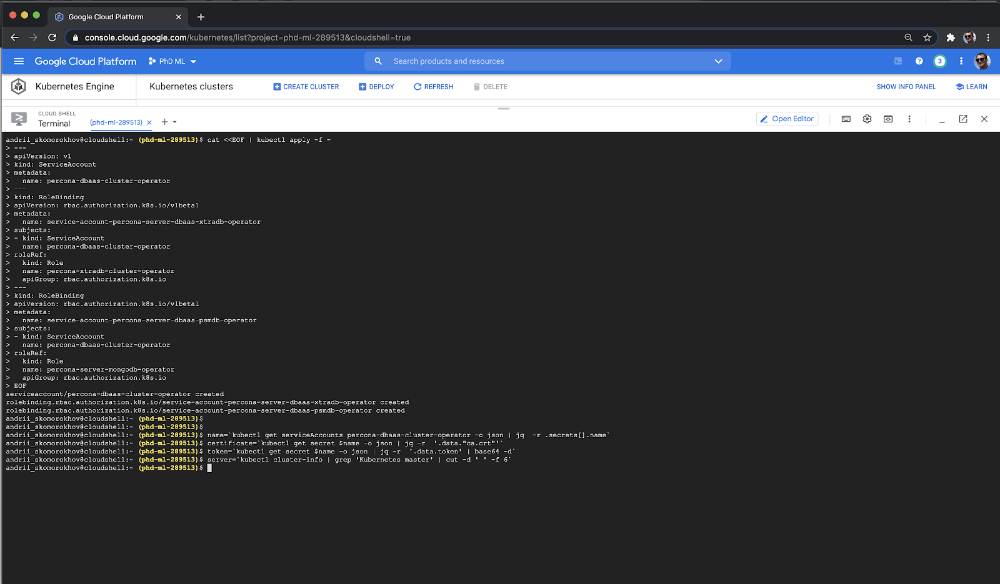


    ```
    echo "
    apiVersion: v1
    kind: Config
    users:
    - name: percona-dbaas-cluster-operator
      user:
        token: $token
    clusters:
    - cluster:
        certificate-authority-data: $certificate
        server: $server
      name: self-hosted-cluster
    contexts:
    - context:
        cluster: self-hosted-cluster
        user: percona-dbaas-cluster-operator
      name: svcs-acct-context
    current-context: svcs-acct-context
    "
    ```

    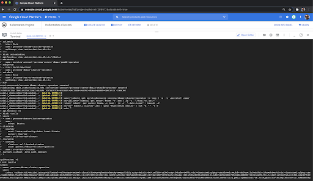

10. Start PMM Server on your local machine or other VM instance:

    ```sh
    docker run --detach --name pmm-server --publish 80:80 --publish 443:443 \
    --env ENABLE_DBAAS=1 perconalab/pmm-server-fb:PR-1240-07bef94;
    ```

11. Login into PMM and navigate to DBaaS

     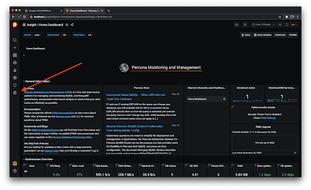

12. Use kubeconfig from step 9 to [Add the Kubernetes cluster](../../using/platform/dbaas.md#add-a-kubernetes-cluster).

## Deleting clusters

> If a Public Address is set in PMM Settings, for each DB cluster an API Key is created which can be found on the page `/graph/org/apikeys`. You should not delete them (for now, until [issue PMM-8045](https://jira.percona.com/browse/PMM-8045) is fixed) -- once a DB cluster is removed from DBaaS, the related API Key is also removed.

For example, if you only run `eksctl delete cluster` to delete an Amazon EKS cluster without cleaning up the cluster first, there will be a lot of orphaned resources such as Cloud Formations, Load Balancers, EC2 instances, Network interfaces, etc. The same applies for Google GKE clusters.

### Cleaning up Kubernetes cluster

1. You should delete all database clusters, backups and restores.

    ```sh
    kubectl delete perconaxtradbclusterbackups.pxc.percona.com --all
    kubectl delete perconaxtradbclusters.pxc.percona.com --all
    kubectl delete perconaxtradbclusterrestores.pxc.percona.com --all

    kubectl delete perconaservermongodbbackups.psmdb.percona.com --all
    kubectl delete perconaservermongodbs.psmdb.percona.com --all
    kubectl delete perconaservermongodbrestores.psmdb.percona.com --all
    ```

2. In the `dbaas-controller` repository, in the deploy directory there are manifests we use to deploy operators. Use them to delete operators and related resources from the cluster.

    !!! important alert alert-warning "Important"
        - Do NOT execute this step before all database clusters, backups and restores are deleted in the previous step. It may result in not being able to delete the namespace DBaaS lives in.
        - Also be careful with this step if you are running DBaaS in more than one namespace as it deletes cluster level CustomResourceDefinitions needed to run DBaaS. This would break DBaaS in other namespaces. Delete just operators deployments in that case.

    ```sh
    # Delete the PXC operator and related resources.
    curl https://raw.githubusercontent.com/percona-platform/dbaas-controller/7a5fff023994cecf6bde15705365114004b50b41/deploy/pxc-operator.yaml | kubectl delete -f -

    # Delete the PSMDB operator and related resources.
    curl https://raw.githubusercontent.com/percona-platform/dbaas-controller/7a5fff023994cecf6bde15705365114004b50b41/deploy/psmdb-operator.yaml | kubectl delete -f -
    ```

3. Delete the namespace where the DBaaS is running, this will delete all remaining namespace level resources if any are left.

    ```sh
    kubectl delete namespace <your-namespace>
    ```

4. Delete the Kubernetes cluster. The way is based on your cloud provider.
    - [Delete GKE cluster](https://cloud.google.com/kubernetes-engine/docs/how-to/deleting-a-cluster)
    - [Delete Amazon EKS cluster](https://docs.aws.amazon.com/eks/latest/userguide/delete-cluster.html)

## Run PMM Server as a Docker container for DBaaS

1. Start PMM server from a feature branch:

    ```sh
    docker run --detach --name pmm-server --publish 80:80 --publish 443:443 --env ENABLE_DBAAS=1  percona/pmm-server:2;
    ```

    !!! important alert alert-warning "Important"
        - Use `--network minikube` if running PMM Server and minikube in the same Docker instance. This way they will share single network and the kubeconfig will work.
        - Use Docker variables `--env PMM_DEBUG=1 --env PMM_TRACE=1` to see extended debug details.

2. Change the default administrator credentials:

	> This step is optional, because the same can be done from the web interface of PMM on the first login.

    ```sh
    docker exec -t pmm-server bash -c 'ln -s /srv/grafana /usr/share/grafana/data; chown -R grafana:grafana /usr/share/grafana/data; grafana-cli --homepath /usr/share/grafana admin reset-admin-password <RANDOM_PASS_GOES_IN_HERE>'
    ```

3. Set the public address for PMM Server in PMM settings UI

4. Follow the steps for [Add a Kubernetes cluster](../../using/platform/dbaas.md#add-a-kubernetes-cluster).

5. Follow the steps for [Add a DB Cluster](../../using/platform/dbaas.md#add-a-db-cluster).

6. Get the IP address to connect your app/service:

    ```sh
    minikube kubectl get services
    ```

## Exposing PSMDB and XtraDB clusters for access by external clients

To make services visible externally, you create a LoadBalancer service or manually run commands to expose ports:

```sh
kubectl expose deployment hello-world --type=NodePort.
```

> **See also**
>
> - [DBaaS Dashboard](../../using/platform/dbaas.md)
>
> - [Install minikube](https://minikube.sigs.k8s.io/docs/start/)
>
> - [Setting up a Standalone MYSQL Instance on Kubernetes & exposing it using Nginx Ingress Controller][STANDALONE_MYSQL_K8S]
>
> - [Use a Service to Access an Application in a Cluster][KUBERNETES_ACCESS_APP]
>
> - [Exposing applications using services][GOOGLE_EXPOSING_APPS]


[ALPHA]: https://en.wikipedia.org/wiki/Software_release_life_cycle#Alpha
[GOOGLE_EXPOSING_APPS]: https://cloud.google.com/kubernetes-engine/docs/how-to/exposing-apps
[KUBERNETES_ACCESS_APP]: https://kubernetes.io/docs/tasks/access-application-cluster/service-access-application-cluster/
[STANDALONE_MYSQL_K8S]: https://medium.com/@chrisedrego/setting-up-a-standalone-mysql-instance-on-kubernetes-exposing-it-using-nginx-ingress-controller-262fc7af593a
