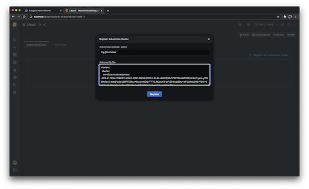
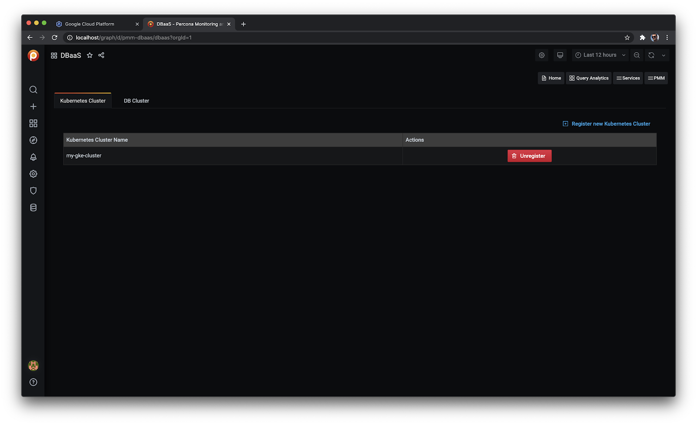

# DBaaS (Alpha)

> <b style="color:goldenrod">Caution</b> **DBaaS functionality is currently in [Alpha status][ALPHA]**.
>
> The information on this page is subject to change and may be inaccurate.

## Software prerequisites

### Docker

**Red Hat, CentOS**

```sh
yum-config-manager --add-repo https://download.docker.com/linux/centos/docker-ce.repo
yum -y install docker-ce
usermod -a -G docker centos
systemctl enable docker
systemctl start docker
```

**Debian, Ubuntu**

```sh
apt-add-repository https://download.docker.com/linux/centos/docker-ce.repo
systemctl enable docker
systemctl start docker
```

### minikube

> Please install minikube 1.16.0

**Red Hat, CentOS**

```sh
yum -y install curl
curl -Lo /usr/local/sbin/minikube https://github.com/kubernetes/minikube/releases/download/v1.16.0/minikube-linux-amd64
chmod +x /usr/local/sbin/minikube
ln -s /usr/local/sbin/minikube /usr/sbin/minikube
alias kubectl='minikube kubectl --'
```

## Start PMM server with DBaaS activated

> - To start a fully-working 3 node XtraDB cluster, consisting of sets of 3x ProxySQL, 3x PXC and 6x PMM Client containers, you will need at least 9 vCPU available for minikube. (1x vCPU for ProxySQL and PXC and 0.5vCPU for each pmm-client containers).
>
> - DBaaS does not depend on PMM Client.
>
> - Setting the environment variable `PERCONA_TEST_DBAAS=1` enables DBaaS functionality.
>
> - Add the option `--network minikube` if you run PMM Server and minikube in the same Docker instance. (This will share a single network and the kubeconfig will work.)
>
> - Add the options `--env PMM_DEBUG=1` and/or `--env PMM_TRACE=1` if you need extended debug details

1. Start PMM server:

    ```sh
    docker run --detach --publish 80:80 --publish 443:443 --name pmm-server --env PERCONA_TEST_DBAAS=1 percona/pmm-server:2
    ```

2. Change the default administrator credentials from CLI:

    (This step is optional, because the same can be done from the web interface of PMM on first login.)

    ```sh
    docker exec -t pmm-server bash -c 'ln -s /srv/grafana /usr/share/grafana/data; chown -R grafana:grafana /usr/share/grafana/data; grafana-cli --homepath /usr/share/grafana admin reset-admin-password <RANDOM_PASS_GOES_IN_HERE>'
    ```

## Install Percona operators in minikube

1. Configure and start minikube:

    ```sh
    minikube config set cpus 16
    minikube config set memory 32768
    minikube config set kubernetes-version 1.16.15
    minikube start
    ```

2. Deploy the Percona operators configuration for PXC and PSMDB in minikube:

    ```sh
    # Install the PXC operator
    curl -sSf -m 30 https://raw.githubusercontent.com/percona/percona-xtradb-cluster-operator/{{op.pxc_vers}}/deploy/bundle.yaml \
    | kubectl apply -f -

    # Install the PSMDB operator
    curl -sSf -m 30 https://raw.githubusercontent.com/percona/percona-server-mongodb-operator/{{op.psmdb_vers}}/deploy/bundle.yaml \
    | kubectl apply -f -
    ```

3. Check the operators are deployed:

    ```sh
    minikube kubectl -- get nodes
    minikube kubectl -- get pods
    minikube kubectl -- wait --for=condition=Available deployment percona-xtradb-cluster-operator
    minikube kubectl -- wait --for=condition=Available deployment percona-server-mongodb-operator
    ```

4. Get your kubeconfig details from minikube (to register your Kubernetes cluster with PMM Server):

    ```sh
    minikube kubectl -- config view --flatten --minify
    ```
	> You will need to copy this output to your clipboard and continue with [add a Kubernetes cluster to PMM](../../using/platform/dbaas.md#add-a-kubernetes-cluster).

## Installing Percona operators on Amazon AWS EKS {: #operators-aws-eks }

1. Create your cluster via `eksctl` or the Amazon AWS interface. For example:

    ```sh
    eksctl create cluster --write-kubeconfig --name=your-cluster-name --zones=us-west-2a,us-west-2b --kubeconfig <PATH_TO_KUBECONFIG>
    ```

2. When your EKS cluster is running, install the PXC and PSMDB operators:

    ```sh
    # Install the PXC operator
    curl -sSf -m 30 https://raw.githubusercontent.com/percona/percona-xtradb-cluster-operator/{{op.pxc_vers}}/deploy/bundle.yaml \
    | kubectl apply -f -

    # Install the PSMDB operator
    curl -sSf -m 30 https://raw.githubusercontent.com/percona/percona-server-mongodb-operator/{{op.psmdb_vers}}/deploy/bundle.yaml \
    | kubectl apply -f -
    ```

    ```
    # Validate that the operators are running
    kubectl get pods
    ```

3. Modify your kubeconfig file, if it's not utilizing the `aws-iam-authenticator` or `client-certificate` method for authentication with Kubernetes. Here are two examples that you can use as templates to modify a copy of your existing kubeconfig:

    - For the `aws-iam-authenticator` method:

        ```yml
        ---
        apiVersion: v1
        clusters:
        - cluster:
            certificate-authority-data: << CERT_AUTH_DATA >>
            server: << K8S_CLUSTER_URL >>
          name: << K8S_CLUSTER_NAME >>
        contexts:
        - context:
            cluster: << K8S_CLUSTER_NAME >>
            user: << K8S_CLUSTER_USER >>
          name: << K8S_CLUSTER_NAME >>
        current-context: << K8S_CLUSTER_NAME >>
        kind: Config
        preferences: {}
        users:
        - name: << K8S_CLUSTER_USER >>
          user:
            exec:
              apiVersion: client.authentication.k8s.io/v1alpha1
              command: aws-iam-authenticator
              args:
                - "token"
                - "-i"
                - "<< K8S_CLUSTER_NAME >>"
                - --region
                - << AWS_REGION >>
              env:
                 - name: AWS_ACCESS_KEY_ID
                   value: "<< AWS_ACCESS_KEY_ID >>"
                 - name: AWS_SECRET_ACCESS_KEY
                   value: "<< AWS_SECRET_ACCESS_KEY >>"
        ```

     - For the `client-certificate` method:

        ```yml
        ---
        apiVersion: v1
        clusters:
        - cluster:
            certificate-authority-data: << CERT_AUTH_DATA >>
            server: << K8S_CLUSTER_URL >>
          name: << K8S_CLUSTER_NAME >>
        contexts:
        - context:
            cluster: << K8S_CLUSTER_NAME >>
            user: << K8S_CLUSTER_USER >>
          name: << K8S_CLUSTER_NAME >>
        current-context: << K8S_CLUSTER_NAME >>
        kind: Config
        preferences: {}
        users:
        - name: << K8S_CLUSTER_NAME >>
          user:
            client-certificate-data: << CLIENT_CERT_DATA >>
            client-key-data: << CLIENT_KEY_DATA >>
        ```

4. Follow the instructions for [Add a Kubernetes cluster](../../using/platform/dbaas.md#add-a-kubernetes-cluster).

	> If possible, the connection details will show the cluster's external IP (not possible with minikube).

## Install Percona operators on Google GKE {: #operators-google-gke }

**Prerequisites**

You should have an account on GCP [https://cloud.google.com/](https://cloud.google.com/).

1. Login into google cloud platform console [https://console.cloud.google.com/](https://console.cloud.google.com/)

2. Navigate to Menu --> Kubernetes Engine --> Clusters

    

3. Click button Create cluster

    

4. You can specify cluster option in form or simply click on “My first cluster” and button Create

    

    

5. Wait until cluster created

    

6. Click on button Connect in a the cluster’s row

    

7. Click button Run in Cloud shell

    

8. Click Authorize

    

    

    

9. Set up PXC and PSMDB operators:

    ```
    curl -sSf -m 30 https://raw.githubusercontent.com/percona/percona-xtradb-cluster-operator/{{op.pxc_vers}}/deploy/bundle.yaml  | kubectl apply -f -
    curl -sSf -m 30 https://raw.githubusercontent.com/percona/percona-server-mongodb-operator/{{op.psmdb_vers}}/deploy/bundle.yaml  | kubectl apply -f -
    ```

    

10. Check if it was set up successfully

    ```
    kubectl api-resources --api-group='psmdb.percona.com'
    kubectl api-resources --api-group='pxc.percona.com'
    ```

    

11. Check versions

    ```
    kubectl api-versions | grep percona.com
    ```

    

12. Create Service Account, copy and store kubeconfig - output of the following command

    ```
    cat <<EOF | kubectl apply -f -
    ---
    apiVersion: v1
    kind: ServiceAccount
    metadata:
      name: percona-dbaas-cluster-operator
    ---
    kind: RoleBinding
    apiVersion: rbac.authorization.k8s.io/v1beta1
    metadata:
      name: service-account-percona-server-dbaas-xtradb-operator
    subjects:
    - kind: ServiceAccount
      name: percona-dbaas-cluster-operator
    roleRef:
      kind: Role
      name: percona-xtradb-cluster-operator
      apiGroup: rbac.authorization.k8s.io
    ---
    kind: RoleBinding
    apiVersion: rbac.authorization.k8s.io/v1beta1
    metadata:
      name: service-account-percona-server-dbaas-psmdb-operator
    subjects:
    - kind: ServiceAccount
      name: percona-dbaas-cluster-operator
    roleRef:
      kind: Role
      name: percona-server-mongodb-operator
      apiGroup: rbac.authorization.k8s.io
    EOF

    name=`kubectl get serviceAccounts percona-dbaas-cluster-operator -o json | jq  -r .secrets[].name`
    certificate=`kubectl get secret $name -o json | jq -r  '.data."ca.crt"'`
    token=`kubectl get secret $name -o json | jq -r  '.data.token' | base64 -d`
    server=`kubectl cluster-info | grep 'Kubernetes master' | cut -d ' ' -f 6`
    ```

    


    ```
    echo "
    apiVersion: v1
    kind: Config
    users:
    - name: percona-dbaas-cluster-operator
      user:
        token: $token
    clusters:
    - cluster:
        certificate-authority-data: $certificate
        server: $server
      name: self-hosted-cluster
    contexts:
    - context:
        cluster: self-hosted-cluster
        user: percona-dbaas-cluster-operator
      name: svcs-acct-context
    current-context: svcs-acct-context
    "
    ```

    

13. Start PMM Server on you local machine or other VM instance:

    ```
    docker run --detach --name pmm-server --publish 80:80 --publish 443:443 \
    --env PERCONA_TEST_DBAAS=1 perconalab/pmm-server-fb:PR-1240-07bef94;
    ```

14.  Login into PMM and navigate to DBaaS

     

15. Register your GKE using kubeconfig from step 12.

	> <b style="color:goldenrod">Important</b> Ensure there are no stray new lines in the kubeconfig, especially in long lines like certificate or token.

    

    

## Deleting clusters

You should delete all installation operators as the operators own resources.

If you only run `eksctl delete cluster` without cleaning up the cluster first, there will be a lot of orphaned resources as Cloud Formations, Load Balancers, EC2 instances, Network interfaces, etc.

In the `pmm-managed` repository, in the deploy directory there are 2 example bash scripts to install and delete the operators from the EKS cluster.

The install script:

```sh
#!/bin/bash

TOP_DIR=$(git rev-parse --show-toplevel)
KUBECTL_CMD="kubectl --kubeconfig ${HOME}/.kube/config_eks"

# Install the PXC operator
cat ${TOP_DIR}/deploy/pxc_operator.yaml | ${KUBECTL_CMD} apply -f -

# Install the PSMDB operator
cat ${TOP_DIR}/deploy/psmdb_operator.yaml | ${KUBECTL_CMD} apply -f -
```

The delete script:

```sh
#!/bin/bash

TOP_DIR=$(git rev-parse --show-toplevel)
KUBECTL_CMD="kubectl --kubeconfig ${HOME}/.kube/config_eks"

# Delete the PXC operator
cat ${TOP_DIR}/deploy/pxc_operator.yaml | ${KUBECTL_CMD} delete -f -
kubectl delete secret my-cluster-secrets

# Delete the PSMDB operator
cat ${TOP_DIR}/deploy/psmdb_operator.yaml | ${KUBECTL_CMD} delete -f -
kubectl delete secret my-cluster-name-secrets
```

(Both scripts are similar except the install script command is `apply` while in the delete script it is `delete`.)

After deleting everything in the EKS cluster, run this command (using your own configuration path) and wait until the output only shows `service/kubernetes` before deleting the cluster with the `eksclt delete` command.

```sh
kubectl --kubeconfig ~/.kube/config_eks get all
```

Example output:

```
NAME                 TYPE        CLUSTER-IP   EXTERNAL-IP   PORT(S)   AGE
service/kubernetes   ClusterIP   10.100.0.1   <none>        443/TCP   4d5h
```

If you don't need the cluster anymore, you can uninstall everything in it and destroy it:

```sh
# Delete all volumes created by the operators:
kubectl [--kubeconfig <config file>] delete pvc --all
# Delete the cluster
eksctl delete cluster --name=your-cluster-name
```

## Run PMM Server as a Docker container for DBaaS

1. Start PMM Server with DBaaS enabled:

    ```sh
    docker run --detach --name pmm-server --publish 80:80 --publish 443:443 --env PERCONA_TEST_DBAAS=1  percona/pmm-server:2;
    ```

	> <b style="color:goldenrod">Important</b>
	>
	> - Use `--network minikube` if running PMM Server and minikube in the same Docker instance. This way they will share single network and the kubeconfig will work.
	>
	> - Use Docker variables `--env PMM_DEBUG=1 --env PMM_TRACE=1` to see extended debug details.

2. Change the default administrator credentials:

	> This step is optional, because the same can be done from the web interface of PMM on the first login.

    ```sh
    docker exec -t pmm-server bash -c 'ln -s /srv/grafana /usr/share/grafana/data; chown -R grafana:grafana /usr/share/grafana/data; grafana-cli --homepath /usr/share/grafana admin reset-admin-password <RANDOM_PASS_GOES_IN_HERE>'
    ```

3. Set the public address for PMM Server in PMM settings UI

4. Follow the steps for [Add a Kubernetes cluster](../../using/platform/dbaas.md#add-a-kubernetes-cluster).

5. Follow the steps for [Add a DB Cluster](../../using/platform/dbaas.md#add-a-db-cluster).

6. Get the IP address to connect your app/service:

    ```sh
    minikube kubectl get services
    ```

## Exposing PSMDB and XtraDB clusters for access by external clients

To make services visible externally, you create a LoadBalancer service or manually run commands to expose ports:

```sh
kubectl expose deployment hello-world --type=NodePort.
```

> **See also**
>
> - [DBaaS Dashboard](../../using/platform/dbaas.md)
>
> - [Install minikube](https://minikube.sigs.k8s.io/docs/start/)
>
> - [Setting up a Standalone MYSQL Instance on Kubernetes & exposing it using Nginx Ingress Controller][STANDALONE_MYSQL_K8S]
>
> - [Use a Service to Access an Application in a Cluster][KUBERNETES_ACCESS_APP]
>
> - [Exposing applications using services][GOOGLE_EXPOSING_APPS]


[ALPHA]: https://en.wikipedia.org/wiki/Software_release_life_cycle#Alpha
[GOOGLE_EXPOSING_APPS]: https://cloud.google.com/kubernetes-engine/docs/how-to/exposing-apps
[KUBERNETES_ACCESS_APP]: https://kubernetes.io/docs/tasks/access-application-cluster/service-access-application-cluster/
[STANDALONE_MYSQL_K8S]: https://medium.com/@chrisedrego/setting-up-a-standalone-mysql-instance-on-kubernetes-exposing-it-using-nginx-ingress-controller-262fc7af593a
