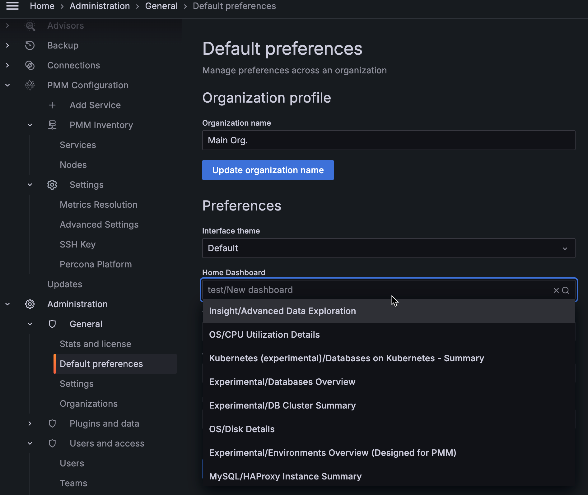

# Set your personal Home dashboard

To set your personal Home dashboard:
{.power-number}

1. From the main menu, go to  **Dashboards > Browse** and select the dashboard you want to set as your home dashboard.

2. Click the  star next to the dashboard title to mark it as a favorite.

    

3. From the side menu go to **Configuration > Preferences**. In the Home Dashboard field, select the dashboard that you want to set as your home dashboard.

    

4. Click **Save**.

