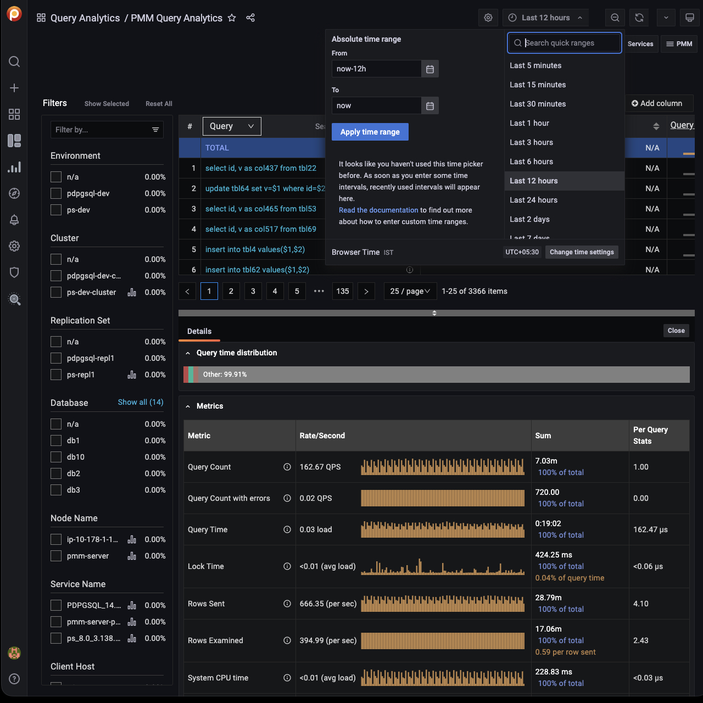

# Filters Panel


- The **Filter** panel on the left hand side of the dashboard lists the filters grouped by category. It also shows the percentage of the main metrics (explained below). If you select a different metric, the percentages on the left panel will change as per this metric. When you select a metric, it reduces the overview list as per the matching filter.
- The first five of each category are shown. If there are more, the list is expanded by clicking **Show all** beside the category name, and collapsed again with **Show top 5**.
- Applying a filter may make other filters inapplicable. These become grayed out and inactive.
- Click the chart symbol <i class="uil uil-graph-bar"></i> to navigate directly to an item's associated dashboard.
- Separately, the global **Time range** setting filters results by time, either your choice of **Absolute time range**, or one of the predefined **Relative time ranges**.




## Custom filter groups

!!! caution alert alert-warning "Important/Caution"
    This feature is still in [Technical Preview](https://docs.percona.com/percona-monitoring-and-management/details/glossary.html#technical-preview) and is subject to change. We recommend that early adopters use this feature for testing purposes only.

Filter queries using custom key=value pairs from query comments. This feature is disabled by default.

### Supported technologies and agents

- MySQL (`perfschema`, `slowlog`),
- PostgreSQL (`pg_stat_statements`, `pg_stat_monitor`)

**Example**


In the image above we have tagged queries running databases on Windows using the following comment: 

```sh
comment: /* OperationSystem='windows' */. 
```
Queries from the database running on Linux are tagged with:

```sh
/* OperationSystem='linux' */. 
```

All types of comments and multicomments are supported `(/* */, --, # etc)`. 

So the queries are as follows:

```sh
SELECT * /* OperationSystem='windows' */ FROM city;
SELECT city /* OperationSystem='linux' */ FROM world;
```

In the output, you can see another custom group in the `OperationSystem` filter. Use this to easily filter by any custom key or value.

### Enabling custom filter groups

- **CLI**: While adding a service through CLI use the flag `comments-parsing`. Possible values are `on/off`. 

    Example for adding MySQL with comments parsing on:

    ```sh
    pmm-admin add mysql --username=root --password=root-password --comments-parsing="on"
    ```

- **UI**: While adding a service through the UI you will see new checkbox to `enable/disable` comments parsing for current service.

    

!!! note alert alert-primary "MySQL CLI"
    - If you are using official MySQL CLI to trigger queries, start mysql with `--comments` flag. Otherwise comments will not be parsed.
    - In case of PGSM (`pg_stat_monitor`), set the DB variable `pgsm_extract_comments=yes`

