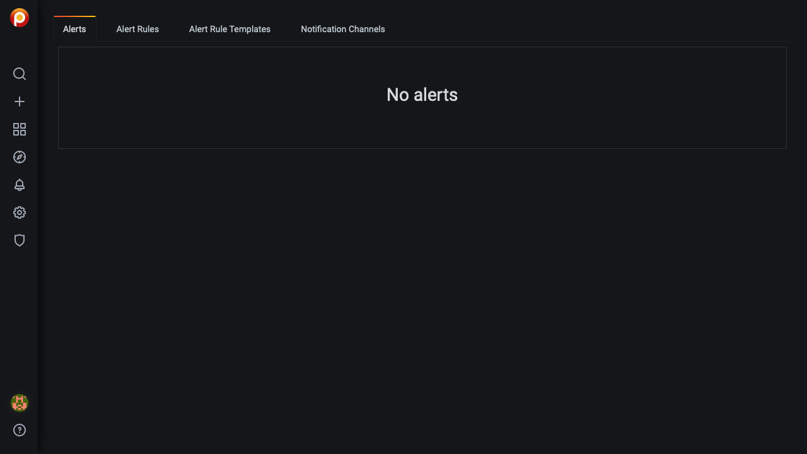
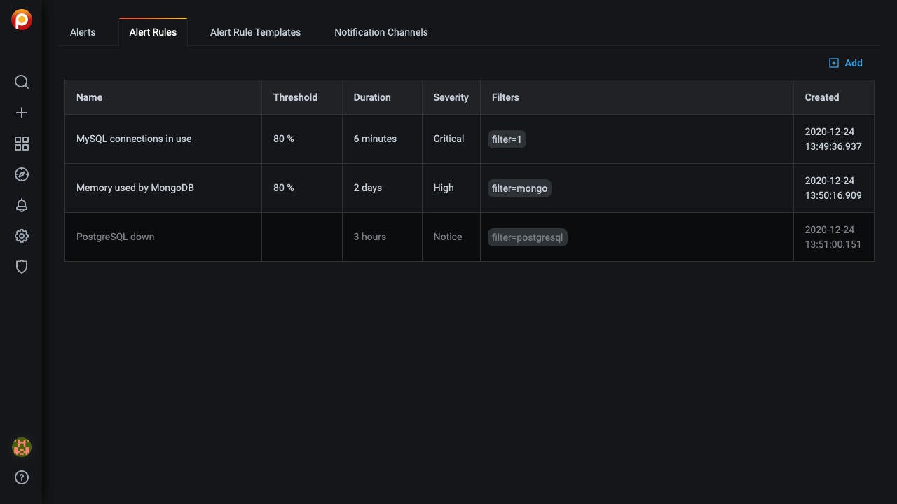
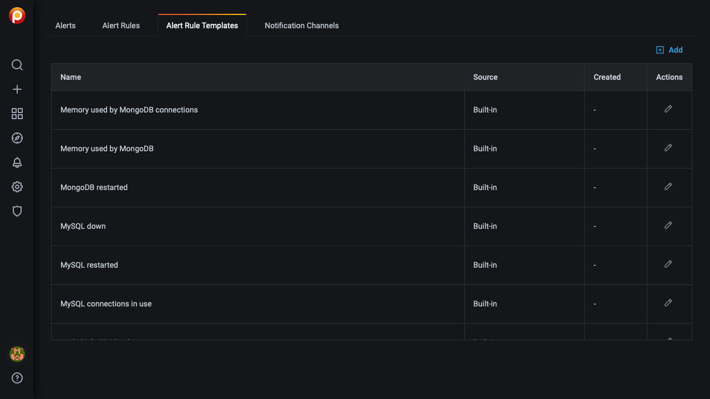
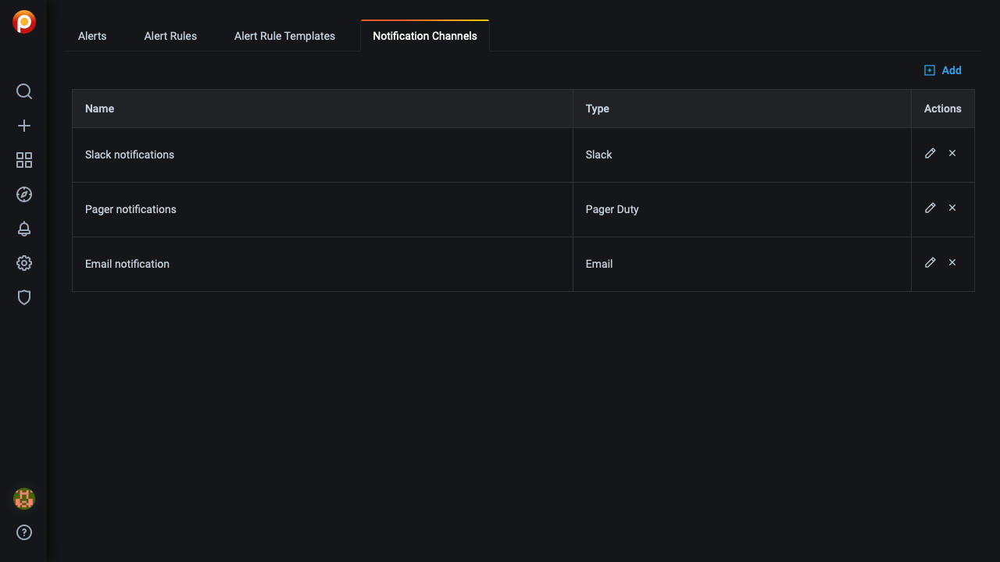
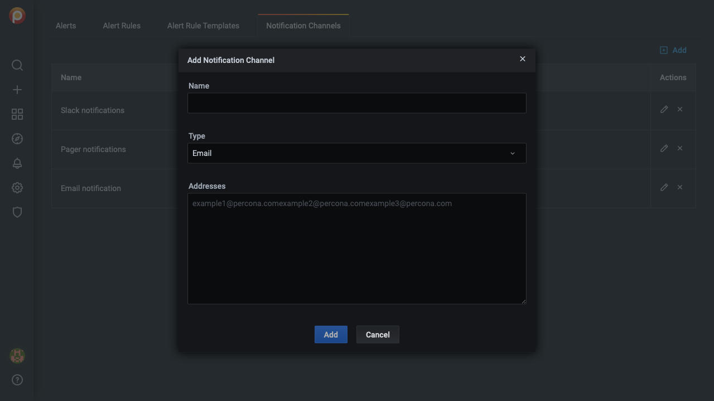
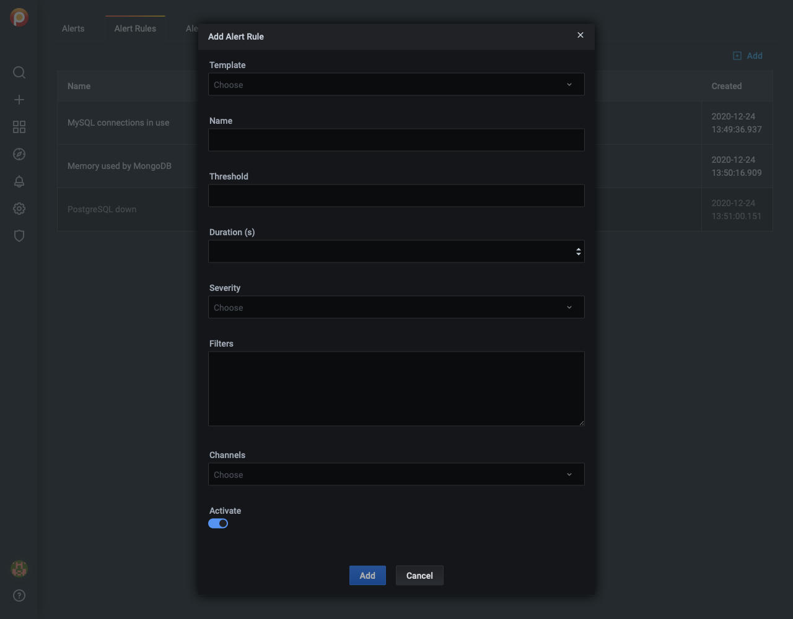
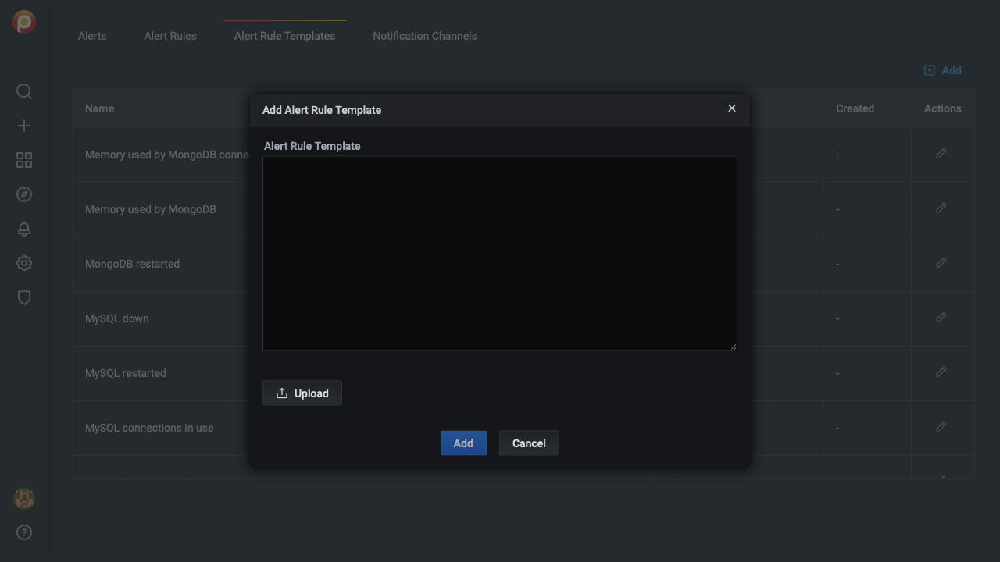

# Integrated Alerting

*Integrated Alerting* lets you know when certain system events occur.

!!! alert alert-warning "Warning"
    Integrated alerting is a technical preview and is subject to change.

---

[TOC]

---

## Definitions

- Alerts are generated when their criteria (*alert rules*) are met; an *alert* is the result of an *alert rule* expression evaluating to *true*.
- Alert rules are based on *alert rule templates*. We provide a default set of templates. You can also create your own.

!!! alert alert-info "Note"
    PMM's *Integrated Alerting* is a customized and separate instance of the Prometheus Alertmanager, and distinct from Grafana's alerting functionality.

## Prerequisites

- Activate *Integrated Alerting*: Select *PMM-->PMM Settings-->Advanced Settings*, turn on *Integrated Alerting* and click *Apply changes*.

- Set up a communication channel: When the *Communication* tab appears, select it. Enter details for *Email* or *Slack*. ([Read more](../how-to/configure.md#advanced-settings))

## Open the *Integrated Alerting* page

- From the left menu, select {{ icon.bell }} *Alerting*, {{ icon.listul }} *Integrated Alerting*

!!! alert alert-info "Note"
    The *Alerting* menu also lists {{ icon.listul }} *Alert Rules* and {{ icon.commentshare }} *Notification Channels*. These are for Grafana's alerting functionality.

This page has four tabs.

1. *Alerts*: Shows alerts (if any).

    

2. *Alert Rules*: Shows rule definitions.

    

3. *Alert Rule Templates*: Lists rule templates.

    

4. *Notification Channels*: Lists notification channels.

    

## Add a Notification Channel

1. On the *Integrated Alerting* page, go to the *Notification Channels* tab.

2. Click {{ icon.plussquare }} *Add*.

3. Fill in the details:

    

    - Name
    - Type
        - Email:
            - Addresses
        - Pager Duty
            - Routing key
            - Service key
        - Slack
            - Channel

4. Click *Add* to add the notification channel, or *Cancel* to abort the operation.

## Add an Alert Rule

1. On the *Integrated Alerting* page, go to the *Alert Rules* tab.

2. Click {{ icon.plussquare }} *Add*.

3. Fill in the details

    

    - Template
    - Name
    - Threshold
    - Duration(s)
    - Severity
    - Filters
    - Channels
    - Activate

4. Click *Add* to add the alert rule, or *Cancel* to abort the operation.

## Add an Alert Rule Template

1. On the *Integrated Alerting* page, go to the *Alert Rule Templates* tab.

2. Click {{ icon.plussquare }} *Add*.

3. Enter a template in the *Alert Rule Template* text box.

    

4. Click *Add* to add the alert rule template, or *Cancel* to abort the operation.
