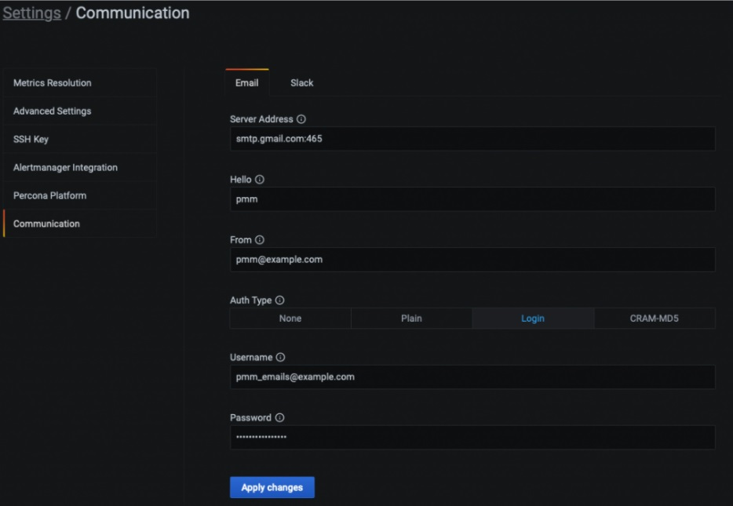

# Integrated Alerting

!!! caution alert alert-warning "Disclaimer"
    Integrated Alerting is currently in [Technical Preview](../details/glossary.md#technical-preview). This means that this feature is still under development and is subject to change. Therefore, we recommend that early adopters use Integrated Alerting for testing purposes only.

Alerting notifies of important or unusual activity in your database environments so that you can identify and resolve problems quickly.

In PMM, you define what system metrics are critical for your environment and what thresholds are acceptable for each metric. When something needs your attention, PMM automatically sends you an alert through your specified communication channel.

The following three basic components define the alerting workflow:

- **Alert template**: provides the framework for the alert rules. PMM includes a set of default templates with common events and expressions for alerting. If you need custom expressions on which to base your alert rules, create your own templates instead.
- **Alert rule**: describes the circumstances under which you want to be alerted.
- **Alert communication channel**: specifies how PMM should deliver alerts.


## Prerequisites

Before creating alert rules:

1. Enable Integrated Alerting.
2. Set up an Email (SMTP) or Slack sender settings for receiving alerts.
3. Specify the Email/Slack/Webhooks/PagerDuty settings and channels to notify.


### Enable Integrated Alerting

1. Select **Configuration > Settings > Advanced Settings**.
2. Under **Technical preview** features, turn on Integrated Alerting.
3. Click **Apply changes**. This adds a new **Communication** tab to the **Settings** menu.

### Set up a communication channel
Set up a communication channel to configure how alerts will be delivered. The following notification channels are supported: email via your SMTP server, Slack, PagerDuty, and Webhook.

To set up a communication channel:

1. Open the new **Communication** tab under **Configuration > Settings**.
2. Choose whether you want to configure the settings for **Email** or **Slack** sender channel. Webhook and PagerDury can be configured when adding the notification channel.
    - For **Email**, fill in the details of your SMTP email server. Enforce TLS encryption if your SMTP server requires this, then click **Test** to confirm that you can connect to the SMTP server with the current settings.
    - For **Slack**, specify the Slack Webhook URL to use. Currently, you can only configure one Slack channel for each Slack URL.
3. Click **Apply changes** to save your settings.
4. From the left menu, select **Alerting > Integrated Alerting > Alerts**. This tab lists all the alerts generated by your alert rules.

**Example**

The screenshot below shows how to configure email notifications through Gmail.
If you’re using Two-Factor Authentication, first set up a [Google App Password](https://www.google.com/url?q=https://support.google.com/accounts/answer/185833?hl%3Den&sa=D&source=docs&ust=1645452547572745&usg=AOvVaw0Ri4SS1RCdbkvGIM7AwRQz) for the account you want to use. You can then use those credentials to fill out the **Communication** form:



### Add a Notification Channel
A notification channel is a specific instance of a communication channel. For example, for Email, the communication channel defines a server, while the notification channel specifies the email addresses where to send alerts sent via the email server.

To add a notification channel:

1. Go to **Alerting > Integrated Alerting** and select the **Notification Channels** tab.
2. Click **Add** and fill in the details for your required channel.
3. Click **Add** to add the notification channel.

## About alert templates
Alerts templates are YAML files that provide the source framework for alert rules.
Alert templates contain general template details and an alert expression defined in [MetricsQL](https://docs.victoriametrics.com/MetricsQL.html). This query language is backward compatible with Prometheus QL.

Starting with PMM 2.26.0, alert rules are no longer dependent on their source rule template after creation. This means that you can update or delete rule templates without impacting existing rules that are based on that template.

## Create custom templates

If none of the default PMM templates contain a relevant expression for the alert rule that you need, you can create a custom template instead.

You can base multiple alert rules on the same template. For example, you can create a **pmm_node_high_cpu_load** template that can be used as the source for alert rules for production versus staging, warning versus critical, etc.

### Template format
When creating custom templates, make sure to use the required template format below:

- **name** (required field): uniquely identifies template. Spaces and special characters are not allowed.
- **version** (required): defines the template format version.
- **summary** (required field): a template description.
- **expr** (required field): a MetricsQL query string with parameter placeholders.
- **params**: contains parameter definitions required for the query. Each parameter has a name, type, and summary. It also may have a unit, available range, and default value.
    - **name** (required): the name of the parameter. Spaces and special characters are not allowed.
    - **summary** (required): a short description of what this parameter represents.
    - **unit** (optional): PMM currently supports either s (seconds) or % (percentage).
    - **type** (required):PMM currently supports the float type. string, bool, and other types will be available in a future release.
    - **range** (optional): defines the boundaries for the value of a  float parameter.
   - **value** (optional): default  parameter value. Value strings must not include any of these special characters: < > ! @ # $ % ^ & * ( ) _ / \ ' + - = (space)
- **for** (required): specifies the duration of time that the expression must be met before the alert will be fired.
- **severity** (required): specifies default alert severity level.
 - **labels** (optional): are additional labels to be added to generated alerts.
- **annotations** (optional): are additional annotations to be added to generated alerts.

### Template example

```yaml

---
templates:
 - name: pmm_mongodb_high_memory_usage
   version: 1
   summary: Memory used by MongoDB
   expr: |-
      sum by (node_name) (mongodb_ss_mem_resident * 1024 * 1024)
      / on (node_name) (node_memory_MemTotal_bytes)
       * 100
       > [[ .threshold ]]
   params:
     - name: threshold
       summary: A percentage from configured maximum
       unit: "%"
       type: float
       range: [0, 100]
       value: 80
   for: 5m
   severity: warning
   labels:
      custom_label: demo
   annotations:
      summary: MongoDB high memory usage ({{ $labels.service_name }})
      description: |-
         {{ $value }}% of memory (more than [[ .threshold ]]%) is used
         by {{ $labels.service_name }} on {{ $labels.node_name }}.

```

## Test alert expressions
If you want to create custom templates, you can test the MetricsQ expressions for your custom template in the **Explore** section of PMM. Here you can also query any PMM internal database.

To test expressions for custom templates:

1. On the left menu of PMM, choose **Explore > Metrics**.
2. Enter your expression in the **Metrics** field and click **Run query**.

For example, to validate that a MongoDB instance is down, shut down a member of a three-node replica set, then check that the following expression returns **0** in **Explore > Metrics**:

```sh
{service_type="mongodb"}
```

## Template compatibility
### With previous PMM versions
PMM 2.26 introduced significant changes to the core structure of rule templates. As a result, alert rules and templates created in previous PMM versions are incompatible with PMM 2.26.0 and cannot be migrated to this new version.

If you’re migrating from PMM 2.25 and earlier, make sure to manually recreate any custom alert rules and rule templates that you want to transfer to PMM 2.26.0 or later.

### With other alerting tools

If you have existing YAML alert templates that you want to leverage in PMM Integrated Alerting:

1. Go to **Alerting > Integrated Alerting > Alert Rule Templates** tab and click **Add** at the top right-hand side of the table.
2. Click **Add** and upload a local .yaml file from your computer.

## Add an Alert Rule
1. Go to **Alerting > Integrated Alerting** and select the **Alert Rules** tab.
2. Click **Add** on the right-hand side of the table.
3. In the **Add Alert** rule dialog, choose the template on which you want to base the new alert rule. This automatically populates the **Duration**, **Severity** fields with information from the template. You can change these values if you want to override the default specifications in the template.
4. In the **Filters** field, specify if you want the alert rule to apply only to specific services or nodes. For example: `service_name'`, Operator:`=(EQUAL)`, VALUE: `ps5.7`.
5. In the **Channels** field, select one or more notification channels that you have configured for sending out the notifications.

## Silence alerts
Silence alerts when you want to stop notifications from one or more alerting rules.

Silencing an alert only stops notifications from being sent to your specified notification channels.

Silenced alerts are still recorded under **Integrated Alerting > Alerts** so that you can review them later. A silenced alert is disabled until you reactivate the alert.


To silence alerts:

1. Click **Alerting** on the main menu.
2. Choose **Integrated Alerting > Alerts** and choose if you want to disable an individual alert or all alerts:
    - To silence an individual alert, scroll through the list of current alerts and click on the bell in the **Actions** column.
    - To silence all alerts, click **Silence All** at the top right side of the **Alerts** table.

To reactivate silenced alerts, click **Unsilence All** or click on the disabled bell icon <i class="uil uil-bell-slash"></i> corresponding to the alerts you want to reactivate.

## Alternative alerting options
PMM Integrated Alerting was introduced as an alternative to Grafana Alerting and Prometheus’ Alertmanager.

These third-party alerting tools continue to be available in PMM until Integrated Alerting moves from Technical Preview to General Availability.

We recommend already using Integrated Alerting since it offers a simpler alerting setup and provides more robust alerting options.
