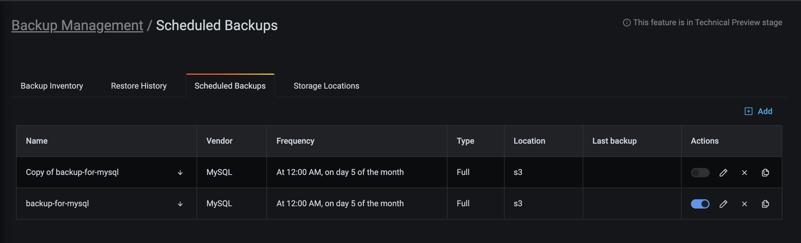
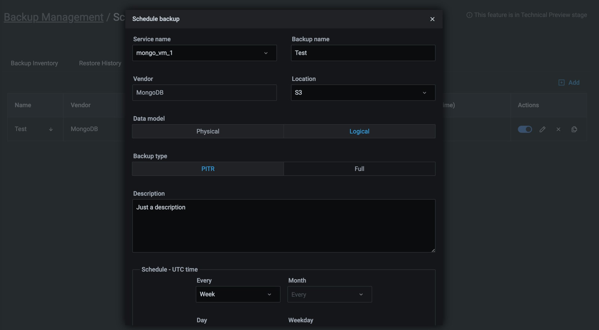
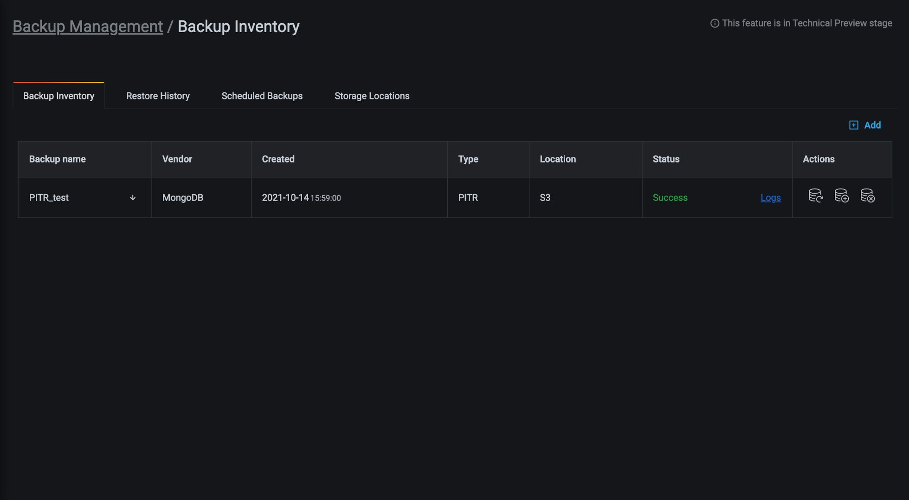

# Backup and restore

## Supported setups 

**- MongoDB replica set setups (GA) with support for:**

  -  Storing backups on Amazon S3-compatible object storageand on mounted filesystem
  -  Creating and restoring Logical snapshot backups
  -  Creating and restoring Physical snapshot backups. This is only available with Percona Server for MongoDB and requires post-restore actions.
  - Creating logical PITR backups both locally and on S3-compatible object storage. Restoring logical PITR backups from S3-compatible object storage.
  
   For a detalied overview of the supported setups for MongoDB, check out the [Support matrix](../using/mongodb_limitations.md).

**- MySQL database server (Technical Preview) with support for:**
    
  - Creating and restoring physical backups
  - Storing backups to Amazon S3-compatible object storage  


## Prerequisites

### Enable Backup Management
  1. Go to  <i class="uil uil-cog"></i> **Configuration > PMM Settings > Advanced Settings** and activate the **Backup Management** option. 
  2. Click **Apply changes**. This adds the <i class="uil uil-history"></i> Backup option on the side menu.

!!! caution alert alert-warning "Important"
    If PMM Server runs as a Docker container, enable backup features at container creation time by adding `-e ENABLE_BACKUP_MANAGEMENT=1` to your `docker run` command.


### Prepare a storage location
#### For local backups
If you prefer storing your backup artifacts on a remote filesystem, make sure that you have Write permissions on the path you define, and that you've mounted the remote folder to all the mongoDB nodes. 

For more information, see the [Percona Backup for MongoDB (PBM) documentation](https://www.google.com/url?q=https://docs.percona.com/percona-backup-mongodb/details/storage-configuration.html%23remote-filesystem-server-storage&sa=D&source=docs&ust=1667855380308508&usg=AOvVaw3B1N4tjh_mv8lt4msbf3Ui). 

#### For Amazon AWS S3-compatible backups
If you want to store backup artifacts in the cloud, make sure you have your Amazon S3 storage account and location details ready.
In addition to bucket location details, you will also need to ensure proper S3 permissions. 

The general minimum permissions are **LIST**/**PUT**/**GET**/**DELETE**. 
A sample IAM policy is:

        ```json
        {
            "Version": "2012-10-17",
            "Statement": [
                {
                    "Effect": "Allow",
                    "Action": [
                        "s3:ListBucket"
                    ],
                    "Resource": "arn:aws:s3:::pmm-backup-testing"
                },
                {
                    "Effect": "Allow",
                    "Action": [
                        "s3:PutObject",
                        "s3:PutObjectAcl",
                        "s3:GetObject",
                        "s3:GetObjectAcl",
                        "s3:DeleteObject"
                    ],
                    "Resource": "arn:aws:s3:::pmm-backup-testing/*"
                }
            ]
        }
        ```
   
### [Create a storage location](#create-a-storage-location)

1. Go to **Backup > Storage Locations**:
    

2. Click **Add storage location** and fill in a name and description for this new location.
3. Choose the type of storage location you are creating:
     - **S3**: Specify the Amazon AWS S3 backup location endpoint (URL), bucket name, and connection details. 
     - **Local Client**: specify the path on your local client for files to be backed up to.

4. Optionally, click **Test** to test the connection.

5. Click **Add** to create the location.


### MongoDB backup prerequistes

Before creating MongoDB backups, make sure that:

- [PMM Client](../setting-up/client/index.md) is installed and running at least on one node of replica set (the one which will be used for backup and restore jobs).
- [Percona Backup for MongoDB](https://docs.percona.com/percona-backup-mongodb/index.html) (PBM) is installed and `pbm-agent` is running on all MongoDB nodes in the replica set. PMM 2.32 and later require PBM 2.0.1 or newer.
- MongoDB is a member of a replica set.
- you set the [required permissions for creating and restoring MongoDB backups](/docs/setting-up/client/mongodb.md#create-pmm-account-and-set-permissions).
- you checked  [MongoDB supported configurations and limitations](mongodb_limitations.md).

### MySQL backup prerequisites

!!! caution alert alert-warning "Important"
    MySQL backup functionality is still Technical Preview
    
    
To be able to create MySQL backups, make sure that:

- [PMM Client](../setting-up/client/index.md) is installed and running on the node.

- For MySQL 8.0+, the user that pmm-agent uses to connect to MySQL must have the BACKUP_ADMIN privilege for Xtrabackup to work.

- There is only one MySQL instance running on the node.

- MySQL is running:

    - as a service via `systemd`;

    - with the name `mysql` or `mysqld` (to confirm, use `systemctl status mysql` or `systemctl status mysqld` respectively);

    - from a `mysql` system user account.

- There is a `mysql` system group.

- MySQL is using the `/var/lib/mysql` directory for database storage.

- `pmm-agent` has read/write permissions to the `/var/lib/mysql` directory.

- The latest versions of the following packages are installed. They should be included in the `$PATH` environment variable:

    - [`xtrabackup`][PERCONA_XTRABACKUP], which includes:

        - [`xbcloud`][PERCONA_XBCLOUD];

        - [`xbstream`][PERCONA_XBSTREAM];

    - [`qpress`][PERCONA_QPRESS].

!!! caution alert alert-warning "Important"
       The versions of each must be compatible with the installed version of MySQL.


## [Make a backup](#make-a-backup)

To create a backup:

1. Go to  <i class="uil uil-history"></i> **Backup > All Backups**.
2. Click <i class="uil uil-plus-square"></i> **Create Backup**.
3. Specify the type of backup that you want to create: **On Demand** or **Schedule Backup**.
4. Enter a unique name for this backup.
5. Choose the service to back up from the Service name drop-down menu. This automatically populates the **DB Technology** field.
6. Select whether you want to create a **Physical** or **Logical** backup of your data, depending on your use case and requirements. For MySQL, only the **Physical** data model is available.
7. Choose a storage location for the backup. MySQL currently only supports storing backups to Amazon S3. If no options are available here, see the [Create a storage location](#create-a-storage-location) section above.
8. If you're creating a schedule backups, also specify the backup type, the schedule, and a retention policy for your backup:
    - **Backup Type**: currently, PMM supports both **Full** and Point-in-type recovery **(PITR)** backup types for MongoDB. However, the PITR option is only available for the **Logical** data model. For MySQL, only the **Full** type is supported.
    - **Shedule**: configure the frequency and the start time for this backup. Make sure that the the schedule you specify here does not create overlapping jobs or overhead on the production environment. Also check that your specified shedule does not overlap with production hours.
    - **Retention**: this option is only available for Snapshot backups stored on Amazon S3. If you wand to keep an unlimited number of backup artifacts, type `0`.
9. Expand **Advanced Settings** to specify the settings for retrying the backup in case of any issues. You can either let PMM retry the backup again (**Auto**), or do it again yourself **Manual**. Auto retry mode enables you to select up to ten retries and an interval of up to eight hours between retries.
10. Click **Backup** to start creating the backup artifact or schedule a job.
11. Go to the **All Backups** tab, and check the **Status** column. An animated ellipsis indicator {{icon.bouncingellipsis}} shows that a backup is currently being created.

## Edit a scheduled backup

1. Go to **Backup > Scheduled Backup Jobs**.
2. In the **Actions** column:
    - Click the switch <i class="uil uil-toggle-on"></i> to enable or disable the backup.
    - Click  to edit, delete or create a (by default, disabled) copy of the backup schedule.

 

## MongoDB Point-In-Time-Recoverable Backups (PITR)

Point-in-Time Recovery restores databases up to a specific moment. PITR includes restoring the data from a backup snapshot and replaying all events that occurred to this data up to a specified moment from [oplog slices].

Point-in-Time Recovery helps you prevent data loss during a disaster such as crashed database, accidental data deletion or drop of tables, unwanted update of multiple fields instead of a single one.

### Compatibility with Percona Backup for MongoDB
PMM introduced the option to create PITR Backups for MongoDB in version 2.23, as part of the larger Backup Management feature. This implementation in PMM uses Percona Backup for MongoDB (pbm) behind the scenes. 

Percona Backup for MongoDB is a distributed, low-impact solution for achieving consistent backups of MongoDB sharded clusters and replica sets.

Starting with PMM 2.32, restoring PITR backups is available for backups based on pbm ≤ 2.0.1. To  restore PITR backups, make sure you have pbm ≥ 2.0.1 installed.

 Percona Backup for MongoDB supports [Percona Server for MongoDB](https://www.percona.com/software/mongodb/percona-server-for-mongodb) and MongoDB Community ≤ 3.6, with [MongoDB Replication](https://docs.mongodb.com/manual/replication/) enabled. For more information, see the [Percona Backup for MongoDB documentation](https://docs.percona.com/percona-backup-mongodb/installation.html).

### How does it work?

To create a PITR backup, select the **PITR** backup type option when creating scheduled backup for MongoDB. See the [Make a backup](#make-a-backup) section above.




#### PITR artifacts

The PITR oplog is available a few minutes (10 by default) after your PITR job has run for the first time. To see the corresponding PITR artifact, check out the list under **Backup > All Backups**.



#### PITR and other scheduled backups

Make sure to disable any other scheduled backup jobs before creating a PITR backup. PMM displays an error message if you try to enable PITR while other scheduled backup jobs are active:


This constraint applies at the service-level. You can still have PITR enabled for one service while having regular scheduled backup jobs for other services.

## Restore a backup

### Restore compatibility
MySQL backups can be restored to the same service it was created from, or to a compatible one. MongoDB backups can only be restored to the same service they were created from.

To restore a backup:

1. Go to <i class="uil uil-history"></i> **Backup > All backups** and find the backup that you want to restore.
2. Click the arrow in the **Actions** column to check all the information for the backup, then click  **> Restore from backup**.
3. In the **Restore from backup** dialog, select **Same service** to restore to a service with identical properties or **Compatible services** to restore to a compatible service.
4. Select one of the available service names from the drop-down menu.
5. If you are restoring a PITR backujp, also  select the point for the date and time that you want to restore the database to.
6. Check the values, then click **Restore**.
7. Go to the **Restores** tab to check the status of the restored backup.
During restoring, PMM disables all the scheduled backup tasks for the current service. Remember to re-enable them manually after the restore.

### Post-restore requirements for MongoDB
Restoring from a physical backup will cause all **mongo** and **pbm-agent** instances to shut down. To bring them back up:

1. Restart all **mongod** (and **mongos** if present) nodes.
2. Restart all **pbm-agents**.

## Delete a backup
You can only delete backup artifacts stored on Amazon S3. Local backups must be removed manually.

To delete a backup:

1. Go to  <i class="uil uil-history"></i> **Backup > All Backups** and find the row with the backup you want to delete.
2. Click the arrow in the **Actions** column to check all the information for the backup, then click  **> Delete backup**.
3. In the Delete backup artifact dialog box, enable **Delete from storage** if you also want to delete the actual backup content besides just the backup register.
4. Click **Delete**.

### Resources
- [Amazon AWS S3](https://aws.amazon.com/s3/)
- [Percona Backup for MongoDB](https://www.percona.com/doc/percona-backup-mongodb/installation.html)
- [PERCONA_QPRESS](https://www.percona.com/doc/percona-xtrabackup/LATEST/backup_scenarios/compressed_backup.html)
- [PERCONA_XBCLOUD](https://www.percona.com/doc/percona-xtrabackup/2.3/xbcloud/xbcloud.html)
- [PERCONA_XBSTREAM](https://www.percona.com/doc/percona-xtrabackup/2.3/xbstream/xbstream.html)
- [PERCONA_XTRABACKUP](https://www.percona.com/software/mysql-database/percona-xtrabackup)
- [oplog slices](https://www.percona.com/doc/percona-backup-mongodb/glossary.html#term-oplog-slice)
- [Percona Server for MongoDB](https://www.percona.com/software/mongo-database/percona-server-for-mongodb)
- [MongoDB Replication](https://docs.mongodb.com/manual/replication/)
