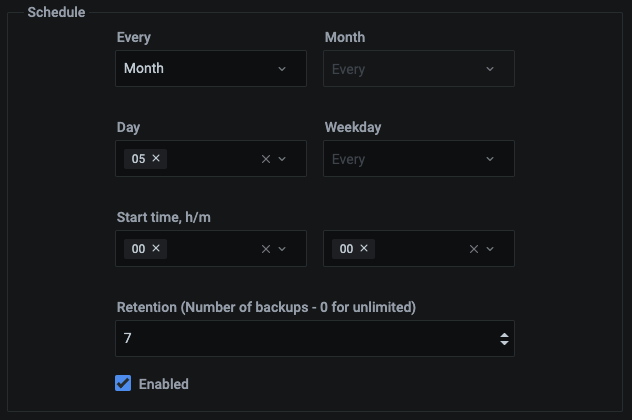

# Backup and Restore

!!! caution alert alert-warning "Caution"
    - Backup and restore are [technical preview](../details/glossary.md#technical-preview) features.
    - Currently supported: MySQL database server or MongoDB replica set cluster, backing up to Amazon AWS S3 storage locations.

!!! summary alert alert-info "Summary"
    - [Enable backup features](#before-you-start).
    - [Add a storage location].
    - Satisfy preconditions:
        - For [MySQL](#mysql-backup-preconditions):
            - Confirm instance service parameters and storage location.
            - Install required packages.
        - For [MongoDB](#mongodb-backup-preconditions):
            - Install and run [Percona Backup for MongoDB] on every node in the replica set.
    - [Make a backup](#make-a-backup), or,
    - [Make](#make-a-scheduled-backup) or [edit](#edit-a-scheduled-backup) a scheduled backup, or,
    - [Restore a backup](#restore-a-backup).

## Before you start

- You have an AWS S3 storage account and location details for it.

- Backup management has been enabled:

    1. Select <i class="uil uil-cog"></i> *Configuration* → <i class="uil uil-setting"></i> *Settings* → *Advanced Settings*.

    1. Activate *Backup Management*.

    1. Click *Apply changes*.

    !!! note alert alert-primary ""
        If PMM Server runs as a Docker container, enable backup features at container creation time by adding `-e ENABLE_BACKUP_MANAGEMENT=1` to your `docker run` command.

## Add a storage location

1. Select <i class="uil uil-history"></i> → *Backup*.

1. Select *Storage locations*.

    

1. Click *Add*.

1. Fill in the form fields.

    

    - *Name*: A short name for this location.
    - *Description*: A long description for this location.
    - *Type*: Choose the type of storage:
        - *S3*: Use [Amazon AWS S3]
            - *Endpoint*: The S3 backup location endpoint (URL).
            - *Bucket Name*: The bucket name.
            - *Access Key*: The access key string.
            - *Secret Key*: The secret key string. (Click <i class="uil uil-eye"></i> to reveal and <i class="uil uil-eye-slash"></i> to hide again.)
        - *Local Client:* (Not currently implemented)
        - *Local Server:* (Not currently implemented)

1. (Optional) Click *Test* to test the connection.

1. Click *Add* to add the location.

## MySQL backup preconditions

- [PMM Client](../setting-up/client/index.md) is installed and running on the node.

- There is only one MySQL instance running on the node.

- MySQL is running:

    - as a service via `systemd`;

    - with the name `mysql` (to confirm, use `systemctl status mysql`);

    - from a `mysql` system user account.

- There is a `mysql` system group.

- MySQL is using the `/var/lib/mysql` directory for database storage.

- `pmm-agent` has read/write permissions to the `/var/lib/mysql` directory.

- The following packages are installed. They should be included in the `$PATH` environment variable:

    - [`xtrabackup`][PERCONA_XTRABACKUP], which includes:

        - [`xbcloud`][PERCONA_XBCLOUD];

        - [`xbstream`][PERCONA_XBSTREAM];

    - [`qpress`][PERCONA_QPRESS].

    !!! caution alert alert-warning "Important"
        The versions of each must be compatible with the installed version of MySQL.

## MongoDB backup preconditions

- [Percona Backup for MongoDB] is installed and `pbm-agent` is running on all MongoDB nodes in the replica set.

- MongoDB is a member of a replica set.

## Make a backup

Make a single on-demand backup.

1. [Add a storage location].

1. Select <i class="uil uil-history"></i> → *Backup*.

1. Select *Backup Inventory*.

1. Click <i class="uil uil-plus-square"></i> *Add*.

1. In the *Backup on demand* dialog, enter values for:

    - *Service name*: Choose from the menu the service to back up.
    - *Vendor*: A value is automatically selected based on the service type.
    - *Backup name*: Enter a unique name for this backup.
    - *Description*: (Optional) Enter a long description for this backup.
    - *Location*: Choose from the menu the storage location.

1. Click *Backup*.

1. In the *Backup Inventory* pane, watch the *Status* column.

## Make a scheduled backup

Make regular scheduled backups.

1. [Add a storage location].

1. Select <i class="uil uil-history"></i> → *Backup*.

1. Select *Scheduled Backups*.

1. Click <i class="uil uil-plus-square"></i> *Add*.

1. In the *Schedule backup* dialog, enter values for:

    - *Service name*: Choose from the menu the service to back up.
    - *Backup name* : Enter a unique name for this scheduled backup.
    - *Vendor*: A value is automatically selected based on the service type.
    - *Location*: Choose from the menu the storage location.
    - *Data model*: Select one of the options:
        - *Physical*: Backup the physical data model.
        - *Logical*: (Not currently implemented)
    - *Description*: (Optional) Enter a long description for this scheduled backup.
    - *Schedule*: The schedule for the backup.
        - *Every*: The backup interval. Choose from the menu one of:
            - *Year*
            - *Month*
            - *Week*
            - *Day*
            - *Hour*
            - *Minute*
        - Depending on the interval chosen, the remaining options will be active or inactive.
            - *Month*: Select one or more months.
            - *Day*: Select one or more day numbers.
            - *Weekday*: Select one or more week day names.
            - *Start time, h/m*: The hour and minute for the backup.
                - In the first field, select one or more hours (*00* to *23*, *00* is midnight).
                - In the second field, select one or more minutes (*00* to *59*).
        - *Enable*: Deselect to define the scheduled backup without enabling it.

        

        !!! note ""
            For this release ({{release}}), times are UTC.

1. Click *Schedule*.

1. A new entry will appear in the list.

## Edit a scheduled backup

1. Select <i class="uil uil-history"></i> → *Backup*.

1. Select *Scheduled Backups*.

1. In the *Actions* column:
    - Click the switch <i class="uil uil-toggle-on"></i> to enable or disable the backup.
    - Click <i class="uil uil-pen"></i> to edit the backup schedule.
    - Click <i class="uil uil-times"></i> to delete the backup schedule.
    - Click <i class="uil uil-copy"></i> to create a (by default, disabled) copy of the backup schedule.

        

## Restore a backup

!!! note alert alert-primary ""
    For now, you can only restore a backup to the same service it was created from. I.e. a MySQL backup of service `mysql-service-1` can only be restored to a MySQL database server registered with the same service name. Future releases will give more flexibility to restore backups to other service types.

1. Select <i class="uil uil-history"></i> → *Backup* → *Backup Inventory*.

1. Find the row with the backup you want to restore.

1. In the *Actions* column for that row, click *Restore from backup*.

1. In the *Restore from backup* dialog, check the values and click *Restore*.

1. Navigate to the *Restore History* tab to check the status of the restored backup.

[Amazon AWS S3]: https://aws.amazon.com/s3/
[Percona Backup for MongoDB]: https://www.percona.com/doc/percona-backup-mongodb/installation.html
[PERCONA_QPRESS]: https://www.percona.com/doc/percona-xtrabackup/LATEST/backup_scenarios/compressed_backup.html
[PERCONA_XBCLOUD]: https://www.percona.com/doc/percona-xtrabackup/2.3/xbcloud/xbcloud.html
[PERCONA_XBSTREAM]: https://www.percona.com/doc/percona-xtrabackup/2.3/xbstream/xbstream.html
[PERCONA_XTRABACKUP]: https://www.percona.com/software/mysql-database/percona-xtrabackup
[Add a storage location]: #add-a-storage-location