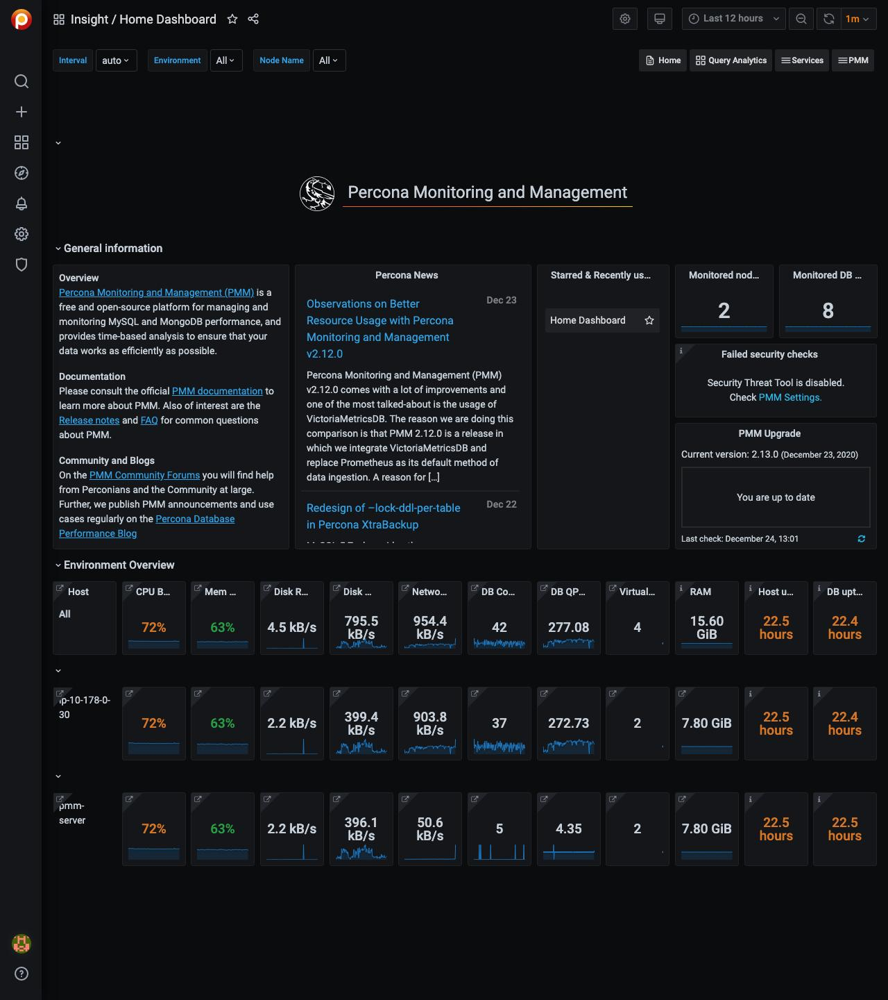
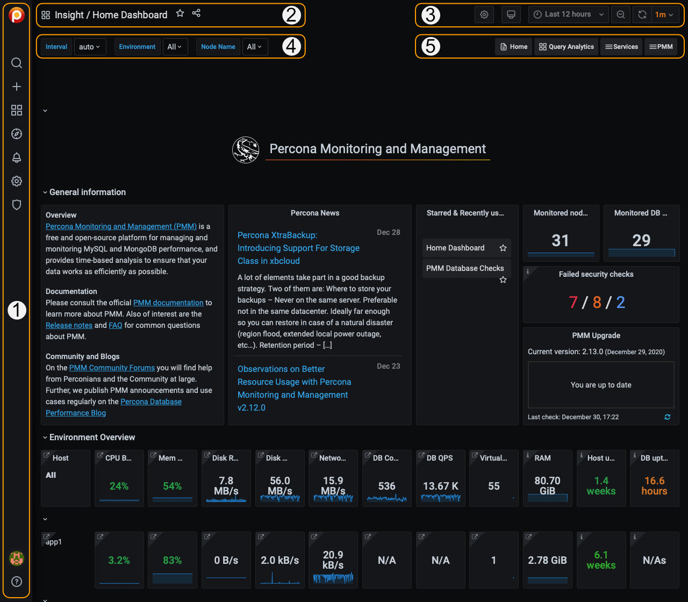

# User Interface

PMM's user interface is a browser application based on [Grafana][Grafana]. This page explains how to log in, how the user interface is laid out, and what the controls do.

[Grafana]: https://grafana.com/docs/grafana/latest/

## Logging in

1. Start a web browser and in the address bar enter the server name or IP address of the PMM server host.
2. The page loads showing the PMM login screen.

    

3. Enter the username and password given to you by your system administrator. The defaults are:
    - Username: `admin`
    - Password: `admin`
4. Click *Log in*
5. If this is your first time logging in, you'll be asked to set a new password. (We recommend you do.) Enter a new password in both fields and click *Submit*. You can click *Skip* to carry on with the default password.
6. The PMM Home dashboard loads.

    

## Dashboards

The interface is a collection of web pages called *dashboards*.

Dashboards are grouped into *folders*. You can customize these, by renaming them or creating new ones.

The area inside dashboards is populated by *panels*. Some are in collapsible panel groups. A panel can show a value, a graph, a chart, or a visual representation of a set.

## Controls

These menus and controls appear on all dashboards:

1. Main menu  (also *Grafana menu*, *side menu*)
2. Navigation bar
3. View controls
4. View selectors (dynamic contents)
5. Shortcut menu (dynamic contents)

(For details see [UI Components](../details/interface.md).)

## Navigation

**Search for a dashboard by name**

There are two ways to open the dashboard search page. (Each takes you to the same search screen.)

- Click the {{icon.search}} icon in the main menu.
- Click the dashboard name in the navigation bar (top row, to the right of the {{icon.apps}} icon). (To search within the current folder, click the folder name instead of the dashboard name.)

1. Click *Search dashboards by name* and begin typing any part of the dashboard name (in this example, "*Instances*").
    

2. Click one of the search results to go to that dashboard. Change the search text to refine the list.

3. To abandon the search, click the {{icon.times}} icon at the end of the search bar.

**Open a dashboard with the menu**

In the [main menu](../details/interface.md#main-menu), the {{ icon.dashboard }} *PMM Dashboards* icon reveals a submenu containing links to all PMM dashboards grouped by service type. (This menu will eventually replace the [shortcut menu](../details/interface.md#shortcut-menu) which has links to commonly-used dashboards.

## Panels

Charts, graphs and set-based panels reveal extra information when the mouse is moved over them.

Some panels have an information icon {{icon.info}} in the top left corner. Mouse over this to reveal panel information.

### Panel menu

At the top of each panel and to the right of the panel name is the *panel menu*.

> **Tip** The menu is hidden until you mouse over it. Look for the {{icon.angledown}} symbol in the title bar of a panel.

| Item                          | Description                                                                         |
|:-----------------------------:| ----------------------------------------------------------------------------------- |
| {{icon.eye}} View             | Open the panel in full window mode                                                  |
| {{icon.share}} Share          | [Render the panel's image for sharing](#rendering-dashboard-images)                 |
| {{icon.compass}} Explore      | Run [PromQL](https://prometheus.io/docs/prometheus/latest/querying/basics/) queries |
| {{icon.infocircle}} Inspect   | See the panel's data or definition                                                  |
| {{icon.cube}} More            | (Only charts and graphs) Additional options                                         |

#### View

The *View* menu items opens panels in full-window mode. This is useful for graphs with several metrics.

Exit a panel's full window mode by pressing *Escape* or clicking the left arrow {{icon.arrowleft}} next to the dashboard name.

> **See also**
>
> - [How to render dashboard images](../how-to/render-dashboard-images.md)
>
> - [How to annotate special events](../how-to/annotate.md)
