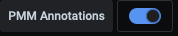

# User Interface

PMM's user interface is a browser application based on Grafana.

---

[TOC]

---

## Dashboards

The interface is a collection of web pages called *dashboards*.

Dashboards are grouped into *folders*. You can customize these, renaming them or creating new ones.

The area inside dashboards is populated by *panels*, many of which are in collapsible panel groups. A panel can show a value, a graph, a chart, or a visual representation of a set.

## Logging in

1. Start a web browser and enter the server name or IP address of the PMM server host.

    

2. Enter the username and password given to you by your system administrator.

    The defaults are:

    - Username: `admin`
    - Password: `admin`

3. Click *Log in*

4. If this is your first time logging in, you'll be asked to set a new password. (We recommend you do.) Enter a new password in both fields and click *Submit*.

5. If you wish, you can click *Skip* and continue using the default password.

6. The PMM Home dashboard loads.

    

## User interface controls: Common

### Top row menu bar


| Items (left)                  | Description               |
| ----------------------------- | ------------------------- |
| {{icon.apps}}                 | (Display only)            |
| (Name) /                      | (Optional) Folder name    |
| (Name)                        | Dashboard name            |
| {{icon.star}}                 | Mark as favorite          |
| {{icon.share}}                | Share dashboard           |
|                               |                           |

| Items (right)                 | Description               |
| ----------------------------- | ------------------------- |
| {{icon.cog}}                  | Dashboard settings        |
| {{icon.monitor}}              | Cycle view mode           |
| {{icon.clock9}} (time range)  | Time range selector       |
| {{icon.searchminus}}          | Time range zoom out       |
| {{icon.sync}}                 | Refresh dashboard         |
| (Time interval)               | Refresh period            |

### Second row menu bar

This menu bar is context sensitive; it changes according to the page you are on.

The items are grouped left and right. (With wide menus on small screens, items may wrap to the next row.)

- Left: Filters and controls for the viewed data
- Right: Links to other dashboards


#### Left group items

| Items                         | Description                      |
| ----------------------------- | -------------------------------- |
| Interval                      | Data interval                    |
| Region                        | Filter by region                 |
| Environment                   | Filter by environment            |
| Cluster                       | Filter by cluster                |
| Replication Set               | Filter by replication set        |
| Node Name                     | Filter by node name              |
| Service Name                  | Filter by service name           |
| PMM Annotations               | View [annotations](#annotations) |

#### Right group items

| Items                         | Description                      |
| ----------------------------- | -------------------------------- |
| {{icon.filealt}} Home         | Home dashboard                   |
| {{icon.apps}} Query Analytics | Query Analytics                  |
| {{icon.bolt}} Compare         | Nodes compare                    |
| (Service Type)                | Service type menu (see below)    |
| {{icon.bars}} HA              | HA dashboards                    |
| {{icon.bars}} Services        | Services menu                    |
| {{icon.bars}} PMM             | PMM menu                         |

!!! alert alert-info "Note"
    The *Compare* menu links to the Instances Overview dashboard for the current service type.

##### Services menu

The *Services* menu choice determines the Service Type menu.

| Menu      | Items                          | Service type menu        | Description           |
| --------- | ------------------------------ | ------------------------ | --------------------- |
| Services  |                                |                          |                       |
|           | MongoDB Instances Overview     | {{icon.bars}} MongoDB    | MongoDB dashboards    |
|           | MySQL Instances Overview       | {{icon.bars}} MySQL      | MySQL dashboards      |
|           | Nodes Overview                 | {{icon.bars}} OS         | OS dashboards         |
|           | PostgreSQL Instances Overview  | {{icon.bars}} PostgreSQL | PostgreSQL dashboards |

##### PMM menu

This item lists shortcuts to utility pages.

| Menu           | Items                           |
| -------------- | ------------------------------- |
| PMM            |                                 |
|                | PMM Add Instance                |
|                | PMM Database Checks             |
|                | PMM Inventory                   |
|                | PMM Settings                    |

### Vertical menu bar (left)

The vertical menu bar (left) is part of the Grafana framework and is visible on every page.


| Items (Top)              | Name                 |
| ------------------------ | -------------------- |
| {{icon.percona}}         | Home                 |
| {{icon.search}}          | Search               |
| {{icon.plus}}            | Create               |
| {{icon.apps}}            | Dashboards           |
| {{icon.compass}}         | Explore              |
| {{icon.bell}}            | Alerting             |
| {{icon.cog}}             | Configuration        |
| {{icon.shield}}          | Server Admin         |
| {{icon.database}}        | DBaaS                |

!!! alert alert-info "Note"
    The DBaaS icon appears only if a server feature flag has been set.

| Icons (Bottom)           | Description          |
|:------------------------:| ---------            |
| (Profile icon)           | User menu            |
| {{icon.questioncircle}}  | Help                 |


## Navigation

There are several ways to open a dashboard.

### By name

1. Click the dashboard name (to the right of the {{icon.apps}} icon)

2. A search field appears labeled *Search dashboards by name*
    

3. Click it and begin typing any part of the dashboard name (in this example, "*Instances*")
    

4. Click one of the search results to go to that dashboard

5. To abandon the search, click the {{icon.times}} icon at the end of the search bar


!!! alert alert-success "Tip"
    To search within the current folder, click the folder's name.

### By menu

Use the second row main menu. (See [Second row menu bar](#second-row-menu-bar).)


## Panels

Charts, graphs and set-based panels reveal additional information when the mouse is moved over them.

Some panels have an information icon {{icon.info}} in the top left corner. Mouse over this to reveal panel information.

### Panel menu

At the top of each panel and to the right of the panel name is the *panel menu*.


!!! alert alert-success "Tip"
    The presence of the menu is hidden until you mouse over it. Look for the {{icon.angledown}} symbol in the title bar of a panel.


| Item                          | Description                                                                         |
| ----------------------------- | ----------------------------------------------------------------------------------- |
| {{icon.eye}} View             | Open the panel in full window mode                                                  |
| {{icon.share}} Share          | [Render the panel's image for sharing](#rendering-dashboard-images)                 |
| {{icon.compass}} Explore      | Run [PromQL](https://prometheus.io/docs/prometheus/latest/querying/basics/) queries |
| {{icon.infocircle}} Inspect   | See the panel's data or definition                                                  |
| {{icon.cube}} More            | (Only charts and graphs) Additional options                                         |

#### View

The *View* menu items opens panels in full-window mode. This is useful for graphs with several metrics.

Exit a panel's full window mode by pressing *Escape* or clicking the left arrow {{icon.arrowleft}} next to the dashboard name.


## Rendering dashboard images

PMM Server can't currently directly render dashboard images exported by Grafana without these additional set-up steps.

**Part 1: Install dependencies**

1. Connect to your PMM Server Docker container.

    ```sh
    docker exec -it pmm-server bash
    ```

2. Install Grafana plugins.

    ```sh
    grafana-cli plugins install grafana-image-renderer
    ```

3. Restart Grafana.

    ```sh
    supervisorctl restart grafana
    ```

4. Install additional libraries.

    ```sh
    yum install -y libXcomposite libXdamage libXtst cups libXScrnSaver pango \
    atk adwaita-cursor-theme adwaita-icon-theme at at-spi2-atk at-spi2-core \
    cairo-gobject colord-libs dconf desktop-file-utils ed emacs-filesystem \
    gdk-pixbuf2 glib-networking gnutls gsettings-desktop-schemas \
    gtk-update-icon-cache gtk3 hicolor-icon-theme jasper-libs json-glib \
    libappindicator-gtk3 libdbusmenu libdbusmenu-gtk3 libepoxy \
    liberation-fonts liberation-narrow-fonts liberation-sans-fonts \
    liberation-serif-fonts libgusb libindicator-gtk3 libmodman libproxy \
    libsoup libwayland-cursor libwayland-egl libxkbcommon m4 mailx nettle \
    patch psmisc redhat-lsb-core redhat-lsb-submod-security rest spax time \
    trousers xdg-utils xkeyboard-config alsa-lib
    ```

**Part 2 - Share the image**

1. Navigate to the dashboard you want to share.

2. Open the panel menu.

3. Select *Share* to reveal the *Share Panel*.

    

4. Click *Direct link rendered image*.

5. A new browser tab opens. Wait for the image to be rendered then use your browser's image save function to download the image.

If the necessary plugins are not installed, a message in the Share Panel will say so.


## Annotations

Annotations mark a moment in time. They are useful for marking system changes or other significant application events. They can be set globally or for specific nodes or services.

You create them on the command line with the [`pmm-admin annotate` command.](../details/commands/pmm-admin.md#pmm-admin-annotate)

Annotations show as a vertical dashed line on a dashboard graph. Reveal the annotation text by mousing over the caret indicator below the line.


You turn annotations on or off with the *PMM Annotations* switch in the second row menu bar.



!!! seealso "See also"
    [docs.grafana.org: Annotations](http://docs.grafana.org/reference/annotations/)
