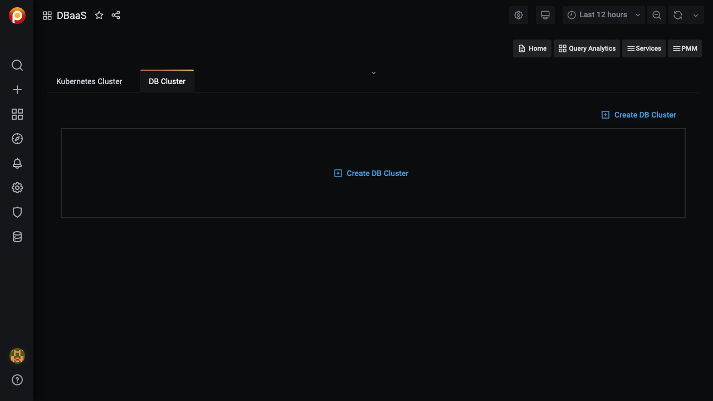
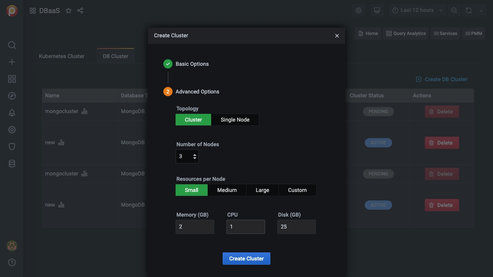

# DBaaS Dashboard

!!! note "Caution"
    DBaaS functionality is Alpha. The information on this page is subject to change and may be inaccurate.

This dashboard is where you add and remove Kubernetes and database clusters.

To access it, select *PMM > PMM DBaaS*, or click the *DBaaS* database icon <i class="uil uil-database"></i> in the left vertical menu bar.


## Add a Kubernetes cluster

1. Click *Register new Kubernetes Cluster*

2. Enter values for the *Kubernetes Cluster Name* and *Kubeconfig file* in the corresponding fields.

    

3. Click *Register*.

4. A message will momentarily display telling you whether the registration was successful or not.

    

## Unregister a Kubernetes cluster

!!! note "Attention"
    You can't unregister a Kubernetes cluster if there DB clusters associated with it.

1. Click *Unregister*.

2. Confirm the action by clicking *Proceed*, or abandon by clicking *Cancel*.

## Add a DB Cluster

!!! note
    You must create at least one Kubernetes cluster to create a DB cluster.

1. Select the *DB Cluster* tab.

    

2. Click *Create DB Cluster*.

3. In section 1, *Basic Options*:

    1. Enter a value for *Cluster name* that complies with domain naming rules.

    2. Select a cluster from the *Kubernetes Cluster* menu.

    3. Select a database type from the *Database Type* menu.

        

4. Expand section 2, *Advanced Options*.

    1. Select *Topology*, either *Cluster* or *Single Node*.

    2. Select the number of nodes. (The lower limit is 3.)

    3. Select a preset for *Resources per Node*.

        *Small*, *Medium* and *Large* are fixed preset values for *Memory*, *CPU*, and *Disk*.

        Values for the *Custom* preset can be edited.

        

5. When both *Basic Options* and *Advanced Options* section icons are green, the *Create Cluster* button becomes active. (If it is inactive, check the values for fields in sections whose icon is red.)

    Click *Create Cluster* to create your cluster.

6. A row appears with information on your cluster:

    

    - *Name*: The cluster name
    - *Database type*: The cluster database type
    - *Connection*:
        - *Host*: The hostname
        - *Port*: The port number
        - *Username*: The connection username
        - *Password*: The connection password (click the eye icon <i class="uil uil-eye"></i> to reveal)
    - *DB Cluster Parameters*:
        - *K8s cluster name*: The Kubernetes cluster name
        - *CPU*: The number of CPUs allocated to the cluster
        - *Memory*: The amount of memory allocated to the cluster
        - *Disk*: The amount of disk space allocated to the cluster
    - *Cluster Status*:
        - *PENDING*: The cluster is being created
        - *ACTIVE*: The cluster is active
        - *FAILED*: The cluster could not be created
        - *DELETING*: The cluster is being deleted


## Restart a DB Cluster

1. Select the *DB Cluster* tab.

2. Identify the DB cluster to restart.

3. In the *Actions* column, open the vertical dots menu <i class="uil uil-ellipsis-v"></i> and click *Restart cluster*.

## Edit a DB Cluster

1. Select the *DB Cluster* tab.

2. Identify the database cluster to be changed.

3. In the *Actions* column, open the menu and click *Edit*.

## Delete a DB Cluster

1. Identify the database cluster to be deleted.

2. In the *Actions* column, open the menu and click *Delete*.

3. Confirm the action by clicking *Proceed*, or abandon by clicking *Cancel*.

    

## Add a Kubernetes Cluster on AWS EKS

1. Create your cluster via `eksctl` or the Amazon AWS interface. Example command:

    ```sh
    eksctl create cluster --write-kubeconfig —name=your-cluster-name —zones=us-west-2a,us-west-2b --kubeconfig <PATH_TO_KUBECONFIG>
    ```

2. After your EKS cluster is up you need to install the PXC and PSMDB operators in. This is done the following way:

    ```sh
    # Prepare a base64 encoded values for user and pass with administrator privileges to pmm-server (DBaaS)
    PMM_USER="$(echo -n 'admin' | base64)";
    PMM_PASS="$(echo -n '<RANDOM_PASS_GOES_IN_HERE>' | base64)";

    # Install the PXC operator
    curl -sSf -m 30 https://raw.githubusercontent.com/percona/percona-xtradb-cluster-operator/pmm-branch/deploy/bundle.yaml  | kubectl apply -f -
    curl -sSf -m 30 https://raw.githubusercontent.com/percona/percona-xtradb-cluster-operator/pmm-branch/deploy/secrets.yaml | sed "s/pmmserver:.*=/pmmserver: ${PMM_PASS}/g" | kubectl apply -f -

    # Install the PSMDB operator
    curl -sSf -m 30 https://raw.githubusercontent.com/percona/percona-server-mongodb-operator/pmm-branch/deploy/bundle.yaml  | kubectl apply -f -
    curl -sSf -m 30 https://raw.githubusercontent.com/percona/percona-server-mongodb-operator/pmm-branch/deploy/secrets.yaml | sed "s/PMM_SERVER_USER:.*$/PMM_SERVER_USER: ${PMM_USER}/g;s/PMM_SERVER_PASSWORD:.*=$/PMM_SERVER_PASSWORD: ${PMM_PASS}/g;" | kubectl apply -f -

    # Validate that the operators are running
    kubectl get pods
    ```

3. Then you need to modify your kubeconfig file, if it's not utilizing the `aws-iam-authenticator` or `client-certificate` method for authentication against k8s. Here are two examples that you can use as template to modify a copy of your existing kubeconfig:

    - For `aws-iam-authenticator` method:

        ```yml
        ---
        apiVersion: v1
        clusters:
        - cluster:
            certificate-authority-data: << CERT_AUTH_DATA >>
            server: << K8S_CLUSTER_URL >>
          name: << K8S_CLUSTER_NAME >>
        contexts:
        - context:
            cluster: << K8S_CLUSTER_NAME >>
            user: << K8S_CLUSTER_USER >>
          name: << K8S_CLUSTER_NAME >>
        current-context: << K8S_CLUSTER_NAME >>
        kind: Config
        preferences: {}
        users:
        - name: << K8S_CLUSTER_USER >>
          user:
            exec:
              apiVersion: client.authentication.k8s.io/v1alpha1
              command: aws-iam-authenticator
              args:
                - "token"
                - "-i"
                - "<< K8S_CLUSTER_NAME >>"
                - --region
                - << AWS_REGION >>
              env:
                 - name: AWS_ACCESS_KEY_ID
                   value: "<< AWS_ACCESS_KEY_ID >>"
                 - name: AWS_SECRET_ACCESS_KEY
                   value: "<< AWS_SECRET_ACCESS_KEY >>"
        ```

     - For `client-certificate` method:

        ```yml
        ---
        apiVersion: v1
        clusters:
        - cluster:
            certificate-authority-data: << CERT_AUTH_DATA >>
            server: << K8S_CLUSTER_URL >>
          name: << K8S_CLUSTER_NAME >>
        contexts:
        - context:
            cluster: << K8S_CLUSTER_NAME >>
            user: << K8S_CLUSTER_USER >>
          name: << K8S_CLUSTER_NAME >>
        current-context: << K8S_CLUSTER_NAME >>
        kind: Config
        preferences: {}
        users:
        - name: << K8S_CLUSTER_NAME >>
          user:
            client-certificate-data: << CLIENT_CERT_DATA >>
            client-key-data: << CLIENT_KEY_DATA >>
        ```

4. Follow the instructions for [Add a Kubernetes cluster](#add-a-kubernetes-cluster).

!!! seealso "See also"
    - [Setting up a development environment for DBaaS](../../setting-up/server/dbaas.md)
    - [Amazon AWS EKS: Create a cluster](https://docs.aws.amazon.com/eks/latest/userguide/create-cluster.html)
    - [Amazon AWS EKS: Create a kubconfig file](https://docs.aws.amazon.com/eks/latest/userguide/create-kubeconfig.html)
    - [AWS IAM Authenticator](https://github.com/kubernetes-sigs/aws-iam-authenticator)
