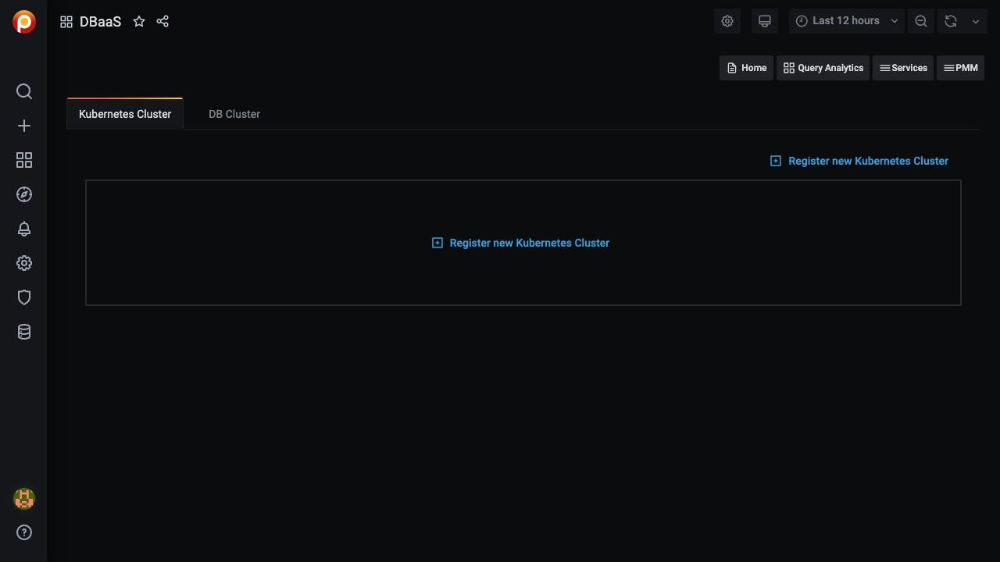
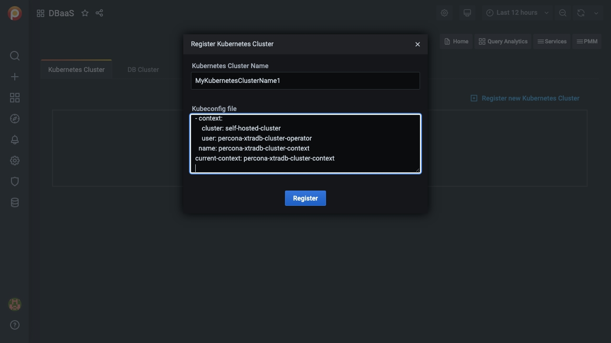
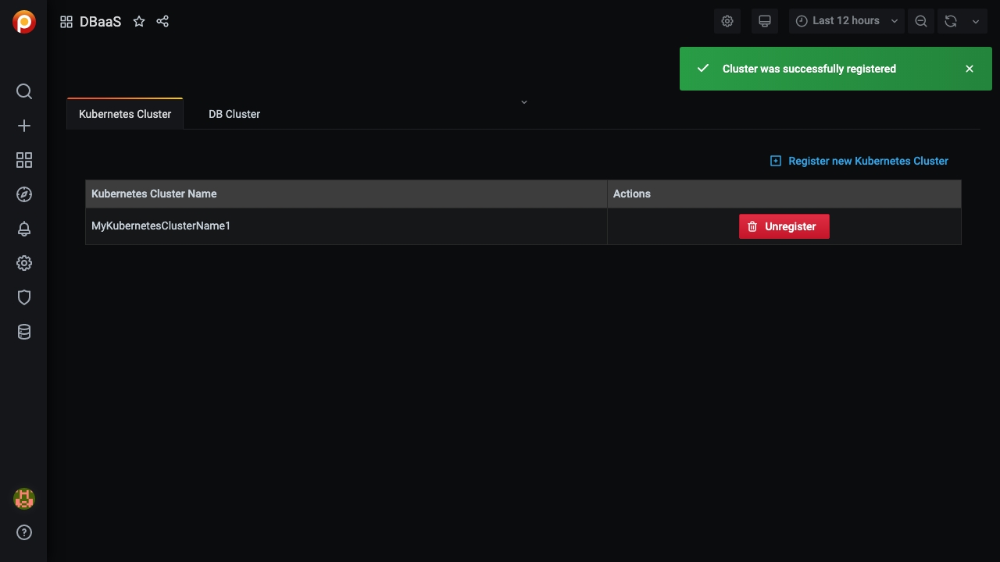
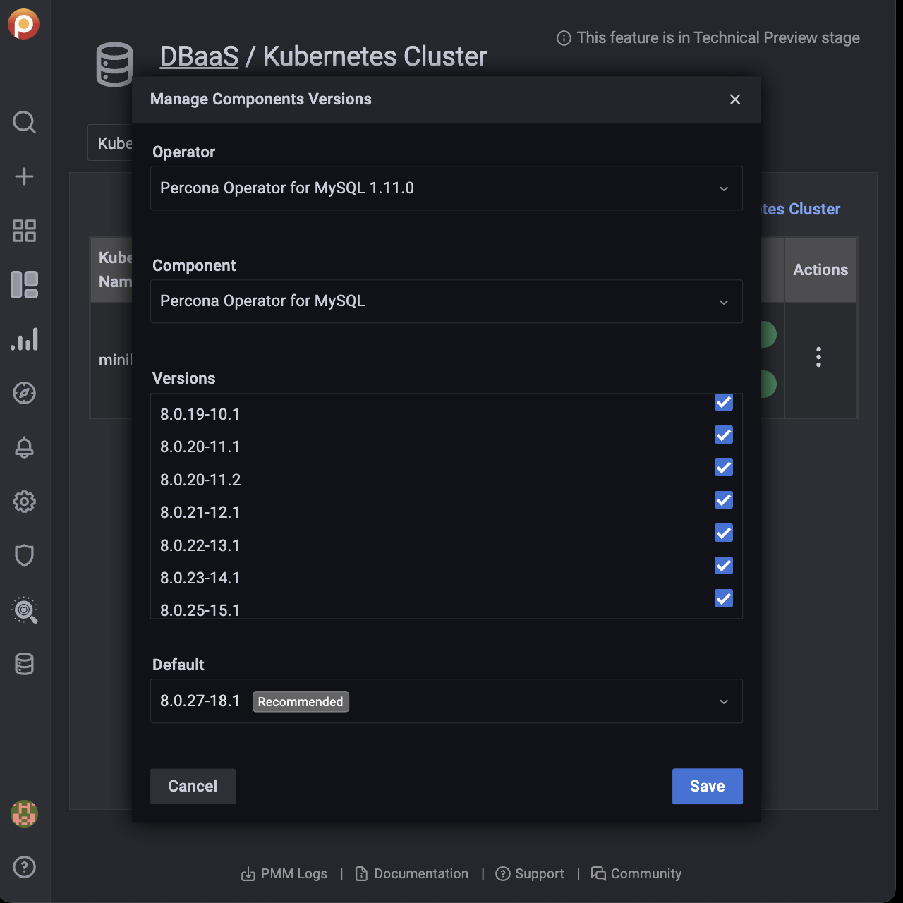
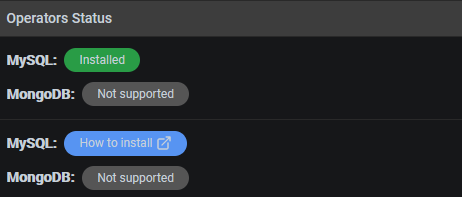
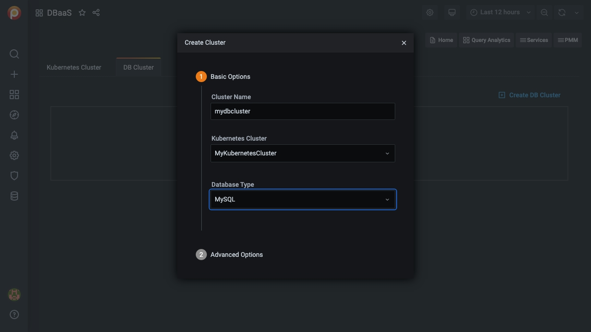
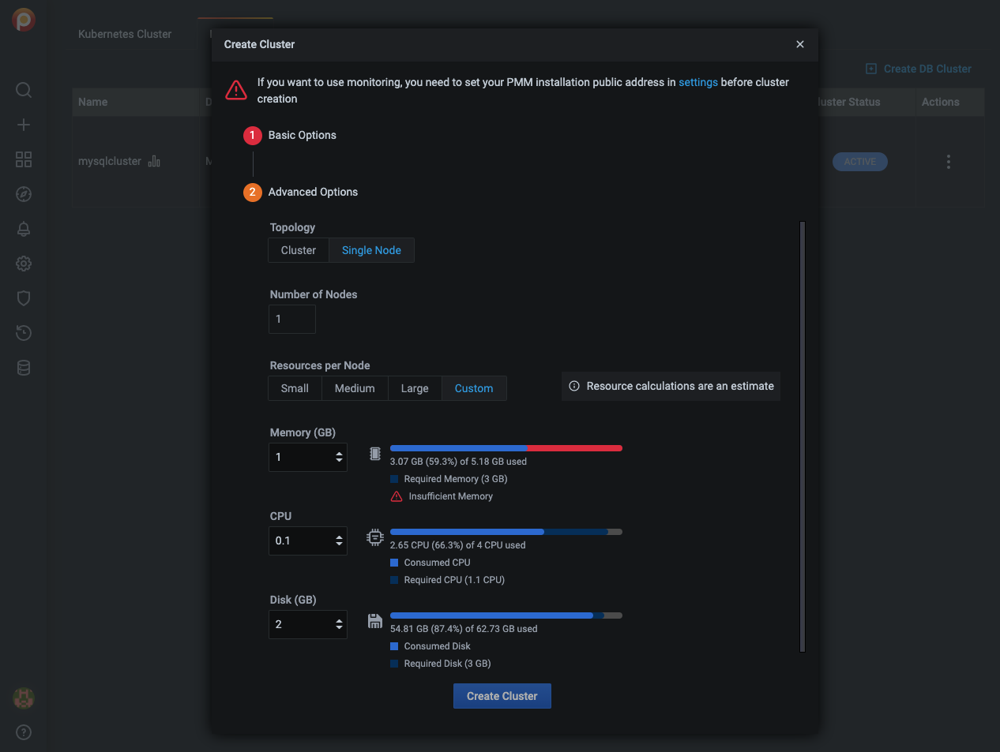
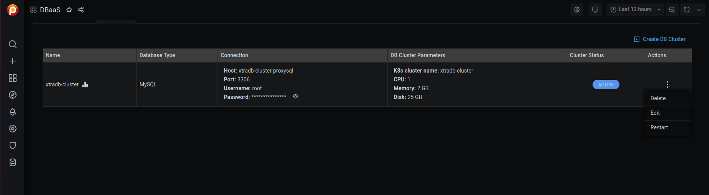
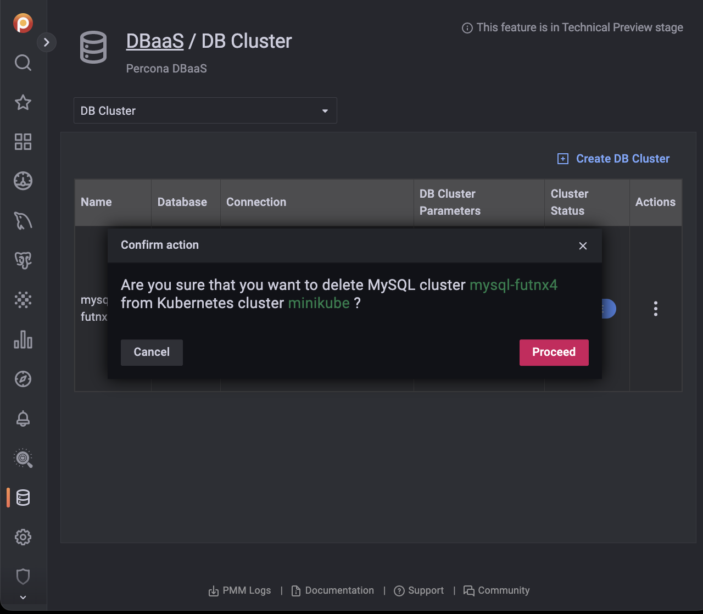

# DBaaS Dashboard (Alpha)

> <b style="color:goldenrod">Caution</b> **DBaaS functionality is currently in [Alpha status][ALPHA]**.
>
> The information on this page is subject to change and may be inaccurate.

The DBaaS dashboard is where you add, remove, and operate on Kubernetes and database clusters.

> You must run PMM Server with a DBaaS feature flag to activate the features described here.

To open the DBaaS dashboard:

- From the main menu, select {{ icon.bars }} *PMM* --> *PMM DBaaS*;
- Or, from the left menu, select {{ icon.database }} *DBaaS*.

## Kubernetes clusters

### Add a Kubernetes cluster

1. Click *Register new Kubernetes Cluster*

2. Enter values for the *Kubernetes Cluster Name* and *Kubeconfig file* in the corresponding fields.

    

3. Click *Register*.

4. A message will momentarily display telling you whether the registration was successful or not.

    

### Unregister a Kubernetes cluster

> You can't unregister a Kubernetes cluster if there DB clusters associated with it.

1. Click *Unregister*.

2. Confirm the action by clicking *Proceed*, or abandon by clicking *Cancel*.

### View a Kubernetes cluster's configuration

1. Find the row with the Kubernetes cluster you want to see.

2. In the *Actions* column, open the {{ icon.ellipsisv }} menu and click *Show configuration*.

### Manage allowed component versions

Administrators can select allowed and default versions of components versions for each cluster.

1. Find the row with the Kubernetes cluster you want to manage.

2. In the *Actions* column, open the {{ icon.ellipsisv }} menu and click *Manage versions*.

    

3. Select an *Operator* and *Component* from the drop-down menus.

    

4. Activate or deactivate allowed versions, and select a default in the *Default* menu.

5. Click *Save*.

### Kubernetes operator status

The Kubernetes Cluster tab shows the status of operators.

## DB clusters

### Add a DB Cluster

You must create at least one Kubernetes cluster to create a DB cluster.

To monitor a DB cluster, set up a [public address](../../how-to/configure.md#public-address) for PMM Server first.

1. Select the *DB Cluster* tab.

2. Click *Create DB Cluster*.

3. In section 1, *Basic Options*:

    1. Enter a value for *Cluster name* that complies with domain naming rules.

    2. Select a cluster from the *Kubernetes Cluster* menu.

    3. Select a database type from the *Database Type* menu.

        

4. Expand section 2, *Advanced Options*.

    1. Select *Topology*, either *Cluster* or *Single Node*.

    2. Select the number of nodes. (The lower limit is 3.)

    3. Select a preset for *Resources per Node*.

        *Small*, *Medium* and *Large* are fixed preset values for *Memory*, *CPU*, and *Disk*.

        Values for the *Custom* preset can be edited.

		Beside each resource type is an estimate of the required and available resources represented numerically in absolute and percentage values, and graphically as a colored, segmented bar showing the projected ratio of used to available resources. A red warning triangle {{ icon.exclamationtrianglered }} is shown if the requested resources exceed those available.

        

5. When both *Basic Options* and *Advanced Options* section icons are green, the *Create Cluster* button becomes active. (If inactive, check the values for fields in sections whose icon is red.)

    Click *Create Cluster* to create your cluster.

6. A row appears with information on your cluster:

    

    - *Name*: The cluster name
    - *Database type*: The cluster database type
    - *Connection*:
        - *Host*: The hostname
        - *Port*: The port number
        - *Username*: The connection username
        - *Password*: The connection password (click the eye icon {{ icon.eye }} to reveal)
    - *DB Cluster Parameters*:
        - *K8s cluster name*: The Kubernetes cluster name
        - *CPU*: The number of CPUs allocated to the cluster
        - *Memory*: The amount of memory allocated to the cluster
        - *Disk*: The amount of disk space allocated to the cluster
    - *Cluster Status*:
        - *PENDING*: The cluster is being created
        - *ACTIVE*: The cluster is active
        - *FAILED*: The cluster could not be created
        - *DELETING*: The cluster is being deleted

### Delete a DB Cluster

1. Find the row with the database cluster you want to delete.

2. In the *Actions* column, open the {{ icon.ellipsisv }} menu and click *Delete*.

3. Confirm the action by clicking *Proceed*, or abandon by clicking *Cancel*.

    

### Edit a DB Cluster

1. Select the *DB Cluster* tab.

2. Find the row with the database cluster you want to change.

3. In the *Actions* column, open the {{ icon.ellipsisv }} menu and click *Edit*.

A paused cluster can't be edited.

### Restart a DB Cluster

1. Select the *DB Cluster* tab.

2. Identify the database cluster to be changed.

3. In the *Actions* column, open the {{ icon.ellipsisv }} menu and click *Restart*.

### Suspend or resume a DB Cluster

1. Select the *DB Cluster* tab.

2. Identify the DB cluster to suspend or resume.

3. In the *Actions* column, open the {{ icon.ellipsisv }} menu and click the required action:

    - For active clusters, click *Suspend*.

        

    - For paused clusters, click *Resume*.

        

> **See also**
> [Setting up a development environment for DBaaS](../../setting-up/server/dbaas.md)

[ALPHA]: https://en.wikipedia.org/wiki/Software_release_life_cycle#Alpha
