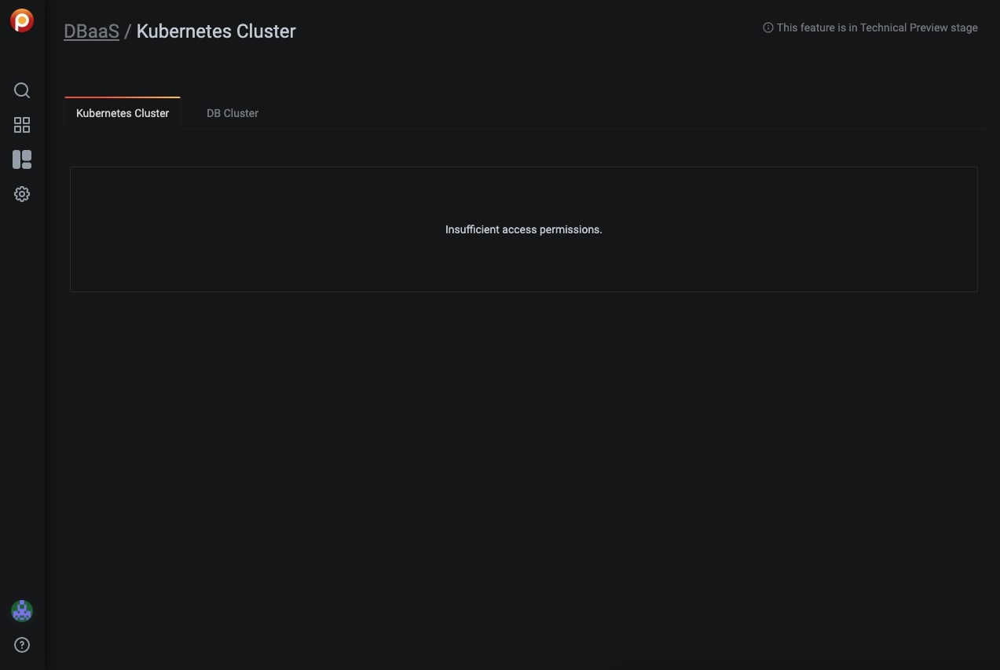

# About Percona Platform

Percona Platform provides value-added services to PMM.

The services comprise:

- [Security Threat Tool](security-threat-tool.md)
- [DBaaS](dbaas.md) 

These Percona Platform features are currently only available for PMM Admin users:

- Backup;
- DBaaS;
- Integrated Alerting;
- Security Checks.
 
To use these features you must be logged in as a PMM Admin user and activate the features.
 
If you are logged in as a user that has a Viewer or Editor role you'll see an 'insufficient access' message when trying to use these features.

