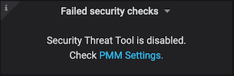

# Security Threat Tool

The Security Threat Toll runs regular checks against connected databases, alerting you if any servers pose a potential security threat.

The checks are automatically downloaded from Percona Platform and run every 24 hours. (This period is not configurable.)

They run on the PMM Client side with the results passed to PMM Server for display in the *Failed security checks* summary dashboard
and the *PMM Database Checks* details dashboard.

!!! note

    Check results data *always* remains on the PMM Server, and is not to be confused with anonymous data sent for Telemetry purposes.

## Where to see the results of checks

On your PMM home page, the *Failed security checks* dashboard shows a count of the number of failed checks.

More details can be seen by opening the *Failed Checks* dashboard using *PMM > PMM Database Checks*.

!!! note

    After activating the Security Threat Tool, you must wait 24 hours for data to appear in the dashboard.

## How to enable the Security Threat Tool

The Security Threat Tool is disabled by default. It can be enabled in *PMM > PMM Settings*
(see [PMM Settings Page](../../how-to/configure.md)).

Failed security checks summary dashboard when checks are disabled:

Failed database checks dashboard when disabled:

## Checks made by the Security Threat Tool

`mongodb_auth`
: This check returns a warning if MongoDB authentication is disabled.

`mongodb_version`
: Warn if MongoDB/PSMDB version is not the latest.

`mysql_anonymous_users`
: Warn if there are accounts with no username.

`mysql_empty_password`
: Warn if there are users without passwords.

`mysql_version`
: Warn if MySQL/PS/MariaDB version is not the latest.

`postgresql_super_role`
: Warn if PostgreSQL has users (besides 'postgres', 'rdsadmin', and 'pmm_user') with the role 'SUPER'. 

`postgresql_version`
: Warn if PostgreSQL version is not the latest.
