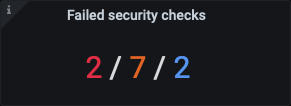
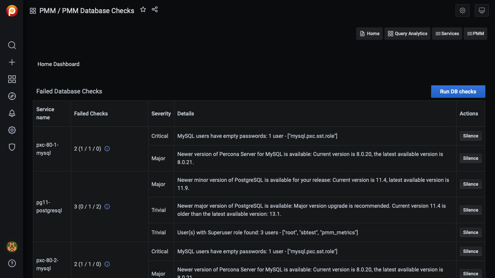

# Security Threat Tool

The Security Threat Tool runs regular checks against connected databases, alerting you if any servers pose a potential security threat.

All checks run on the PMM Client side. Results are sent to PMM Server where a summary count is shown on the *Home Dashboard*, with details in the *PMM Database Checks* dashboard.

Checks are automatically downloaded from Percona Platform and run every 24 hours. (This period is not configurable.)

**Check results data *always* remains on the PMM Server.** It is not related to anonymous data sent for Telemetry purposes.

The *Failed security checks* panel on the *Home Dashboard* shows the number of failed checks classed as *critical* (red), *major* (amber), and *trivial* (blue).

> **Key**
>
> <b style="color:#e02f44;">Critical</b> / <b style="color:#e36526;">Major</b> / <b style="color:#5794f2;">Trivial</b>

Details are in the *PMM Database Checks* dashboard (select *PMM-->PMM Database Checks*).

## How to enable

The Security Threat Tool (STT) is disabled by default. Enable it in [*PMM Settings-->Advanced Settings*](../../how-to/configure.md#advanced-settings).

Enabling STT in the settings also causes the PMM server to download STT checks from Percona Platform and run them once. This operation runs in the background so even though the settings update finishes instantly it might take some time for the checks to complete download and execution and the results (if any) to be visible in the *PMM Database Checks* dashboard.

## Change a check's interval

1. Navigate to *PMM-->PMM Database Checks*

2. Activate the *All Checks* tab

3. In the *Actions* column for a chosen check, click the {{icon.history}} *Interval* icon

4. Chose an interval from the options

5. Click *Save*

## List of checks made

| Check ID                | Description
| ----------------------- | ----------------------------------------------------------------
| `mongodb_auth`          | MongoDB authentication is disabled
| `mongodb_version`       | MongoDB/Percona Server for MongoDB version is not the latest
| `mongodb_cve_version`   | MongoDB/Percona Server for MongoDB version is not the latest with CVE fixes
| `mysql_anonymous_users` | There are accounts with no username
| `mysql_empty_password`  | There are users without passwords
| `mysql_version`         | MySQL/PS/MariaDB version is not the latest
| `postgresql_super_role` | PostgreSQL has users (besides `postgres`, `rdsadmin`, and `pmm_user`) with the role 'SUPER'
| `postgresql_version`    | PostgreSQL version is not the latest