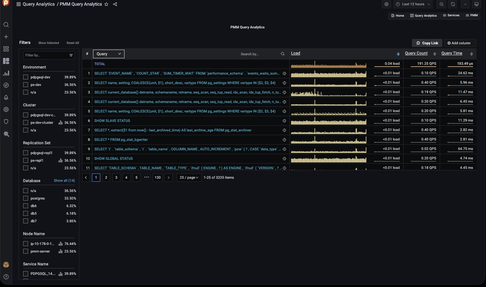
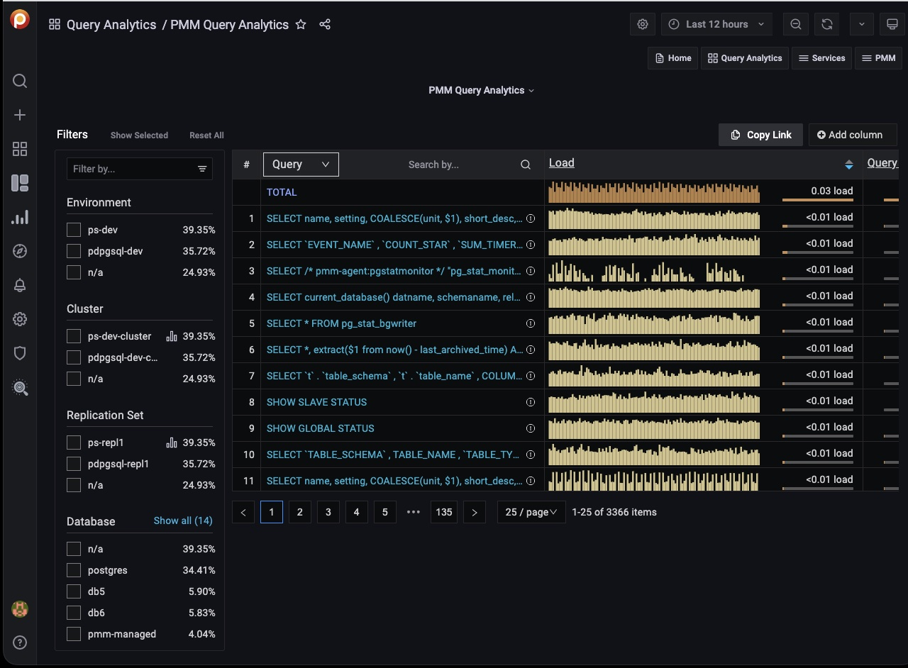
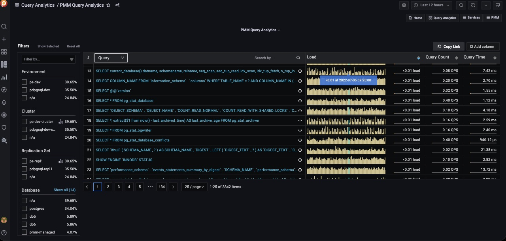
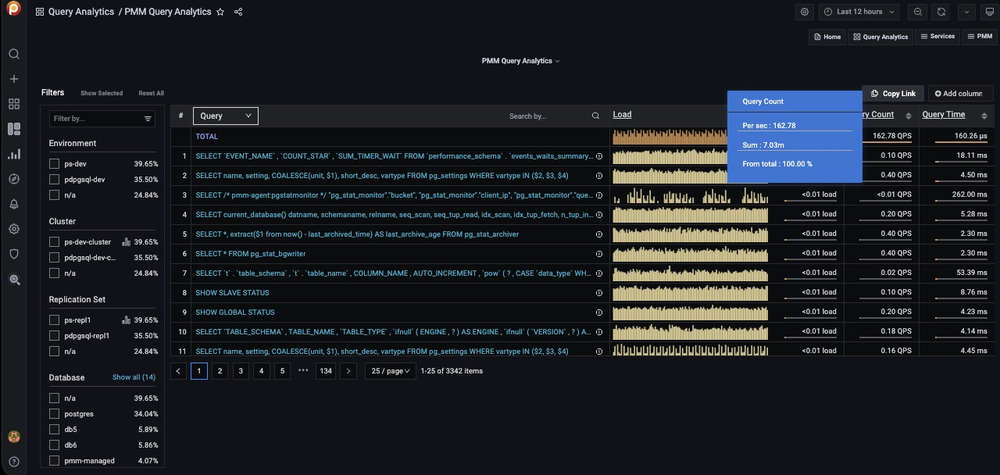
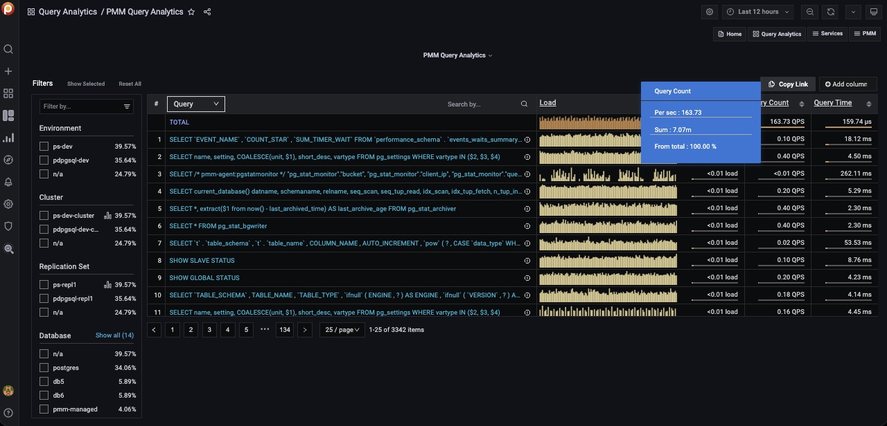
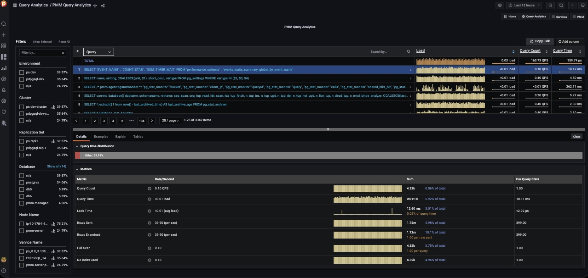
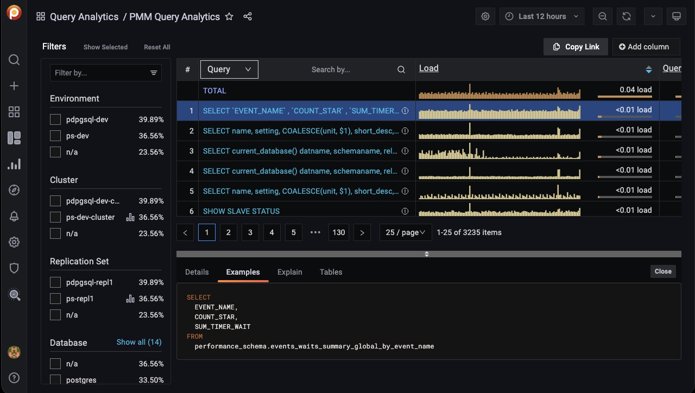
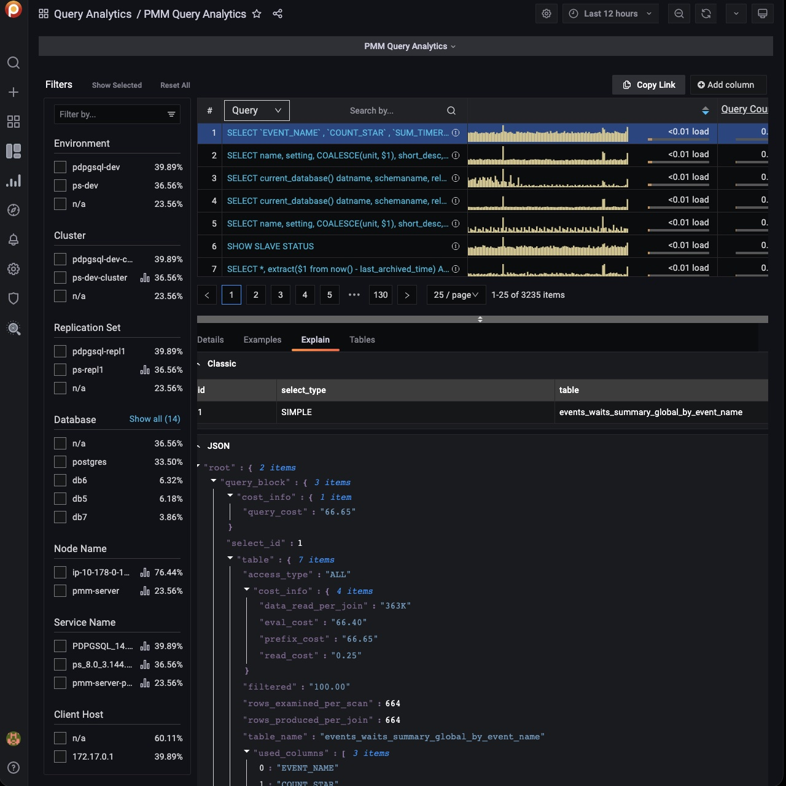

# Query Analytics

The *Query Analytics* dashboard shows how queries are executed and where they spend their time.  It helps you analyze database queries over time, optimize database performance, and find and remedy the source of problems.

Query Analytics supports MySQL, MongoDB and PostgreSQL. The minimum requirements for MySQL are:

- MySQL 5.1 or later (if using the slow query log)
- MySQL 5.6.9 or later (if using Performance Schema)

Query Analytics displays metrics in both visual and numeric form. Performance-related characteristics appear as plotted graphics with summaries.

The dashboard contains three panels:

- [Filters Panel](#filters-panel)
- [Overview Panel](#overview-panel)
- [Details Panel](#details-panel)

!!! note alert alert-primary ""
    Query Analytics data retrieval is not instantaneous and can be delayed due to network conditions. In such situations *no data* is reported and a gap appears in the sparkline.

## Filters Panel

- The Filter panel occupies the left side of the dashboard. It lists filters, grouped by category. Selecting one reduces the Overview list to those items matching the filter.
- The first five of each category are shown. If there are more, the list is expanded by clicking *Show all* beside the category name, and collapsed again with *Show top 5*.
- Applying a filter may make other filters inapplicable. These become grayed out and inactive.
- Click the chart symbol {{icon.graphbar}} to navigate directly to an item's associated dashboard.
- Separately, the global *Time range* setting filters results by time, either your choice of *Absolute time range*, or one of the predefined *Relative time ranges*.

## Overview Panel

To the right of the Filters panel and occupying the upper part of the dashboard is the Overview panel.

Each row of the table represents the metrics for a chosen object type, one of:

- Query
- Service Name
- Database
- Schema
- User Name
- Client Host

At the top of the second column is the *dimension* menu. Use this to choose the object type.

On the right side of the dimension column is the *Dimension Search* bar.

Enter a string and press Enter to limit the view to queries containing only the specified keywords.

Delete the search text and press Enter to see the full list again.

**Columns**

- The first column is the object’s identifier. For *Query*, it is the query’s [Fingerprint](../details/glossary/#fingerprint).
- The second column is the *Main metric*, containing a reduced graphical representation of the metric over time, called a *sparkline*, and a horizontal meter, filled to reflect a percentage of the total value.
- Additional values are revealed as mouse-over tool-tips.

**Tool-tips**

- For the *Query* dimension, hovering over the information icon {{icon.infocircle}} reveals the query ID and its example.
- Hovering on a column header reveals an informative tool-tip for that column.
- Hovering on the main metric sparkline highlights the data point and a tooltip shows the data value under the cursor.

- Hovering on the main metric meter reveals the percentage of the total, and other details specific to the main metric.

    

- Hovering on column values reveals more details on the value. The contents depends on the type of value.

    

**Adding and removing columns**

- Metrics columns are added with the *Add column* button.

    

- When clicked, a text field and list of available metrics are revealed. Select a metric or enter a search string to reduce the list. Selecting a metric adds it to the panel.
- A metric column is removed by clicking on the column heading and selecting *Remove column*.
- The value plotted in the *main metric* column can be changed by clicking a metric column heading and selecting *Swap with main metric*.

**Sorting**

- The entire list is sorted by one of the columns.
- Click either the up or down caret to sort the list by that column’s ascending or descending values.

**Pagination**

- The pagination device lets you move forwards or backwards through pages, jump to a specific page, and choose how many items are listed per page.

    

- Queries are grouped into pages of 25, 50 or 100 items.

## Details Panel

- Selecting an item in the Overview panel opens the *Details panel* with a [Details Tab](#details-tab).
- If the dimension is *Query*, the panel also contains the [Examples Tab](#examples-tab), [Explain Tab](#explain-tab), and [Tables Tab](#tables-tab).

### Details Tab

The *Details* tab contains a *Query time distribution* bar (only for MySQL databases) and a set of *Metrics* in collapsible subpanels.

- The *Query time distribution* bar shows a query’s total time made up of colored segments, each segment representing the proportion of time spent on one of the follow named activities:

    - `query_time`: Statement execution time.
    - `lock_time`: Time to acquire locks.
    - `blk_read_time`: Total time the statement spent reading blocks (if `track_io_timing` is enabled, otherwise zero).
    - `blk_write_time`: Total time the statement spent writing blocks (if `track_io_timing` is enabled, otherwise zero).
    - `innodb_io_r_wait`: Time for InnoDB to read the data from storage.
    - `innodb_queue_wait`: Time the query spent either waiting to enter the InnoDB queue, or in it pending execution.
    - `innodb_rec_lock_wait`: Time the query waited for row locks.
    - `other`: Remaining uncategorized query time.

- *Metrics* is a table with these headings:

    - *Metric*: The Metric name, with a question-mark tool-tip that reveals a description of the metric on mouse-over.
    - *Rate/Second*: A sparkline chart of real-time values per unit time.
    - *Sum*: A summation of the metric for the selected query, and the percentage of the total.
    - *Per Query Stats*: The value of the metric per query.

- Each row in the table is a metric. The contents depends on the chosen dimension.

### Examples Tab

(For *Query* dimension.)

The *Examples* tab shows an example of the selected query’s fingerprint or table element.

*Note: query example and fingerprint can be truncated to 1024 long to reduce space usage. In this case,  the query explains section will not work.*

### Explain Tab

(For *Query* dimension.)

The *Explain* tab shows the `explain` output for the selected query, in Classic or JSON formats:

- MySQL: Classic and JSON
- MongoDB: JSON only
- PostgreSQL: Not supported

### Tables Tab

(For *Query* dimension.)

The *Tables* tab shows information on the tables and indexes involved in the selected query.

## Query Analytics for MongoDB

MongoDB is conceptually different from relational database management systems, such as MySQL and MariaDB.

Relational database management systems store data in tables that represent single entities. Complex objects are represented by linking tables.

In contrast, MongoDB uses the concept of a document where all essential information for a complex object is stored in one place.

Query Analytics can monitor MongoDB queries. Although MongoDB is not a relational database management system, you analyze its databases and collections in the same interface using the same tools.

[SLOW_QUERY_LOG]: ../setting-up/client/mysql.md#slow-query-log
[PERFORMANCE_SCHEMA]: ../setting-up/client/mysql.md#performance-schema
