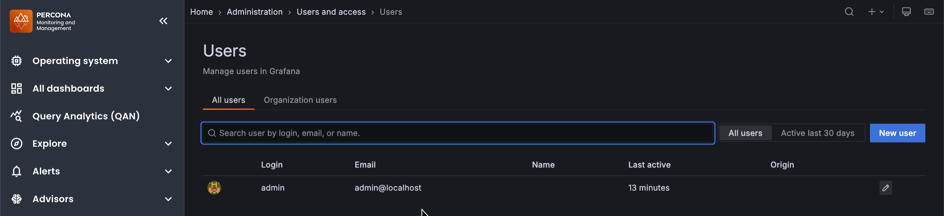

# Add users

Adding users with basic authentication (username and password stored in PMM) from **Administration > Users and access > Users** tab.

If your organization uses LDAP, OAuth, SAML, or other authentication methods, users are managed through your external authentication system. See [authentication methods](../../reference/ui/log_in.md) for more information.

To add a new user in PMM:
{.power-number}

1. Go to **Users and access** page, click **New user**.
2. On the **Add new user** dialog box, enter the following:
    - **Name** - Full name of the user
    - **Email** - Email address or username (if this is an existing Grafana user)
    - **Username** - Login username for this user
    - **Password** - Secure password for this user

3. Click **Create user**.

The new user can now log in to PMM using the username and password you created.

## Assign user roles

After creating a user, you may want to assign them specific roles or permissions. See [Edit users](edit_users.md) for information on:

- Granting or revoking admin privileges
- Changing organization roles (Admin, Editor, Viewer)
- Managing user permissions