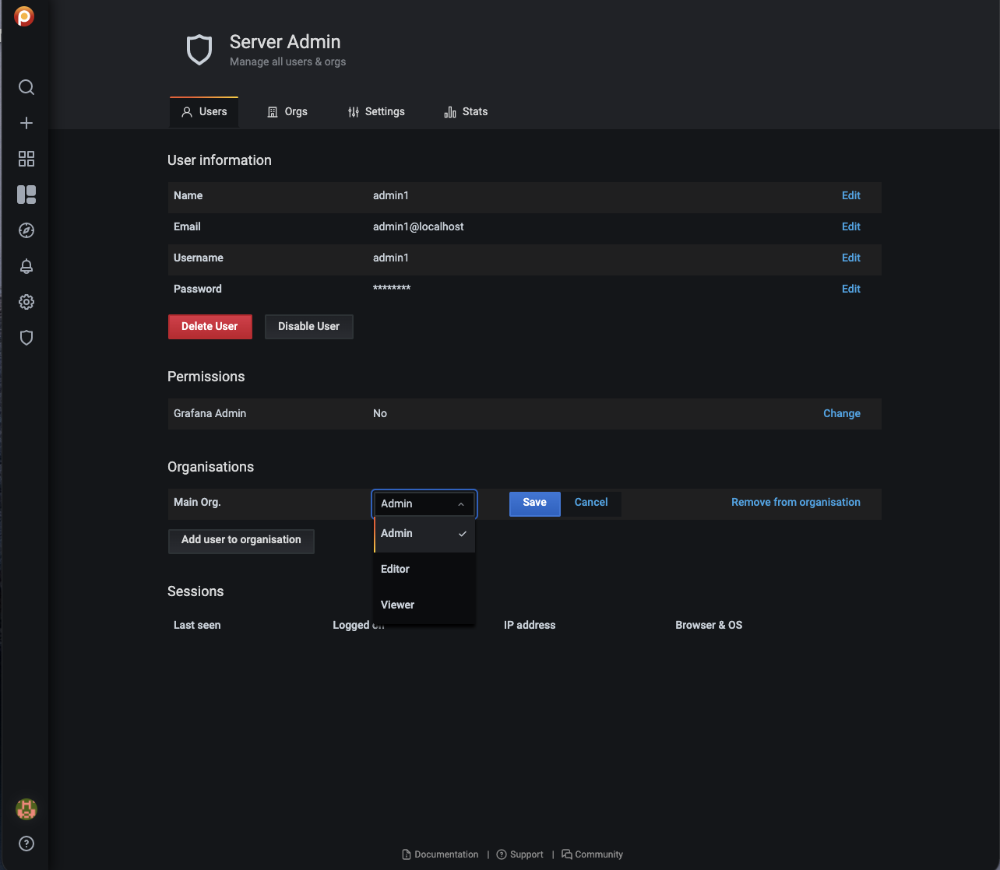

# Edit users

You can edit users by changing the information or settings for an individual user account.

!!! caution alert alert-warning "Important"
    After changing the default admin password for the PMM Server, register the pmm-agent using the same credentials and add the services again. Otherwise, PMM will cease to monitor the service/nodes.

## Grant or revoke admin privileges

You can grant or revoke admin access to a user as follows:
{.power-number}

1. On the **Users** tab, click the user account you want to edit.

2. To grant or revoke the privileges, click the user. User information dialog box opens.

3. In the **Permissions** section, click **Change** and then select **Yes/No**, depending on whether you want to provide admin access or not.

4. Click **Change**.

## Change organization role

You can change the organization role assigned to your user account.

To change the role:
{.power-number}

1. On the **Users** tab, click the user for whom you want to change the role.

2. In the **Organizations** section, click **Change role**.

3. Select the role from the drop-down and click **Save**.

The following are the privileges for the various *roles*:

- **Admin** - Managing data sources, teams, and users within an organization

- **Editor** - Creating and editing dashboards

- **Viewer** - Viewing dashboards

For detailed information on the privileges for these roles and the different tasks that they can perform, see [Grafana organization roles](https://grafana.com/docs/grafana/latest/permissions/organization_roles/).

## Migrate from Percona Account authentication (deprecated)
!!! caution alert alert-warning "Percona Platform discontinuation"
    **Percona Platform is deprecated as of PMM 3.5.0 and will be discontinued with PMM 3.7.0 (March 2026).**

Previously, users could sign in to PMM using their Percona Account credentials. When logging in this way, users were automatically assigned **Viewer** role access. To grant these users **Admin** or **Editor** access, administrators would manually change their permissions after they logged in.

This authentication method is being removed. All users must transition to local PMM authentication before March 2026. If your organization currently uses Percona Account authentication:
{.power-number}

1. Identify all users who currently authenticate via Percona Accounts.
2. [Create local PMM accounts](../manage-users/add_users.md) for these users with appropriate roles.
3. Communicate new credentials to affected users.
4. Test local authentication before Platform discontinuation.
5. Update any documentation or processes that reference Percona Account sign-in.

For more information, see [Log into PMM](../../reference/ui/log_in.md).