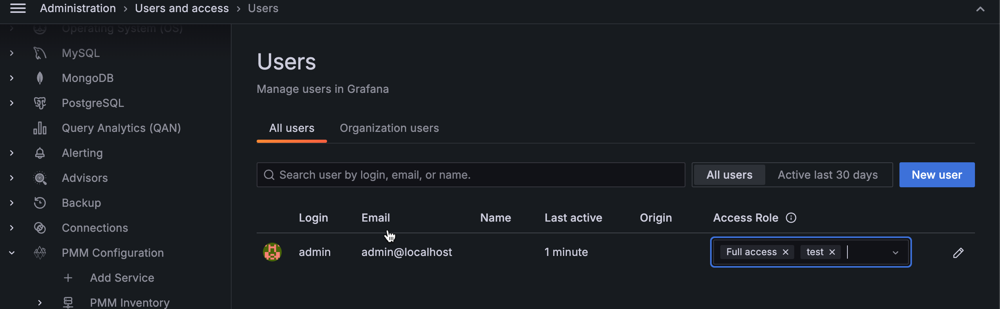

# Assign access roles to users

To assign access roles to users:
{.power-number}

1. From the [main menu](../../../reference/ui/ui_components.md), go to **PMM Configuration > Settings > Advanced Settings** and enable the **Access Roles** option.
2. Go to **Administration > Users and access > Users**.
3. Click on the user you want to modify.
4. From the **Roles** drop-down select the appropriate roles.
5. Verify the assigned roles appear in the **Access Role** column.

