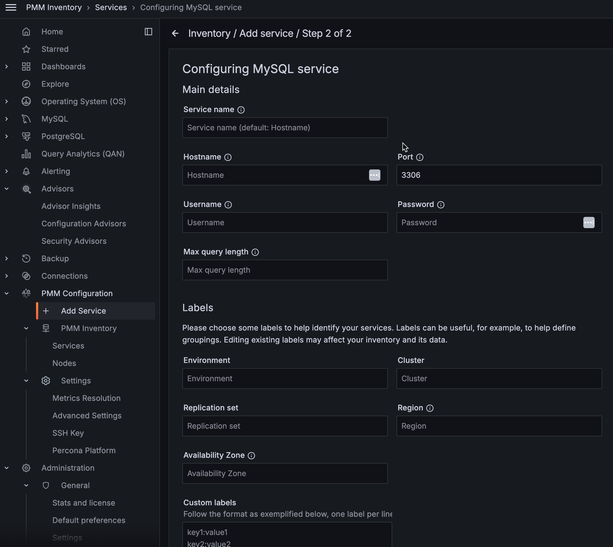

# Labels for access control

Label-based access control in PMM allows you to manage who has access to metrics based on labels. By creating roles, you can specify which data can be queried based on a specific criterion, for instance, allowing the QA team to view data related to test environments. 
 
With label-based access control, you can associate multiple labels with a role, ensuring only data from series that match your defined labels is returned. 

## Standard vs custom labels

PMM supports standard as well as custom labels. When the user adds a service to monitoring, PMM automatically assigns some standard labels. Thease labels are mostly based on the type of service being added to monitoring, such as `service_type`, `agent_type`, `node_name`, etc. Some other labels are auto-generated by PMM, for example, `service_id`, `node_id`, etc. Normally, the user can override standard labels when an object &mdash; Node, Service, or Agent &mdash; is created. There is also a possibility to define custom labels when adding objects. Custom labels, however, are assigned and updated only by the user.

It's important to note that standard labels are not always available for all objects. For example, the `service_type` label is only available for services, while the `agent_type` label is only available for agents.

Both standard and custom labels are persisted during the metrics collection process, and can be used in PromQL queries.

**Examples**

| **Label Type**| **Object**| **Label name ** | **Example** |                                                                                                
|---------------|-----------|-----------------|--------------------------------------|
| **Standard**  | Node      | node_id         | 5bdfb1b4-c6c4-4086-83a2-e8daa0b84d4b |                                          
| **Standard**  | Service   | service_type    | mysql, mongodb, postgresql etc.      |
| **Custom**    | Node, Service, Agent | Any string matching the regular expression:   [a-zA-Z_][a-zA-Z0-9_]*.   Also, it cannot start with two underscores.| owner="joe"  _rack="12345"|

## Adding labels

You can add standard or custom labels while adding a service to monitoring in PMM.

### Using PMM UI

To set the labels via the user interface:
{.power-number}

1. From the **Main** menu, go to **PMM Configuration > PMM Services > Add Service**.

2. Select the service you want to monitor. The page to add the service opens.

3. Enter the service parameters such as *Hostname, Service name, Port, Username, Password*, etc.

4. Enter standard labels via the input section `Labels`.

5. Enter custom labels via section `Custom labels`.

### Using pmm-admin

You can also add standard and custom labels using [pmm-admin](../../../use/commands/pmm-admin.md).

## Modifying labels

Currently, PMM does not support modifying standard labels. To modify a standard label, you first need to remove the service and re-add it with a new set of standard labels.

However, you can modify custom labels of a service via an [API endpoint](https://percona-pmm.readme.io/reference/changeservice).
