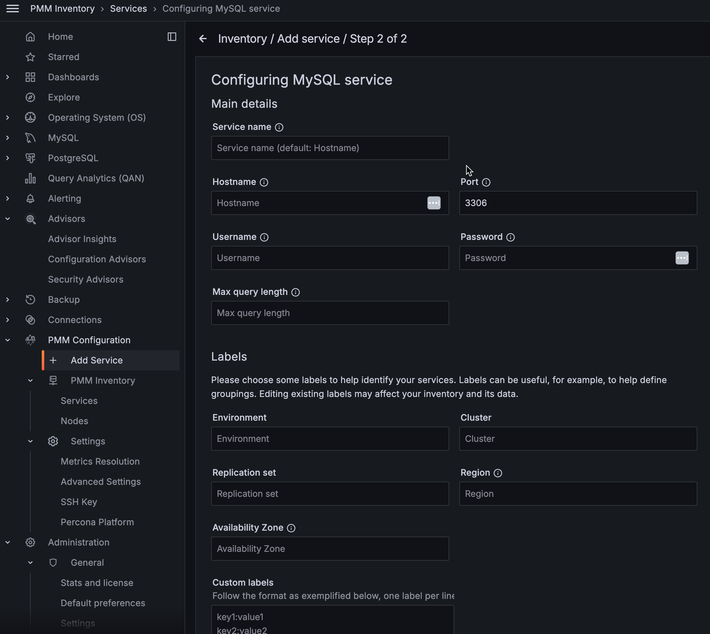

# Labels for access control

Label-based access control in PMM allows you to manage who has access to metrics based on labels. By creating roles, you can specify which data can be queried based on specific label criteria, for instance, allowing the QA team to view data related to test environments. 
 
With Label-based access control, you can associate multiple labels with a role, ensuring only data from series that match your defined labels is returned. 

## Standard vs custom labels

PMM supports standard as well as custom labels. PMM automatically assigns standard labels. You can also set standard labels when an object (Node, Service, or Agent) is created. Custom labels are assigned and updated only by a user.

**Examples**

| **Label Type**| **Object**| **Label name **| **Example** |                                                                                                
|----------|--------|-------|------------------------------|
| **Standard**  | Node   | node_id |123|                                          
|          | Service|service_type   |   - mysql, mongodb, postgresql etc.                                     
| **Custom**| Node, Service, Agent| Any string matching regular expression:   [a-zA-Z_][a-zA-Z0-9_]*.   Also, it cannot start with two underscores.| owner="joe"  _rack="12345"|

## Adding labels

You can add custom or standard labels in PMM while adding a service for monitoring in PMM.

### Using PMM UI

To set the labels using the user interface:
{.power-number}

1. From the **Main** menu, go to **PMM Configuration > PMM Services > Add Service**.

2. Select the service you want to add to PMM for monitoring. The page to add the service opens.

3. Enter the details such as *Hostname, Service name, Port, Username, Password,* etc., along with Label or Custom labels.

 

### Using pmm-admin

 You can also assign labels using [pmm-admin](../../../use/commands/pmm-admin.md).
