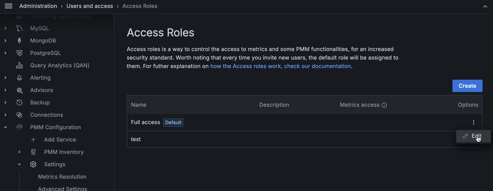

# Manage access roles

You can manage roles in PMM by editing or deleting a role.

## Edit roles

To edit access roles:
{.power-number}

1. From [main menu](../../../reference/ui/ui_components.md), go to **PMM Configuration > Settings > Advanced Settings** and enable the **Access Roles** option.

2. Go to **Administration > Users and access > Access Roles**.

3. On the role you want to edit, click the **ellipsis (three vertical dots) > edit role** in the **Options** column. The **Edit** role page opens.

    

4. Make the required changes to the role.

5. Click **Save Changes**.

## Set a role as default

When a user signs in to PMM for the first time and the user has no role assigned, the user is automatically assigned the *Default* role. For administrators, the default role provides a convenient way to configure default permissions for new users.

To set a role as default, do the following:
{.power-number}

1. From [main menu](../../../reference/ui/ui_components.md), go to **PMM Configuration > Settings > Advanced Settings** and enable the **Access Roles** option.

2. Go to **Administration > Users and access > Access Roles**.

3. On the role you want to set as default, click the **ellipsis (three vertical dots) → set as default** in the **Options** column.

## Remove roles

To remove access roles, do the following:
{.power-number}

1. From [main menu](../../../reference/ui/ui_components.md), go to **PMM Configuration > Settings > Advanced Settings** and enable the **Access Roles** option.
   
2. On the role you want to remove, click the **ellipsis (three vertical dots) > Delete** in the **Options** column. Delete role pop-up opens.

3. Click **Confirm** and delete the role.
