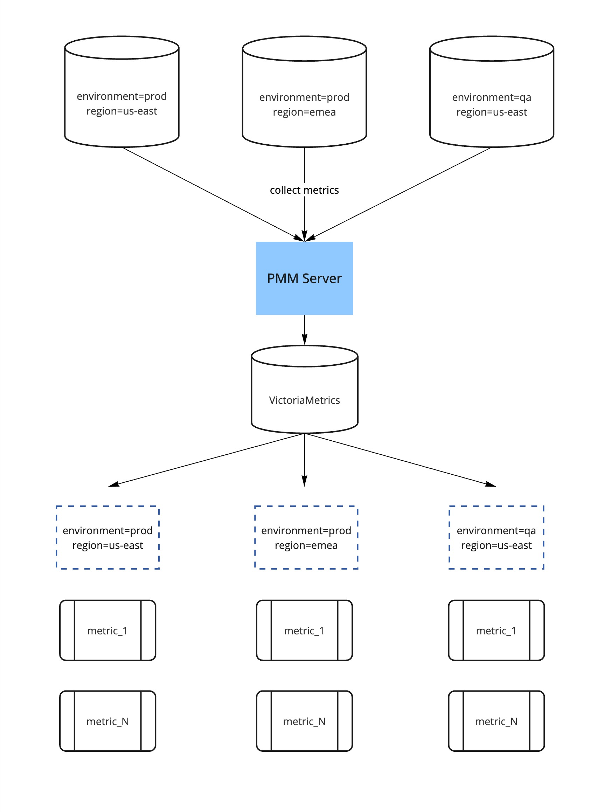
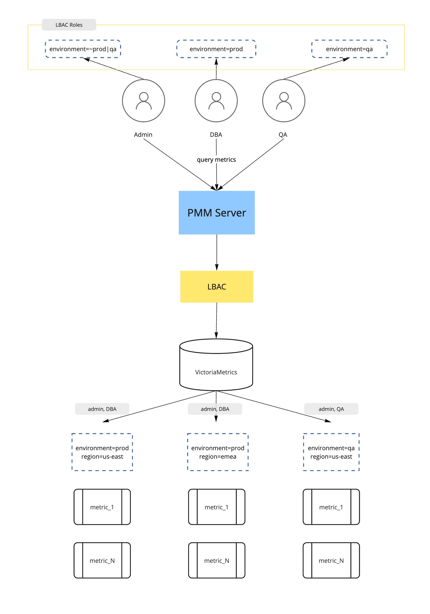
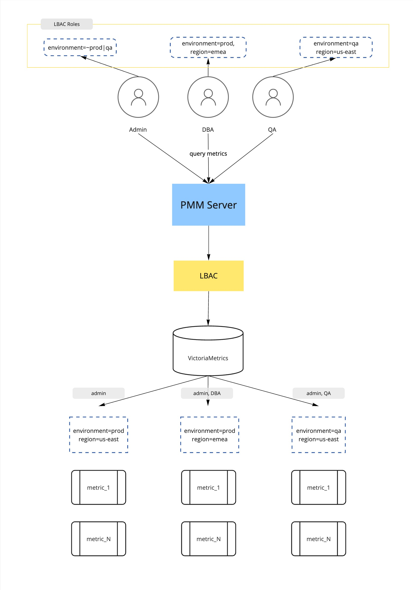

# Use Cases

An overview of the infrastructure can be seen in the diagram below. PMM monitors several services. The metrics that are stored in VictoriaMetrics have appropriate labels, for example, **environment** and **region**.

  <!-- source: https://miro.com/app/board/uXjVPfHchvM=/ -->
  

## Use case 1 - Simple selectors

This use case demonstrates a scenario with three different roles within an organization that have access to data in PMM. The access control for each role is enforced as follows:

- Admin role: access to all metrics, in both **prod** and **qa** environments and in both regions
- DBA role: access to metrics within **prod** environment in both regions
- QA role: access to metrics within **qa** environment in both regions

    <!-- source: https://miro.com/app/board/uXjVPfHchvM=/ -->
    

**Acess summary**

| **Role**  | **Label selectors**  | **Accessible metrics** |
|-----------|----------------------|-----------------------|
| **Admin** | environment=~prod|qa | The metrics in "prod" and "qa" environments in all regions will be accessible.|
| **DBA**   | environment=prod AND region=emea| The metrics in "prod" environment in all regions will be accessible.|
| **QA**    | environment=qa, region=us-east | The metrics in "qa" environment in all regions will be accessible.|

## Use case 2 - Compound selectors

This use case is a modification of the prior scenario, where the labels selectors are compound to provide a more granular access. In particular, both the **DBA** and **QA** roles now have access to one specific region each.

- Admin role: access to all metrics, in both **prod** and **qa** environments and in both regions
- DBA role: access to metrics within **prod** environment and in **emea** region only
- QA role: access to metrics within **qa** environment and in **us-east** region only

    <!-- source: https://miro.com/app/board/uXjVPfHchvM=/ -->
    

**Acess summary**

| **Role**  | **Label selectors**  | **Accessible metrics** |
|-----------|----------------------|-----------------------|
| **Admin** | environment=~prod|qa | The metrics in "prod" and "qa" environments in all regions will be accessible.|
| **DBA**   | environment=prod AND region=emea| The metrics for "emea" region in "prod" environment will be accessible.|
| **QA**    | environment=qa, region=us-east | The metrics for "us-east" region in "qa" environment will be accessible.|
