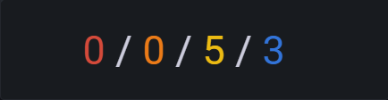

# Advisor details

Percona advisors provide automated insights and recommendations within Percona Monitoring and Management (PMM). These proactive insights help you uncover problems before they become larger issues: security risks, misconfigurations, poor performance, etc.

Advisor checks are grouped by category: Connections, Durability, Logging, Maintenance, Performance, Replication, Resources, Schema & indexes, Security and Versions. Each category offers a set of automated checks, which investigate a specific range of possible issues. You can browse all checks on the **Advisors > Catalog** page.

## Enable/Disable
Advisors are bundled with every PMM installation and automatically loaded by PMM Server when starting up. PMM runs automatic advisor checks in the background when the **Advisors** option is enabled under **Configuration > Settings > Advisors**. This option is enabled by default, but you can disable it at any time if you do not need to check the health and performance of your connected databases.

To turn off a single check, go to **Advisors > Catalog** and use the **Status** switch in the check's row. To turn off a check only for some services, click the :material-dns-outline: **Disable for services** icon in the check's row, select the services, and click **Disable**. The check keeps running on the other services of its type.

## Automatic checks
Advisor checks can be executed manually or automatically.

By default, PMM runs checks every 24 hours, only for database types present in your inventory. This keeps your results focused and avoids unnecessary checks.

For example, if you only monitor PostgreSQL services, PMM skips MySQL and MongoDB checks. **Advisors > Catalog** still lists all available checks, but only PostgreSQL checks are executed and can show as Failed.

Check results *always* remain on the PMM Server. They are never sent as part of Telemetry.

## Configure execution intervals
To control when and how often advisor checks run:

- for all checks: Navigate to **Configuration > Settings > Advisors** and use the **Rare**, **Standard**, and **Frequent** fields under **Check run interval** to set global default intervals.
- for individual checks: Navigate to **Advisors > Catalog** and select an interval in the check's **Interval** column.

### Change run interval for automatic advisors
You can change the standard 24-hour interval to a custom frequency for each advisor check:

 - *Rare interval* - 78 hours
 - *Standard interval* (default) - 24 hours
 - *Frequent interval* - 4 hours

To change the frequency of an automatic check:
{.power-number}

1. Go to **Advisors > Catalog**.
2. Find your check. To narrow the list, type in **Search checks**, which matches the name, summary, description, category and technology of each check, or use the **Category**, **Technology**, **Interval** and **Status** filters.

    !!! hint "Tip"
        If you need to share the filtered list of checks with your team members, send them the PMM URL. The URL keeps your search and filters.
3. In the check's **Interval** column, select **Rare**, **Standard** or **Frequent**. The new interval applies right away, and a message confirms the change.

## Manual checks
In addition to the automatic checks that run every 24 hours, you can also run checks manually, for ad-hoc assessments of your database health and performance.

To run checks manually, go to **Advisors > Catalog** and do one of the following:

- To run all checks, click the :material-play-outline: **Run all** icon. This icon is available only when no search or filter is applied.
- To run some checks, narrow the list with **Search checks** or the filters, then click the :material-playlist-check: **Run selected** icon. PMM runs every enabled check in the filtered list.
- To run a single check, click the :material-play-outline: **Run** icon in the check's row.

A message confirms that the checks started. To see their results, click **View results** in the message.

## One run at a time
PMM runs one set of advisor checks at a time, whether you start the checks manually or they run automatically.

If you start checks while another run is queued or in progress, PMM doesn't start them. Instead, an error message tells you who started the current run and how long ago. Try again when the current run finishes.

If automatic checks become due while another run is in progress, PMM starts them as soon as that run finishes. Automatic checks of different intervals that become due at the same time run together, as one run.

### Run status
To see the status of each run, go to **Advisors > Run history**. The **Duration** column shows one of the following:

- **Queued…**: The run waits for PMM to start it, which takes up to a minute.
- **Running…**: The run is executing checks.
- The run duration: The run finished.
- **Interrupted**: PMM restarted, or the leader of a high availability (HA) cluster changed, before the run finished. The insights that the run saved are kept, and the checks that the run didn't reach show as **Not run**.
- **Aborted**: The run stopped before running any check. The PMM Server logs show the cause.

While a run is in progress, the **Run history** and **Insights** pages refresh every 10 seconds, so you can follow the run as it progresses.

The **Triggered by** column shows who started the run: **User** or **Scheduler**. If the run was limited to some interval groups, the column also lists them, for example **Scheduler · Frequent**. A run that wasn't limited to interval groups shows only who started it, for example **Scheduler**.

### Run coverage
When a run starts, PMM works out every check-and-service pair that the run will execute. This is the run's plan. The **Checks** and **Services** columns show how much of its plan the run covered, as *n*/*N*:

- **Checks**: *n* checks passed or found an issue on at least one service, out of the *N* checks that the run planned.
- **Services**: *n* services had at least one check that passed or found an issue, out of the *N* services that the run planned to cover.

Checks that couldn't run don't count toward *n*. The **Errors** column counts them instead. If a finished run covered less than it planned, *n* shows in a warning colour.

Some runs show one of the following values instead:

- **—**: The run has no plan. It is queued or aborted, or it stopped while planning.
- **0/0**: The run completed with nothing to check. There are no MySQL, PostgreSQL or MongoDB services, or every check that applies to them is disabled.

### Run again
To repeat a run, go to **Advisors > Run history**, click the :material-dots-vertical: icon in the run's row, and select **Run again**. PMM starts a new run with the same scope: the same checks, services and interval groups. As with any other run, PMM doesn't start it while another run is queued or in progress.

## Advisor results
The results are sent to PMM Server, where you can review them on the **Advisors > Insights** page. For an overview, the **Advisor Insights** panel on the [Environments Overview](../reference/dashboards/dashboard-env-overview.md) dashboard shows how many checks failed in their most recent run, by severity:

- <b style="color:#e02f44;">Critical</b>
- <b style="color:#e36526;">Error</b>
- <b style="color:#ecbb13;">Warning</b>
- <b style="color:#3274d9;">Info</b>

To see more details about the available checks and any checks that failed, click the :material-magnify-expand: *Advisors* icon on the main menu.

### Insight status
**Advisors > Insights** lists the outcome of each check on each service. When a run starts, PMM records a **Pending** insight for every check-and-service pair in the run's plan. As each check finishes, its insight changes to one of the following statuses:

- **OK**: The check passed.
- **Failed**: The check found an issue.
- **Error**: PMM couldn't execute the check. The insight shows the reason, for example that the service has no pmm-agent, or that its pmm-agent has never connected.

If the run ends before it reaches a check, for example because PMM restarted or the HA leader changed, the check's insight changes to **Not run**.

The **Error** status is different from the **Error** severity. The status means that the check couldn't run, while the severity rates an issue that a check found.

**Pending** and **Not run** insights have no severity and no **Checked at** time, so both columns show **—**. The list shows them after the insights of checks that ran, and you can select them in the **Status** filter. To see why a check is pending or didn't run, open the insight's details pane.

To run an insight's check again on the same service, click the :material-dots-vertical: icon in the insight's row and select **Re-run now**. For a **Not run** insight, this runs the check that the run didn't reach. **Re-run now** isn't available for a **Pending** insight, because its check belongs to the run in progress.

If the pmm-agent of a service is too old for a check, the check doesn't apply to that service. The run leaves that pair out of its plan, so it has no insight and doesn't count toward the run's coverage.

### History retention
PMM keeps runs and their insights for the period set in **Advisor history retention** under **Configuration > Settings > Advisors**, 30 days by default. When a run started longer ago than this period, PMM deletes the run together with all its insights, including **Pending** and **Not run** ones.

## Email notifications
PMM can email you a report after each Advisor run that finds issues, so that you learn about them without opening PMM.

### Prerequisites
PMM sends the emails through the SMTP server that the `GF_SMTP_*` environment variables of the PMM Server container configure. Set at least `GF_SMTP_ENABLED=true`, `GF_SMTP_HOST` with the server's port, and `GF_SMTP_FROM_ADDRESS`. For details, see [Configure Email (SMTP) server settings](../alert/contact_points.md#configure-email-smtp-server-settings).

### Turn on notifications
To turn on Advisor notifications:
{.power-number}

1. Go to **Configuration > Settings > Advisors**. The notification settings appear only when the **Advisors** option is enabled.
2. Turn on **Advisor notifications**.
3. In **Notification recipients**, enter up to 20 email addresses, separated by commas. Enter plain addresses, such as `dba@example.com`, without display names.
4. In **Notification severity threshold**, select the least severe level that triggers a notification: **Critical**, **Error**, **Warning** or **Info**. The default is **Error**.
5. Optional: To check that the emails arrive, click **Send test email**.
6. Click **Apply changes**.

The test email goes to the addresses that are currently in **Notification recipients**, so you can test them before you apply the changes. It contains sample findings at or above the severity threshold that is currently applied. No checks are run, and nothing is recorded in PMM. If PMM can't send the email, for example because a `GF_SMTP_*` variable is missing, an error message shows the cause.

If PMM Server runs with the [`PMM_ENABLE_ADVISOR_NOTIFICATIONS`](../install-pmm/install-pmm-server/deployment-options/docker/env_var.md#feature-controls) environment variable, the variable controls whether notifications are on, and you can't change **Advisor notifications** in the UI. You must still set **Notification recipients**, because PMM sends no email without them.

### Email contents
When a run completes with findings at or above the severity threshold, PMM sends one email about that run. Runs without such findings send no email, and neither do runs that are interrupted or aborted. The email lists only failed checks, not checks that passed or couldn't run.

The email contains the following:

- A count of the findings by severity and by technology: MySQL, PostgreSQL and MongoDB
- Suggested next steps
- The details of each finding, in the same format as **Copy as text** on the **Advisors > Insights** page

## Create your own advisors
Advisors detect common security threats, performance degradation, data loss and data corruption. If you are a developer, you can create custom checks to cover additional use cases, relevant to specific database infrastructure. 

For more information, see [Develop Advisor checks](../advisors/develop-advisor-checks.md).

