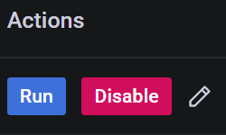
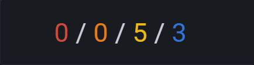

# Advisor details

Percona advisors provide automated insights and recommendations within Percona Monitoring and Management (PMM). These proactive insights help you uncover problems before they become larger issues: security risks, misconfigurations, poor performance, etc.

Advisors are grouped by category: Security, Configuration, Performance and Query. Each advisor category offers a set of automated checks, which investigate a specific range of possible issues. 

## Enable/Disable
Advisors are bundled with every PMM installation and automatically loaded by PMM Server when starting up. PMM runs automatic advisor checks in the background when the **Advisors** option is enabled under **Configuration > Settings > Advanced Settings**. This option is enabled by default, but you can disable it at any time if you do not need to check the health and performance of your connected databases.

## Automatic checks
Advisor checks can be executed manually or automatically.
By default, PMM runs all the checks available for your PMM instances every 24 hours.

Check results *always* remain on the PMM Server. They are never sent as part of Telemetry.

### Change run interval for automatic advisors
You can change the standard 24-hour interval to a custom frequency for each advisor check:

 - *Rare interval* - 78 hours
 - *Standard interval* (default) - 24 hours
 - *Frequent interval* - 4 hours

To change the frequency of an automatic check:
{.power-number}

1. Click :material-magnify-expand: **Advisors**.
2. Select the **Advisor** tab that contains the check for which you want to change the frequency.
3. Expand the relevant advisor and scroll through the list to find your check. Alternatively, use the **Filter** section at the top of the table to search checks by Name, Description, Status, or Interval.

    !!! hint alert alert-success "Tip"
        If you need to share filtered advisor results with your team members, send them the PMM URL. This saves your search criteria and results.
4. Click the :material-pencil-box-outline: **Interval** icon in the **Actions** column, next to the check you want to update.
5. Chose an interval and click **Save**.

## Manual checks
In addition to the automatic checks that run every 24 hours, you can also run checks manually, for ad-hoc assessments of your database health and performance.

To run checks manually:
{.power-number}

1. Click :material-magnify-expand: **Advisors** on the main menu.
2. Select the **Advisor** tab that contains the checks which you want to run manually.
3. Click **Run checks** to run all the available checks for this advisor group, or expand an advisor and click **Run** next to each check that you want to run individually.

## s results
The results are sent to PMM Server where you can review any failed checks on the Home dashboard. The summary count of failed checks is classified as:

- <b style="color:#e02f44;">Critical</b>, which also includes checks tagged as **Alert** and **Emergency**
- <b style="color:#e36526;">Error</b>
- <b style="color:#5794f2;">Warning</b>
- <b style="color:#3274d9;">Notice</b>, which also includes checks tagged as **Info** and **Debug**

To see more details about the available checks and any checks that failed, click the :material-magnify-expand: *Advisors* icon on the main menu.

## Create your own advisors
Advisors detect common security threats, performance degradation, data loss and data corruption. If you are a developer, you can create custom checks to cover additional use cases, relevant to specific database infrastructure. 

For more information, see [Develop Advisor checks](../advisors/develop-advisor-checks.md).

