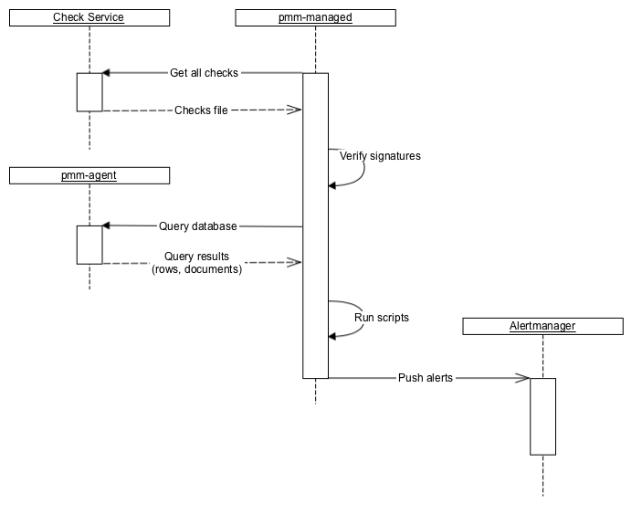
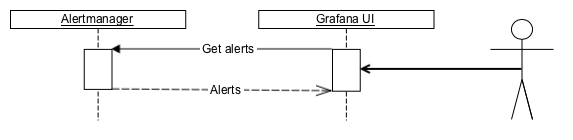

# Developing Advisor checks

PMM offers sets of checks that can detect common security threats, performance degradation, data loss and data corruption.

As a developer, you can create custom checks to cover additional use cases, relevant to your specific database infrastructure.

## Check components

A check is a combination of:

- A query for extracting data from the database.
- Python script for converting extracted data into check results. This is actually a [Starlark](https://github.com/google/starlark-go) script, which is a Python dialect that adds more imperative features than Python. The script's execution environment is sandboxed, and no I/O can be done from it.

All checks are self-contained in the first phase, as well as in most of the planned phases.

This means that extracted data is processed on the PMM side and not sent back to Percona Platform.

## Backend

At the backend, pmm-managed does the following:
{.power-number}

1. pmm-managed checks that the installation is opted-in for checks.
2. pmm-managed downloads files with checks from Percona Platform.
3. pmm-managed verifies file signatures using a list of hard-coded public keys. At least one signature should be correct.
4. pmm-managed sends queries to pmm-agent and gathers results.
5. pmm-managed executes check scripts that produce alert information.
6. pmm-managed sends alerts to Alertmanager.
   - Due to Alertmanager design, pmm-managed has to send and re-send alerts to it much more often than the frequency with which checks are executed. This expected behavior is not important for using checks but is important for understanding how checks work.
   - Currently, Prometheus is not involved.



## Frontend
PMM uses Alertmanager API to get information about failed checks and show them on the UI:



## Format for checks
Advisor checks use the following format:

??? note alert alert-info "Checks format"

    
    ```yaml
    ---
    checks:
      - version: 2
        name: exampleV2
        summary: Check format V2
        description: Checks something important
        interval: standard
        family: MYSQL
        category: configuration ## Deprecated since PMM 2.36
        advisor: dev            ## Required since PMM 2.36
        queries:
          - type: MYSQL_SHOW
            query: VARIABLES

          - type: METRICS_INSTANT
            query: mysql_global_status_uptime{service_name=~"{{.ServiceName}}"}

          - type: METRICS_INSTANT
            query: mysql_global_status_uptime{service_name=~"{{.ServiceName}}"}
            parameters:
              lookback: 5m

          - type: METRICS_RANGE
            query: avg by (node_name) (avg_over_time(node_load1{node_name=~"{{.NodeName}}"}[5m]))
            parameters:
              range: 15m
              step: 5m

          - type: METRICS_RANGE
            query: avg by (node_name) (avg_over_time(node_load1{node_name=~"{{.NodeName}}"}[5m]))
            parameters:
              lookback: 5m
              range: 15m
              step: 5m

        script: |
          def check_context(docs, context):
              # `docs` is a frozen (deeply immutable) list where each item represents single query results. Order of results
              # matches order of queries in check file. Each query result is list of dicts where each item where each dict
              # represents a single document in result set.
              #
              # `context` is a dict with additional functions.
              #
              # Global `print` and `fail` functions are available.
              #
              # `check_context` function is expected to return a list of dicts that are then converted to alerts;
              # in particular, that list can be empty.
              # Any other value (for example, string) is treated as a script execution failure
              # (Starlark does not support Python exceptions);
              # it is recommended to use global function `fail` for that instead.

              results = []

              for row in docs[0]:
                  name, value = row["Variable_name"], row["Value"]
                  if name == "version":
                      results.append({
                          "summary": "MySQL has version {}".format(value),
                          "description": "Current version is {}".format(value),
                          "read_more_url": "",
                          "severity": "warning",
                          "labels": {},
                      })

              uptimeNow = int(int(docs[1][0]["value"][1])/60)
              results.append({
                  "summary": "MySQL uptime {} min".format(uptimeNow),
                  "description": "Current uptime is {} min".format(uptimeNow),
                  "read_more_url": "",
                  "severity": "warning",
                  "labels": {},
              })

              uptimeFiveMinAgo = int(int(docs[2][0]["value"][1])/60)
              results.append({
                  "summary": "MySQL uptime 5 min ago was {} min".format(uptimeFiveMinAgo),
                  "description": "5 min ago uptime was {} min".format(uptimeFiveMinAgo),
                  "read_more_url": "",
                  "severity": "warning",
                  "labels": {},
              })

              dataPoints = []
              for row in docs[3][0]["values"]:
                dataPoints.append(row[1])

              results.append({
                  "summary": "Node has load average for last 15 minutes {}".format(dataPoints),
                  "description": "Data points {}".format(dataPoints),
                  "read_more_url": "",
                  "severity": "warning",
                  "labels": {},
              })

              dataPoints = []
              for row in docs[4][0]["values"]:
                  dataPoints.append(row[1])

              results.append({
                  "summary": "Five minutes ago node had load average for 15 minutes {}".format(dataPoints),
                  "description": "Data points {}".format(dataPoints),
                  "read_more_url": "",
                  "severity": "warning",
                  "labels": {},
              })

              return results
    ```
    

## Checks script

The check script assumes that there is a function with `check_context`, that accepts a _list_ where each item represents the result of a single query specified in the check. Each result itself is a _list_ of _docs_ containing returned rows for SQL databases and documents for MongoDB. It returns zero, one, or several check results that are then converted to alerts.

## Check severity levels

You can label your advisor checks with one of the following available severity levels: **Emergency**, **Alert**, **Critical**, **Error**, **Warning**, **Notice**, **Info**, **Debug**.
PMM groups failed checks by their severity, and displays them under **Advisors Checks > Failed Checks**.

## Check fields

Checks can include the following fields:

- **Version** (integer, required): defines what other properties are expected, what types are supported, what is expected from the script and what it can expect from the execution environment, etc.
- **Name** (string, required): defines machine-readable name (ID).
- **Summary** (string, required): defines short human-readable description.
- **Description** (string, required): defines long human-readable description.
- **Family** (string, required): specifies one of the supported database families: MYSQL, POSTGRESQL, MONGODB. This field is only available for Advisor checks v.2.
- **Advisor** (string, required): specifies the advisor to which this check belongs. For local environments, specify **dev**.
- **Interval** (string/enum, optional): defines running interval. Can be one of the predefined intervals in the UI: Standard, Frequent, Rare.
- **Queries** (array, required): contains items that specify queries.
    - **Type** (string/enum, required): defines the query type. Check the list of available types in the table below.
    - **Query** (string, can be absent if the type defines the whole query by itself): The query is executed on the PMM Client side and can contain multiple queries specific to the target DBMS.
    - **Parameters** (key-value, can be absent if query doesn't have required parameters)
- **Script** (string, required): contains a small Starlark script that processes query results, and returns check results. It is executed on the PMM Server side.


## Query types

Expand the table below for the list of checks types that you can use to define your query type and the PMM Service type for which the check will run.

??? note alert alert-info "Check types"

    | Check type  |  Description | "query" required (must be empty if "No")   |
    |---|---|---|
    | MYSQL_SHOW |Executes 'SHOW …' clause against MySQL database. |Yes|
    | MYSQL_SELECT    |     Executes 'SELECT …' clause against MySQL database.  |Yes|
    | POSTGRESQL_SHOW     |    Executes 'SHOW ALL' command against PosgreSQL database.    |No|
    | POSTGRESQL_SELECT      | Executes 'SELECT …' clause against PosgreSQL database.  |Yes|
    | MONGODB_GETPARAMETER     | Executes db.adminCommand( { getParameter: "*" } ) against MongoDB's "admin" database. For more information, see [getParameter](https://docs.mongodb.com/manual/reference/command/getParameter/)| No|
    | MONGODB_BUILDINFO    | Executes db.adminCommand( { buildInfo:  1 } ) against MongoDB's "admin" database. For more information, see [buildInfo](https://docs.mongodb.com/manual/reference/command/buildInfo/) | No|
    | MONGODB_GETCMDLINEOPTS          |    Executes db.adminCommand( { getCmdLineOpts: 1 } ) against MongoDB's "admin" database. For more information, see [getCmdLineOpts](https://docs.mongodb.com/manual/reference/command/getCmdLineOpts/) |No|
    | MONGODB_REPLSETGETSTATUS     |   Executes db.adminCommand( { replSetGetStatus: 1 } ) against MongoDB's "admin" database. For more information, see  [replSetGetStatus](https://docs.mongodb.com/manual/reference/command/replSetGetStatus/) |No|
    | MONGODB_GETDIAGNOSTICDATA |Executes db.adminCommand( { getDiagnosticData: 1 } ) against MongoDB's "admin" database. For more information, see [MongoDB Performance](https://docs.mongodb.com/manual/administration/analyzing-mongodb-performance/#full-time-diagnostic-data-capture)| No|
    | METRICS_INSTANT |Executes instant [MetricsQL](https://docs.victoriametrics.com/MetricsQL.html) query. Query can use placeholders in query string  **{{.NodeName**}} and **{{.ServiceName}}**  . Both match target service/node names. To read more about instant queries, check out the [Prometheus docs](https://prometheus.io/docs/prometheus/latest/querying/api/#instant-queries).|Yes|
    | METRICS_RANGE |Executes range [MetricsQL](https://docs.victoriametrics.com/MetricsQL.html) query. Query can use placeholders in query string  **{{.NodeName**}} and **{{.ServiceName}}**  . Both match target service/node names. To read more about range queries, check out the [Prometheus docs](https://prometheus.io/docs/prometheus/latest/querying/api/#range-queries).|Yes|
    | CLICKHOUSE_SELECT |Executes 'SELECT ...' statements against PMM's [Query Analytics](../use/qan/index.md) ClickHouse database. Queries can use the  **{{.ServiceName**}} and **{{.ServiceID}}**   placeholders in query string. They match the target service name and service ID respectively.|Yes|

## Query parameters
- `METRICS_INSTANT`
    - **lookback** (duration, optional): specifies how far in past to look back to metrics history. If this parameter is not specified, then query executed on the latest data. Example values: `30s`, `5m`, `8h`.
- `METRICS_RANGE`
    - **lookback** (duration, optional): specifies how far in past to look back to metrics history. If this parameter is not specified, then query executed on the latest data. Example values: `30s`, `5m`, `8h`.
    - **range** (duration, required): specifies time window of the query. This parameter is equal to [Prometheus API](https://prometheus.io/docs/prometheus/latest/querying/api/#range-queries).
    - **step** (duration, required): query resolution. This parameter is equal to [Prometheus API](https://prometheus.io/docs/prometheus/latest/querying/api/#range-queries).
- `POSTGRESQL_SELECT`
    - **all_dbs** (boolean, optional): execute query on all available databases in PostgreSQL instance. If this parameter is not specified, then query executed on the default database (the one that was specified when service was added to PMM).

## Develop checks

!!! note alert alert-primary "Development/debugging only"
    Note that check development in PMM is currently for **debugging only** and **NOT for production use!**  Future releases plan to include the option to run custom local checks in addition to hosted Percona Platform checks.

To develop custom checks for PMM:
{.power-number}

1. Install the latest PMM Server and PMM Client builds following the [installation instructions](https://www.percona.com/software/pmm/quickstart#).
2. Run PMM Server with special environment variables:

    - `PERCONA_TEST_CHECKS_FILE=/srv/custom-checks.yml` to use checks from the local files instead of downloading them from Percona Platform.
    - `PERCONA_TEST_CHECKS_DISABLE_START_DELAY=true` to disable the default check execution start delay. This is currently set to one minute, so that checks run upon system start.
    - `PERCONA_TEST_CHECKS_RESEND_INTERVAL=2s` to define the frequency for sending the SA-based alerts to Alertmanager.

    ```sh
    docker run -p 443:8443 --name pmm-server \
    -e PERCONA_TEST_CHECKS_FILE=/srv/custom-checks.yml \
    -e PERCONA_TEST_CHECKS_DISABLE_START_DELAY=true \
    -e PERCONA_TEST_CHECKS_RESEND_INTERVAL=2s \
    perconalab/pmm-server:3-dev-container
    ```

3. Log into Grafana with credentials **admin/admin**.

4. Go to **PMM Configuration > Settings > Advanced Settings** and make sure the **Advisors** option is enabled.

5. Create `/srv/custom-checks.yml` inside the `pmm-server` container with the content of your check. Specify **dev** advisor in your check.

6. The checks will run according to the time interval defined on the UI. You can see the result of running the check on the home dashboard:

    

7. Click on the number of failed checks to open the Failed Checks dashboard:

    

8. Check out pmm-managed logs:
    ```sh
    docker exec -it pmm-server supervisorctl tail -f pmm-managed
    ```

## Troubleshooting and tips

When developing checks for PMM, you may encounter various issues. Here are solutions for common problems:

### Managing debug output
Debug mode generates excessive information in log files that can obscure important data. To disable debug logging, use `PMM_DEBUG=0`.

### Filtering logs
All check subsystem logs include the component=checks tag. Filter relevant logs with: `grep "component=checks" /path/to/pmm-managed.log`.

### Development tab issues

If your Development tab isn't appearing on the **Advisors** page:
{.power-number}

1. Verify your check file links to the development advisor: `advisor: dev`.
2. If the Development tab still doesn't appear, check for YAML formatting issues in your check file. Examine `pmm-managed` logs for parsing errors or validation failures.

### Reloading check files
There are two ways to reload your check file after making changes:

- Using the UI (when available): click the **Run check** button on the **Advisors** page.
- From command line (always works): SSH into PMM Server and execute: `supervisorctl restart pmm-managed`.

## Submit feedback
We welcome your feedback on the current process for developing and debugging checks. Send us your comments or post a question on the [Percona Forums](https://forums.percona.com/c/percona-monitoring-and-management-pmm/pmm-3/84).
