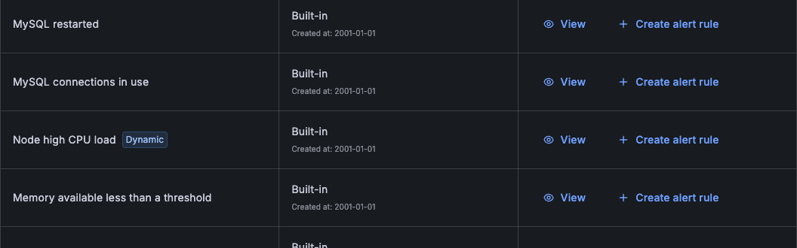
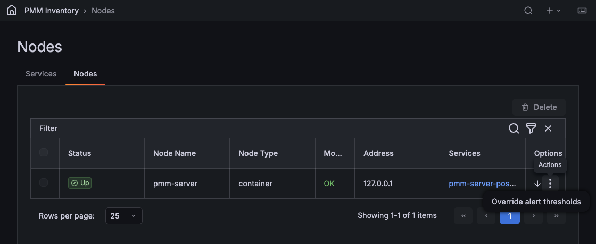
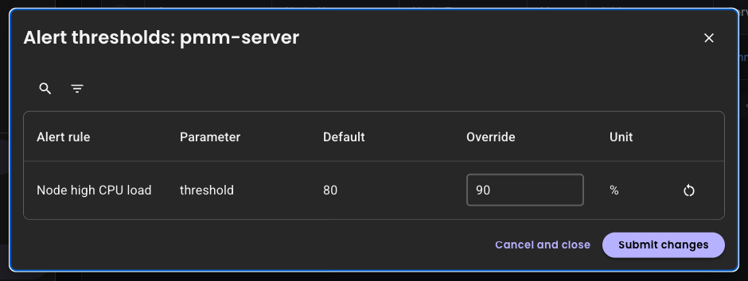

# Dynamic alert thresholds

Starting with PMM 3.10.0, you can change an alert rule's threshold for individual nodes without editing or duplicating the rule. Use it when one alert rule fits most of your nodes, but a few need a higher or lower limit.

## How dynamic thresholds work

A template can mark a threshold parameter as overridable. On the **Alerts &gt; Templates** page, these templates carry a **Dynamic** badge.

When you create an alert rule from such a template:

- The threshold value you enter becomes the rule's default for every node.
- An override replaces the default for one node, and the other nodes keep the default.
- Alert descriptions that include the threshold show the value in effect for the node that fired.



## Prerequisites

Before you start, make sure that:

- You have the **Admin** role.
- Percona Alerting is enabled.
- The alert rule was created in PMM 3.10.0 or later from a template with a **Dynamic** badge, such as `pmm_node_high_cpu_load`. To create one, see [Add an alert rule based on a template](alert_rules.md#add-an-alert-rule-based-on-a-template).

## Override a threshold for a node

To set a different threshold for one node:
{.power-number}

1. Go to **Inventory &gt; Nodes**.
2. Click the :material-dots-vertical: icon next to the node, then select **Override alert thresholds**.

    

3. In the **Override** column, enter the threshold for this node. The value uses the unit in the **Unit** column and must be within the range that the template allows.

    

4. Click **Submit changes**. PMM shows **Alert thresholds updated**.

The alert rule uses the new threshold from its next evaluation, usually within a minute. The node still has to exceed the threshold for the rule's **Duration** before the alert fires.

If PMM rejects a value, for example because it is out of range, the dialog stays open with your changes and PMM shows the reason.

## Reset a threshold to the default

To remove an override and return a node to the rule's default:
{.power-number}

1. Go to **Inventory &gt; Nodes**, click the :material-dots-vertical: icon next to the node, then select **Override alert thresholds**.
2. Click the :material-restart: icon (**Reset to default**) next to the threshold, or clear the **Override** field.
3. Click **Submit changes**.

Entering the default value has the same effect: PMM removes the override instead of storing a copy of the default.

## Make a custom template threshold dynamic

To enable overrides for a parameter in a [custom template](alert_rules.md#create-custom-templates), the template must meet these requirements:

- It uses **queries**, **expressions**, and **condition** instead of **expr**.
- The parameter has `type: float` and `overridable: true`.
- The parameter is the whole right-hand side of a comparison, for example `$A > [[ .threshold ]]`. Expressions such as `$A > [[ .threshold ]] * 100` are rejected.
- Every expression that uses the parameter compares it against the same query.
- The query result keeps the `node_name` label, so that PMM can match each node to its override.

The following template makes the `threshold` parameter of a CPU load alert overridable:


```yaml
templates:
  - name: custom_node_high_cpu_load
    version: 1
    summary: Node high CPU load
    queries:
      - ref_id: A
        expr: |-
          (1 - avg by(node_name) (rate(node_cpu_seconds_total{mode="idle"}[5m]))) * 100
    expressions:
      - ref_id: C
        type: math
        expression: "$A > [[ .threshold ]]"
    condition: C
    params:
      - name: threshold
        summary: A percentage from configured maximum
        unit: "%"
        type: float
        range: [0, 100]
        value: 80
        overridable: true
    for: 5m
    severity: warning
    annotations:
      summary: Node high CPU load ({{ $labels.node_name }})
      description: |-
        {{ $labels.node_name }} CPU load is more than [[ .threshold ]]%.
```


For the full list of template fields, see [Template format](alert_rules.md#template-format).

## Limitations

Dynamic thresholds have the following limitations:

- You can override thresholds per node only.
- Among the built-in templates, only `pmm_node_high_cpu_load` supports overrides.
- Alert rules created before PMM 3.10.0 don't support overrides. To use overrides, create the rule again from the template.
- The default is the value entered when the rule was created. If you later change the threshold in the rule's query in Grafana, the **Default** column doesn't reflect the change.
- A copy of an alert rule shares the overrides of the original rule.
- If PMM Server can't provide the overrides for more than 5 minutes, for example during a restart, nodes with overrides use the default until the overrides are available again.

## Automate threshold changes with the API

You can list, set, and clear thresholds with the PMM API, for example to apply the same overrides to many nodes at once. For the endpoints, see the alerting section of the [PMM API reference](https://percona-pmm.readme.io/reference/introduction).

## Next steps

- [Configure contact points](contact_points.md) to receive the alerts.
- [Silence alerts](silence_alerts.md) during planned maintenance.
- [Browse the alert template catalog](templates_list.md).
