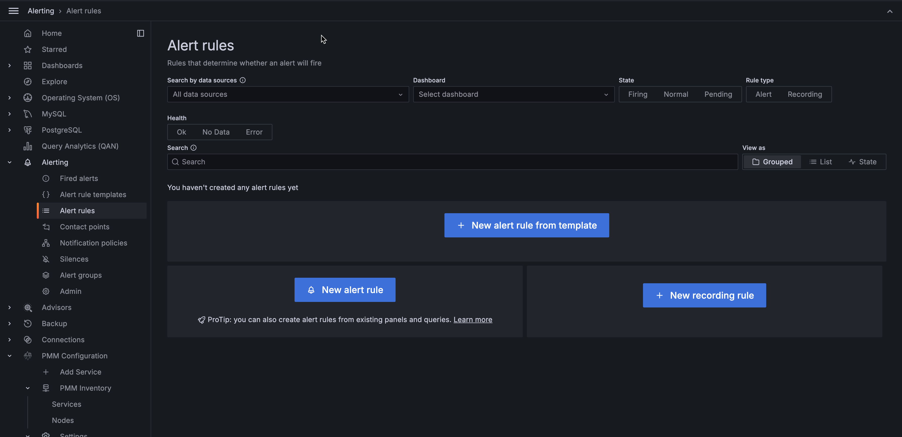
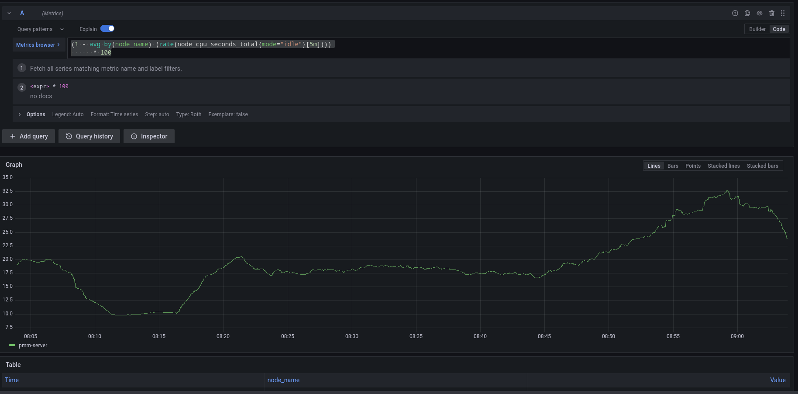

# Alert rules and alert templates

Alert rules describe the circumstances under which you want to be alerted. The evaluation criteria that you define determine whether an alert will fire. 

An alert rule consists of one or more queries and expressions, a condition, the frequency of evaluation, and the duration over which the condition is met. For example, you might configure an alert to fire and trigger a notification when MongoDB is down.



An alert rule can be in three possible states:

- Normal: Everything is working correctly and the conditions specified in the rule has not been met. This is the default state for newly created rules.
- Pending: The conditions specified in the alert rule has been met, but for a time that is less than the configured duration.
- Firing: Both the conditions and the duration specified in the alert rule have both been met.

It takes at least one evaluation cycle for an alert rule to transition from one state to another (e.g., from `Normal` to `Pending`).

## Alert rules templates

PMM provides a set of Alert Rule templates with common events and expressions for alerting. These templates can be used as a basis for creating Alert Rules. You can also create your own templates if you need custom expressions.

You can check the alert templates available for your account under **Alerting > Alert rule templates** tab. PMM lists here the following types of templates:

- Built-in templates, available out-of-the-box with PMM.
- Templates downloaded from Percona Platform.
- Custom templates created or uploaded on the **Alerting page > Alert Templates** tab. You can also store your custom template files in your ``/srv/alerting/templates`` directory and PMM will load them during startup.

## Accessing alert templates

To check the alert templates for your PMM instance, go to PMM > **Alerting > Alert Rule Templates** tab.

To check the full list of available PMM templates, see the [List of available alert templates topic](../alert/templates_list.md)

### Create alert rules from alert rule templates

This section focuses on creating an alert rule based on PMM templates. For information on working with the other alert types, check the Grafana documentation on [Grafana Labs](https://grafana.com/docs/grafana/latest/alerting/).

### Provision alert resources

Before creating PMM alert rules, configure the required alert resources:
{.power-number}

1. Go to **PMM Configuration > Settings > Advanced Settings** and ensure that the **Percona Alerting** option is enabled. When this is disabled, the **Alerting** page displays only Grafana-managed alert rules. This means that you will not be able to create alerts based on PMM templates.
2. Go to **Dashboards** and check the folders available for storing alert rules. If none of the available folders are relevant for your future alert rules, click **New > New Folder** and create a custom one.
3. Go to **Alerting > Alert rule templates** and check the default PMM templates. If none of the templates include a relevant expression for the type of alerts that you want to create, click **Add template** to create a custom template instead.

### Configure alert templates

Alerts templates are YAML files that provide the source framework for alert rules.
Alert templates contain general template details and an alert expression defined in [MetricsQL](https://docs.victoriametrics.com/MetricsQL.html). This query language is backward compatible with PromQL.

### Create custom templates

If none of the default PMM templates contain a relevant expression for the alert rule that you need, you can create a custom template instead.

You can base multiple alert rules on the same template. For example, you can create a `pmm_node_high_cpu_load` template that can be used as the source for alert rules for production versus staging, warning versus critical, etc.

### Template format

When creating custom templates, make sure to use the required template format below:

- **name** (required): uniquely identifies template. Spaces and special characters are not allowed.
- **version** (required): defines the template format version.
- **summary** (required): a template description.
- **expr** (required): a MetricsQL query string with parameter placeholders.
- **params**: contains parameter definitions required for the query. Each parameter has a name, type, and summary. It also may have a unit, available range, and default value.
    - **name** (required): the name of the parameter. Spaces and special characters are not allowed.
    - **summary** (required): a short description of what this parameter represents.
    - **unit** (optional): PMM currently supports either s (seconds) or % (percentage).
    - **type** (required): PMM currently supports the `float` type. `string`, `bool`, and other types will be available in a future release.
    - **range** (optional): defines the boundaries for the value of a  float parameter
   - **value** (optional): default parameter value. Value strings must not include any of these special characters: `< > ! @ # $ % ^ & * ( ) _ / \ ' + - = (space)`
- **for** (required): specifies the duration of time that the expression must be met before the alert will be fired
- **severity** (required): specifies default alert severity level
 - **labels** (optional): are additional labels to be added to generated alerts

- **annotations** (optional): are additional annotations to be added to generated alerts.

??? info "Template example"

    ```yaml
    
    ---
    templates:
      - name: pmm_node_high_cpu_load
        version: 1
        summary: Node high CPU load
        expr: |-
          (1 - avg by(node_name) (rate(node_cpu_seconds_total{mode="idle"}[5m])))
          * 100
          > bool [[ .threshold ]]
        params:
          - name: threshold
            summary: A percentage from configured maximum
            unit: "%"
            type: float
            range: [0, 100]
            value: 80
        for: 5m
        severity: warning
        annotations:
          summary: Node high CPU load ({{ $labels.node_name }})
          description: |-
            {{ $labels.node_name }} CPU load is more than [[ .threshold ]]%.
    
    ```

### Test alert expressions

If you want to create custom templates, you can test the MetricsQL expressions for your custom template in the **Explore** section of PMM. Here you can also query any PMM internal database.

To test expressions for custom templates:
{.power-number}

1. On the main menu in PMM, choose **Explore > Metrics**.
2. Enter your expression in the **Metrics** field and click **Run query**.

For example, to check the CPU usage, Go to **Explore > Metrics** in your PMM dashboard and run the query expression below:
```
(1 - avg by(node_name) (rate(node_cpu_seconds_total{mode="idle"}[5m]))) * 100
```


Note that to paste the query above, **Explore** must be in `Code` mode, and not in `Builder` mode.

### Add an alert rule based on a template

After provisioning the resources required for creating Percona templated alerts, you are now ready to create your alert rule based on a Percona template. 

If you want to learn about creating Grafana alerts instead, check out [Grafana's documentation](https://grafana.com/docs/grafana/latest/alerting/):
{.power-number}

1. Go to **Alerting > Alert Rules**, and click **New alert rule from template**.
2. On the **Create alert rule from template** page, choose the template on which you want to base the new alert rule. This automatically populates the **Name**, **Duration**, and **Severity** fields with information from the template. You can change these values if you want to override the default specifications in the template.
3. From the **Folder** drop-down menu, select the location where you want to store the rule.
4. In the **Filters** section, specify if you want the alert rule to apply only to specific services or nodes. For example: `service_name=ps5.7`. When creating alert rule filters, consider the following:
   
    - Filters use conjunction semantics. This means that if you add more than one filter, PMM will combine their conditions to search for matches: filter 1 AND filter 2 AND filter 3.
    - **Label** must be an exact match. You can find a complete list of labels using the <i class="uil uil-compass"></i> **Explore** menu in PMM.

5. Click **Save and Exit** to close the page and go to the **Alert Rules** tab where you can review, edit and silence your new alert.
