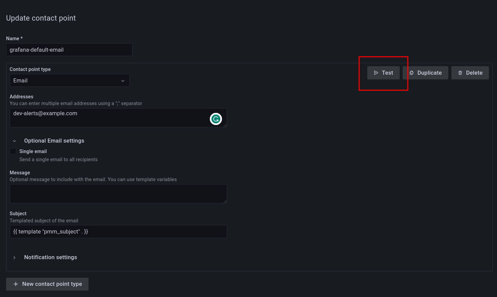
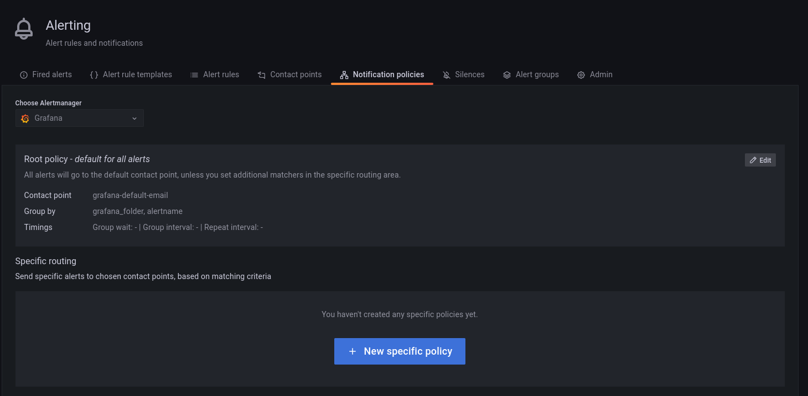

# Contact points

Contact points specify where Percona Alerting should deliver notifications for alerts. PMM can be configured via a Notification policy to send a notification to specified contact points whenever an alert is fired.

Depending on the severity of an alert, you might want to send different alert notifications to different channels. For example, you can deliver common notifications via a Slack channel, but send an email notification for potentially critical issues.  

Percona Alerting uses email as the default contact point but you can choose from a variety of other contact points, including Slack, Webhooks, PagerDuty, and more.

Before Percona Alerting can send out email notifications via email contact points, you will need to:
{.power-number}

1. Configure Email (SMTP) server settings.
2. Configure a contact point to define the email delivery options

Contact points with invalid settings show a **No Attempts** status under <i class="uil uil-bell"></i> **Alerting > Contact points**.

## Configure Email (SMTP) server settings

To use SMTP with a PMM Docker installation:
{.power-number}

1. Create an `.env` file and populate it with your SMTP credentials (and other environment variables) as follows:

    ```
    GF_SMTP_ENABLED=true  
    GF_SMTP_HOST=smtp.gmail.com:587
    GF_SMTP_USER=email@domain.com
    GF_SMTP_PASSWORD=<YOUR_SMTP_PASSWORD>
    GF_SMTP_SKIP_VERIFY=false
    GF_SMTP_FROM_ADDRESS=email@domain.com
    GF_SMTP_FROM_NAME=Percona Alerting
    ```
    Below is a summary of each environment variable above: 

    - `GF_SMTP_ENABLED`: When true, enables Grafana to send emails.
    - `GF_SMTP_HOST`: Host address of your SMTP server.
    - `GF_SMTP_USER`: Username for SMTP authentication.
    - `GF_SMTP_PASSWORD`: Password for SMTP authentication
    - `GF_SMTP_SKIP_VERIFY`: When true, verifies SSL for the SMTP server.
    - `GF_SMTP_FROM_ADDRESS`: Email address to be used when sending out emails.
    - `GF_SMTP_FROM_NAME`: Name to be used when sending out emails.

    *NB: If you are using your Gmail’s SMTP credentials as shown above, you will have to generate an app password and fill it in as the value of your $GF_SMTP_PASSWORD variable.*

2. Pass in the `.env` file to Docker run using the `--env-file` flag:
    ```
    docker run --env-file=.env -p 443:8443 percona/pmm-server:3
    ```
    This command starts a docker container and will keep running as long as the container is also running. Stopping the command (e.g with Ctrl+C) will stop the container hence, subsequent commands should be run in a new terminal.

## Restore SMTP settings following an upgrade

If you configured PMM to use SMTP settings via environment variables, you do not need to do anything after an upgrade as your settings will be transferred.

## Configure an Email contact point

After configuring the SMTP settings, specify email delivery options for an Email contact point:
{.power-number}

1. Go to **Alerting > Contact points**.
2. Click the edit button next to the **grafana-default-email** to update PMM's default Email contact point, or click **Add contact point** to create a custom one.
3. Enter a contact point name, and add the email addresses for the recipients of the email notifications.
4. Expand **Optional Email settings** and fill in any other relevant settings:
    - Enable the **Single email** option to send a single email to the recipients containing alerts that are firing. For example, if an alert fires for three nodes, this would send only one email listing all three alerts.
    - Add an optional message to include with the email notifications.
    - Edit the email subject for the notifications. The default subject line uses the following format [FIRING: *number of alerts firing for the alert rule*](*Name of alert rule and instance*).
5. If you do not want to be notified when an alert resolves, expand **Notification settings**, and tick the **Disable Resolved Message** checkbox.
6. If you want your contact point to notify via multiple channels, for example, both via Email and Teams, click **New contact point type** and fill out additional contact point type details.
7. Click the **Test** button to send a test email and make sure your contact point works as expected.
    
8. Click the **Save contact point** button at the bottom of the page. The contact point is now listed under **Alerting > Contact points**.

### Create additional contact points

In addition to Email contact points, you can add a variety of other contact points, including Slack, email, webhooks, PagerDuty, and more.

Follow the steps above to create additional contact points. Different contact points require different configuration information. For example, for Slack, PMM requires the recipient information, the API token and the webhook URL, which you can get from your Slack administrator.

## Notification policies

Notification policies determine how notifications (triggered by alerts) are routed to contact points by defining where, when, and how to send notifications.

For example, you might specify a limit for the number of times a notification is sent during a certain period. This helps ensure that you don't spam your Slack channel with too many notifications about the same issue.

### Root notification policy

Percona Alerting comes pre-configured with a Notification Root Policy, which is the default notification policy. It uses the **grafana-default-email** contact point and is applied to all alerts that don’t have a custom notification policy assigned to them.

### How matching works

Policies can have one or more child policies. An alert matches if the alert’s labels match all the **Matching Labels** specified on the policy.

Alerts that don't match any specific policies are handled by the root policy. The root policy also handles any alert rules for which the assigned custom notification policy has been deleted, to ensure notifications for existing alerts continue to be delivered.

### Edit the root notification policy

To edit the root notification policy:
{.power-number}

1. Go to <i class="uil uil-bell"></i> **Alerting > Notification policies** tab.
2. Click the ellipsis button next to the root policy box and select the **Edit** option.
3. Choose whether to keep the default Email contact point, select a new available contact point or create a new one.
4. In the **Group by** field, specify how alert rules should be processed into notifications. If multiple alerts are matched for this policy, they will be grouped based on the labels you specify, and a notification will be sent per group.
5. Expand the **Timing options** section and specify how notification wait times should be processed. These are short pauses the system can take to efficiently process multiple sets of alerts for notifications:
      - **Group wait**: The default is to wait 30 seconds to buffer alerts of the same group before sending a notification initially.
      - **Group interval**: The default is to wait five minutes before sending a batch of new alerts after the first notification was sent.
      - **Repeat interval**: The default is to wait four hours before resending an alert.
6. Click **Save** to save your changes.

### Create a new notification policy

To create a new notification policy:
{.power-number}

1. Go to <i class="uil uil-bell"></i> **Alerting > Notification policies** tab.


2. Click **New nested policy**.
3. The **Matching labels** section defines the rules for matching alert labels. The matching label is a combination of label name, operator and label value, where the label name is any valid label in your environment. For example:  `node_name`, `cluster`, etc.
A policy will match an alert if the alert’s labels match all the matching labels specified on the policy. If there are no matchers, **the policy will handle all the alert instances**. For example, you could add a **node_name=pmm-server** matcher to send out notifications only for this node.
4. Select an existing contact point for the policy.
5. Enable **Continue matching subsequent sibling nodes** to continue matching subsequent siblings of the policy after an alert matched the parent policy.
This can be useful, for example, when you want to send notifications to a catch-all contact point as well as to one of more specific contact points handled by subsequent policies.
6. Toggle **Override grouping** if you do not want to use root policy grouping.
7. Toggle **Override general timings** to specify how often you want to wait until the initial notification is sent for a new group. When this is disabled, PMM uses root policy group timings instead.
8. Add a mute timing if you want to mute notifications or this policy for a specific, regular interval. For example, you can create a mute to suppress trivial notifications during weekends. Mute timings are different from silences in the sense that they are recurring, while silences have a fixed start and end time.
   
    !!! caution alert alert-warning "Important"
        Time specified in mute timing must be in UTC format, i.e. 14:00, not 2:00 PM.
