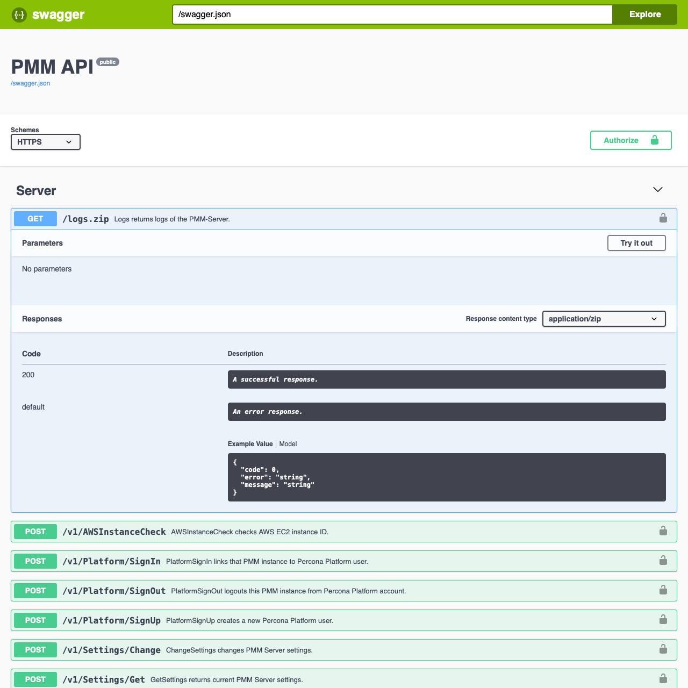

# About PMM API

PMM Server provides a comprehensive REST API that enables you to monitor databases, manage resources, collect metrics, and automate PMM operations programmatically. The API supports endpoints for managing nodes, services, agents, alerting, backups, and other PMM components. 

The [complete API documentation on Readme.io](https://percona-pmm.readme.io/reference/introduction) includes detailed endpoint specifications, authentication methods, example requests, and response schemas.

## Interactive API documentation

You can explore and test the API using the built-in [Swagger](https://swagger.io/tools/swagger-ui/) UI, accessible at the `/swagger/` endpoint of your PMM Server. The Swagger interface allows you to:

 - browse available API endpoints
 - view detailed request and response schemas
 - execute API requests directly from the browser
 - test different parameters and see live responses

## Core API resources

The PMM API organizes resources into Nodes, Services and Agents. 

### Nodes

A Node represents a hosting environment where your services run and monitoring takes place. This can include bare metal servers, virtual machines, Docker containers, or cloud instances like Amazon RDS.

Each Node can:

- host multiple Services and Agents
- receive insights from zero or more Agents
- be monitored independently of other components

### Services

A Service represents a monitored database or application instance in your infrastructure. These include database systems like MySQL, MongoDB, Amazon Aurora, PostgreSQL, and other supported database types.

Services can:

 - run on zero nodes (serverless configurations)
 - run on a single node (standalone installations)
 - span multiple nodes (distributed systems like Percona XtraDB Cluster)
 - receive monitoring insights from multiple Agents

### Agents
Agents are the monitoring components that:

- collect metrics, query data, and system information
- run on specific Nodes
- monitor multiple Services and/or Nodes
- include both internal PMM agents and External Exporters

## Resource types and management

All resources (Nodes, Services, and Agents) have specific Types which define their properties and operational logic. These Types determine how each resource behaves and what properties it can have within PMM.

The management of these resources follows specific patterns:

 - **Nodes and Services**: These are inherently external resources. PMM does not manage their actual creation or deletion. Instead, PMM maintains an inventory of these resources within PMM Server, allowing you to add them to or remove them from the inventory as needed.
- **Agents**: Most Agents are initiated and halted by pmm-agent. The exception is the External Exporter Type, which is initiated externally. Agents are responsible for collecting and reporting monitoring data about Nodes and Services.

## Authentication

API access requires authentication using service account tokens. 

For details about controlling access to the PMM Server components and resources, see **[Authentication with service accounts](../api/authentication.md)** topic.