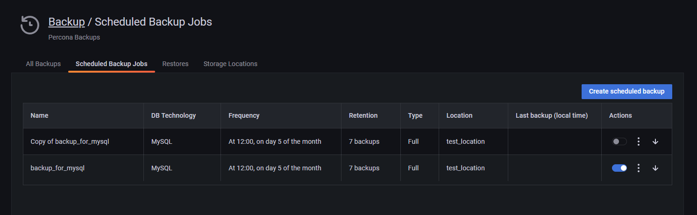

# Edit a scheduled backup

To edit a scheduled backup:
{.power-number}

1. Go to **Backup > Scheduled Backup Jobs**.
2. In the **Actions** column:
    - Click the switch :material-toggle-switch-outline: to enable or disable the backup.
    - Click :material-dots-vertical: to edit, delete or create a (by default, disabled) copy of the backup schedule.

 
