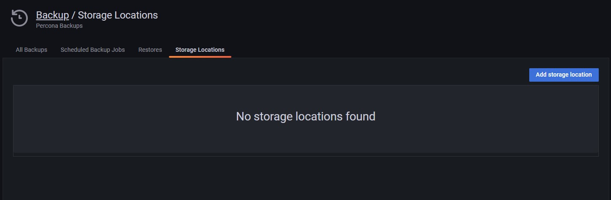

# Prepare a storage location

Prepare a storage location as a backup destination for creating and storing your backup artifacts.

PMM supports the following types of storage:

- **Amazon S3-compatible**: enables you to use not only AWS S3, but also other storage solutions that support S3 API, like [min.io](https://min.io/).
- **Local storage**: currently only available for MongoDB backups.

## Prepare a location for local backups
If you prefer storing your MongoDB backup artifacts on a remote filesystem, make sure that you've mounted the remote folder to all the mongoDB nodes on the same path, and that PBM tool has Write permissions on the path you define.

For more information, see the [Percona Backup for MongoDB (PBM) documentation](https://docs.percona.com/percona-backup-mongodb/details/storage-configuration.html#remote-filesystem-server-storage).

## Prepare a location for S3-compatible storage
If you want to store backup artifacts in S3-compatible storage, you can use [Amazon S3](https://aws.amazon.com/s3/), [Min.io](https://min.io/) or any other storage solution with S3-compatible API.

Before creating a cloud storage location for our future backups, make sure you have your S3-compatible storage ready. In addition to bucket location details, you will also need to ensure proper S3 permissions.

The general minimum permissions are **LIST**/**PUT**/**GET**/**DELETE**.
A sample [IAM](https://aws.amazon.com/iam/) policy is:

        ```json
        {
            "Version": "2012-10-17",
            "Statement": [
                {
                    "Effect": "Allow",
                    "Action": [
                        "s3:ListBucket"
                    ],
                    "Resource": "arn:aws:s3:::pmm-backup-testing"
                },
                {
                    "Effect": "Allow",
                    "Action": [
                        "s3:PutObject",
                        "s3:PutObjectAcl",
                        "s3:GetObject",
                        "s3:GetObjectAcl",
                        "s3:DeleteObject"
                    ],
                    "Resource": "arn:aws:s3:::pmm-backup-testing/*"
                }
            ]
        }
        ```
   
## Create the storage location

1. Go to **Backup > Storage Locations**:

    

2. Click **Add storage location** and fill in a name and description for this new location.
3. Choose the type of storage location you are creating:
     - **S3**: Specify the S3-compatible backup location endpoint (URL), bucket name, and connection details. 
     - **Local Client**: specify the path on your local client for files to be backed up to.

4. Optionally, for S3-compatible storages, you can click **Test** to check the connection.

5. Click **Add** to create the location.


## Specific target directories for backups

During backup creation, PMM enables you to set a specific folder within the local or S3-compatible location that you prepared following the instructions above.  
Organizing backups in folders not only makes it easier to group backups for an entire cluster, but also improves PMM-PBM (Percona Backup for MongoDB) integration workflows. 

The **Folder** field on the Create Backup pages is automatically populated with the value of the cluster label. You can change this default folder from PMM’s Advanced Settings, but make sure you understand how your custom folder will impact PBM integration workflows.
