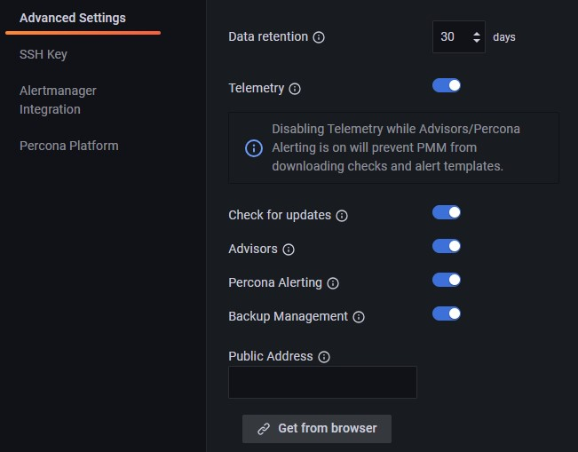
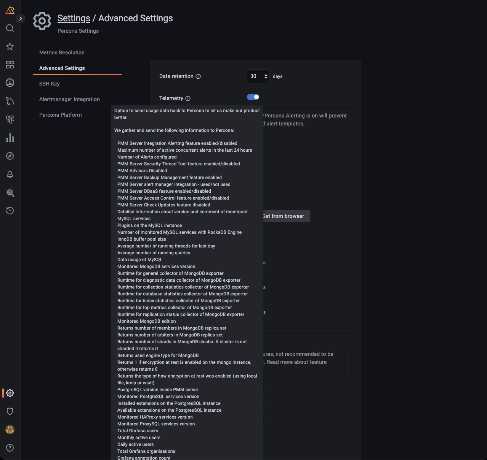

# Advanced PMM settings

## Data retention

**Data retention** specifies how long data is stored by PMM Server. By default, time-series data is stored for 30 days. You can adjust the data retention time to balance your system's available disk space with your metrics history requirements.

## Telemetry

The **Telemetry** switch enables gathering and sending basic **anonymous** data to Percona, which helps us to determine where to focus the development and what is the uptake for each release of PMM. 
Specifically, gathering this information helps determine if we need to release patches to legacy versions beyond support, determine when supporting a particular version is no longer necessary, and understand the best frequency of releases.

PMM Telemetry is based on data collected by various PMM components and stored inside PMM Server 

-!!! note alert alert-primary ""
    When PMM is installed, telemetry is not sent immediately. Before the first telemetry report is generated, PMM provides users with a 24-hour grace period to disable telemetry.

To see the metrics being collected by telemetry, from the [main menu](../reference/ui/ui_components.md#main-menu) navigate to **PMM Configuration** > <i class="uil uil-setting"></i> **Settings** > **Advanced Settings** > **Telemetry** and hover over the exclamation mark.

We do not gather anything that can identify your system, but consider the following:

1. The Country Code is evaluated from the submitting IP address before being discarded.

2. We do create an "instance ID" - a random string generated using UUID v4.  This instance ID is generated to distinguish new instances from existing ones, for figuring out instance upgrades.

The first telemetry reporting of a new PMM Server instance is delayed by 24 hours to allow enough time to disable the service for those that do not wish to share any information.

The landing page for this service, [check.percona.com](https://check.percona.com), explains what this service is.

Grafana’s [anonymous usage statistics](https://grafana.com/docs/grafana/latest/administration/configuration/#reporting-enabled) is not managed by PMM. To activate it, you must change the PMM Server container configuration after each update.

As well as via the **PMM Settings** page, you can also disable telemetry with the `-e DISABLE_TELEMETRY=1` option in your docker run statement for the PMM Server.

For information on the various config parameters for telemetry, see the [config file](https://github.com/percona/pmm/blob/main/managed/services/telemetry/config.default.yml).

When active, PMM will automatically check for updates and put a notification in the home page **Updates** dashboard if any are available.

## Advisors

Advisors are sets of checks grouped by functionality that run a range of database health checks on a registered PMM instance.

The findings are reported on the **Advisors > Advisor Insights** page, and an overview is displayed on the Home dashboard.

The Advisors option is enabled by default.  Checks are re-fetched and rerun at intervals.

See [Working with Advisor checks](../advisors/advisors.md).

## Percona Alerting

Enables [Percona Alerting](../alert/index.md) and reveals the **Percona templated alerts** option on the **Alerting** page.

## Backup Management

Enables [Backup Management](../backup/index.md) option and reveals the **Backup** page from where you can:

- Create and restore MongoDB and MySQL backups
- Automate backup scheduling
- Set retention policies
- Monitor your backup and restore activity

## Public Address

The address or hostname PMM Server will be accessible at. Click **Get from browser** to have your browser detect and populate this field automatically.

## Microsoft Azure monitoring

!!! caution alert alert-warning "Caution"
    This is a technical preview feature.

Activates Microsoft Azure monitoring.