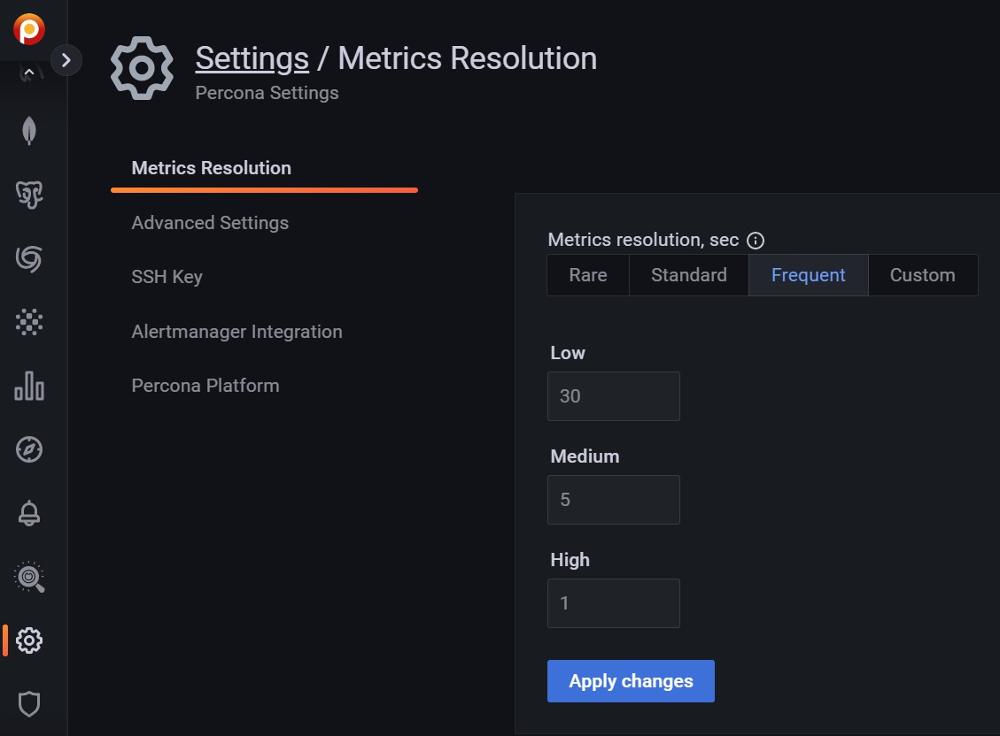

# Metrics resolution

Metrics are collected at three intervals representing low, medium and high resolutions.

The **Metrics Resolution** settings tab contains three fixed presets (**Rare**, **Standard** and **Frequent**) and an editable custom preset (**Custom**). Each preset is a group of low, medium and high resolutions. The values are in seconds.

!!! note alert alert-primary "Time intervals and resolutions"
    Short time intervals are **high** resolution metrics. Longer time intervals are *low* resolution. So:

    - A low resolution interval *increases* the time between collection, resulting in low-resolution metrics and lower disk usage.
    - A high resolution interval *decreases* the time between collection, resulting in high-resolution metrics and higher disk usage.

The default values (in seconds) for the fixed presets and their resolution names are:

| Editable? | Preset            | Low  | Medium | High |
|-----------|-------------------|------|--------|------|
| No        | Rare              | 300  | 180    | 60   |
| No        | Standard          | 60   | 10     | 5    |
| No        | Frequent          | 30   | 5      | 1    |
| Yes       | Custom (defaults) | 60   | 10     | 5    |

Values for the **Custom** preset can be entered as values, or changed with the arrows.

!!! note alert alert-primary "Note"
    If there is poor network connectivity between PMM Server and PMM Client, or between PMM Client and the database server being monitored, scraping every second may not be possible when the network latency is greater than 1 second.