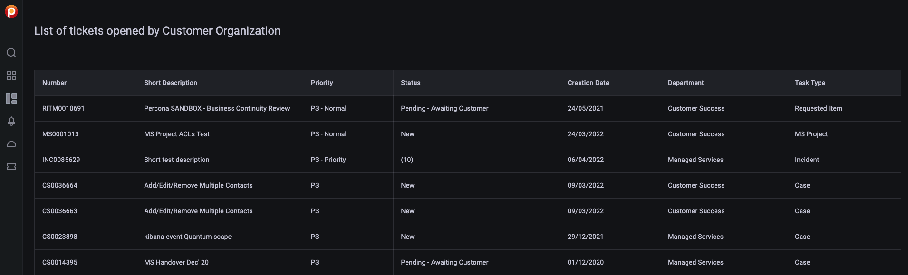

# Check Percona Portal account information

When you connect your PMM instances to Percona Platform, PMM gets access to:

-  [more alert templates](../../alert/templates_list.md)
-  [Registered Advisor Checks](../../advisors/advisor-details.md) for additional database checks
-  Paid Advisor Checks for more advanced database health checks. 
  
Paid checks are available when you connect to Percona Platform with a customer account.

You can check the list of available Paid Advisor checks on the [Advisors details page](../../advisors/advisor-details.md).

When you connect with a customer account, PMM  reveals two new tabs on the main menu, where you can check all the information available for your customer accounts:  **Entitlements** and **Support tickets**:

