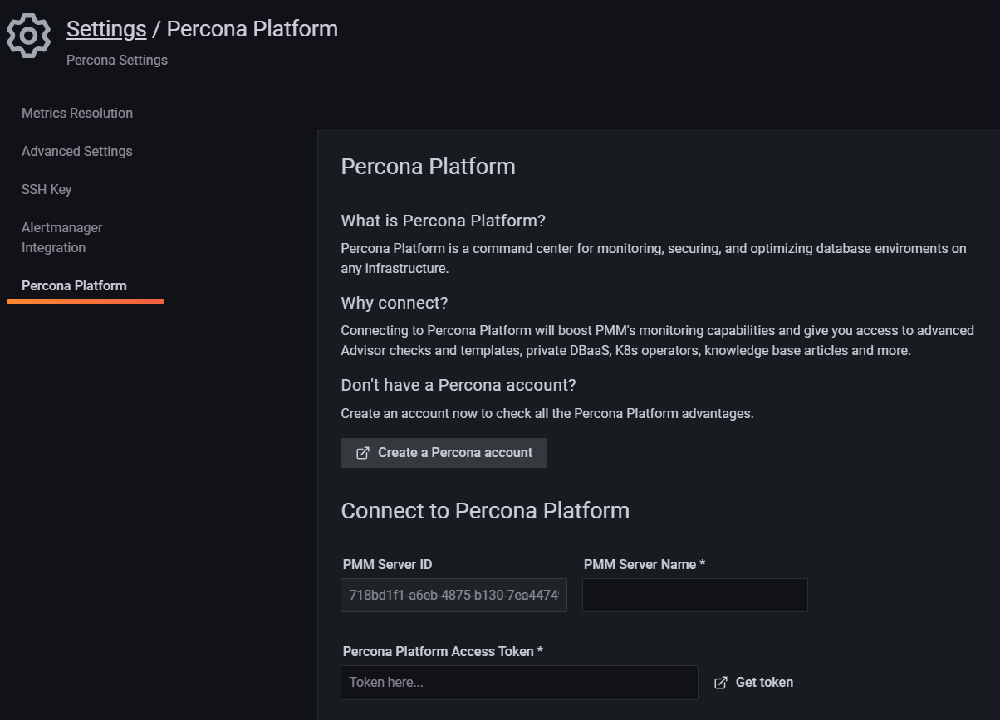

# Connect PMM to Percona Platform
To connect your PMM Server to Percona Platform, copy your personal access token from Platform Portal and paste it into PMM. You will find your access token in Platform Portal as part of your user profile page.

## Token validity

For security reasons, access tokens expire after 30 minutes. Make sure to paste the code before that, or generate a new one if it expires.

To connect your PMM Server to Percona Platform:
{.power-number}

1. In PMM, go to **PMM Configuration > Settings > Percona Platform** tab to fill in the **Connect PMM to Percona Portal** form: 

2. The **PMM Server ID** field is automatically populated with the ID identified for your PMM instance. Enter the name of your PMM instance and click **Get token** to go to Percona Platform Portal and generate your access token.
3. Log into Percona Platform using your Percona Account (if you don't have an active current session).
4. On the **Profile Settings page**, copy the code from the **Percona Platform Access Token** field.
5. Back into PMM, paste the Access Token into the **Percona Platform Access Token** field, and click  **Connect**.

To confirm that you have successfully connected the server and check the list of all servers currently connected to an organization, go to [Percona Platform](https://portal.percona.com) > **Dashboard** tab and click **View Instances** next to the **Connect your PMM** step.

## Check Percona Portal entitlements

After connecting to the Percona Platform, PMM has access to [additional alert templates](../../alert/templates_list.md), [Advisor checks](../../advisors/advisors-details.md), and account information. See [Check Percona Portal account information](account-info.md).

### Disconnect a PMM instance

Disconnect a PMM instance when you want to unlink it from your Percona Platform organization or stop monitoring it there.

To disconnect a PMM Server, go to <i class="uil uil-cog"></i> **Configuration > Settings > Percona Platform** and click **Disconnect**.

#### Disconnecting instances as an Admin

In situations where you are not able to disconnect servers yourself, ask your PMM Admin to disconnect the server for you. For example, you may not be able to disconnect servers when PMM is moved to a network segment without outbound connections to public networks.

If you cannot disconnect servers yourself, ask your PMM Admin to disconnect the server for you. For example, you may not be able to disconnect servers when PMM is moved to a network segment without outbound connections to public networks.

If you are a PMM Admin, you can terminate any connections to Percona Platform, even if you are not logged into PMM with a Percona Account. However, we recommend logging in with a Percona Account before disconnecting servers, as this will automatically remove the disconnected servers from Percona Platform as well. 

If you do disconnect servers without being connected with a Percona Account, you'll have to manually remove the unavailable servers from Percona Platform. This ensures that your list of connected PMM instances stays up-to-date in Percona Platform. 

To do this, go to [PMM instances](https://portal.percona.com/login), and remove any servers that you have already disconnected from PMM.

## Sign into PMM with your Percona Account
Once you've successfully connected your PMM instance to the Percona Platform, you can also sign into PMM using your Percona Account:
{.power-number}

1. Log out of your existing PMM session.
2. On the PMM login screen, click *Sign in with Percona Account*.
 If you have an active Percona Account session on the same browser, PMM will log you in automatically. Otherwise, enter your Percona Account credentials to start a new session.

