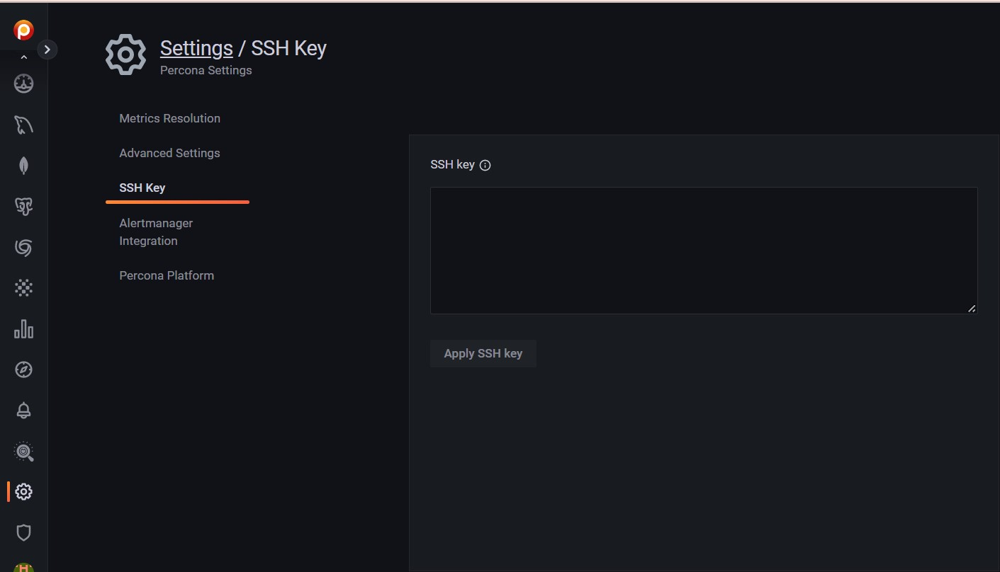

# SSH Key

This section enables you to upload your public SSH key for SSH access to the PMM Server, such as when accessing it as a [virtual appliance](../install-pmm/install-pmm-server/deployment-options/virtual/index.md).

Enter your **public key** in the **SSH Key** field and click **Apply SSH Key**.