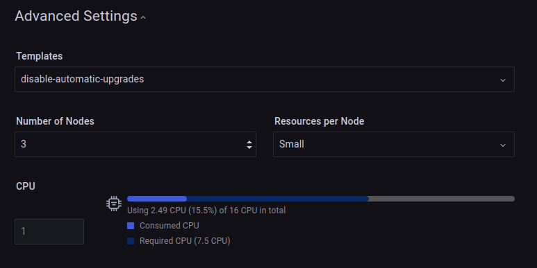

# Database cluster Templates

!!! caution alert alert-primary "Do not use for mission-critical workloads"
    DBaaS feature is deprecated. We encourage you to use [Percona Everest](http://per.co.na/pmm-to-everest) instead. Check our [Migration guide](http://per.co.na/pmm-to-everest-guide).

Database clusters can be created from templates using PMM. Database cluster Template allows operators to customize Database Clusters based on their requirements, environments, or infrastructure.

Examples

- **Data clusters**: Different load patterns, such as simple reads, heavy writes, 50%/50% read/write, and the number of connections.

- **Infrastructure** - Different parameters and tuning for the resulting cluster: such as network configuration (load balancing, exposure), storage classes/types, etc.

- **Environment**: Combination of database cluster and infrastructure that will affect the database cluster configuration.


# Customize PXC DB configuration

The following **example** shows how DBaaS users can create PXC DB clusters from a template that sets a custom MySQL configuration. The default MySQL configuration is the following:

```sh
[mysqld]
wsrep_provider_options="gcache.size=600M"
```
!!! note alert alert-primary "Note"   
    PXC DB configuration can be customized based on your needs. This can be accomplished by creating a template and changing that field.


## Create Custom Resource Definition (CRD) template

To create a template, do the following:

1. Identify the field(s) of interest by reading the [PXC operator documentation](https://docs.percona.com/percona-operator-for-mysql/pxc/index.html) and the [PXC CRD](https://github.com/percona/percona-xtradb-cluster-operator/blob/v1.11.0/deploy/crd.yaml#L6378-L6379). In this case, you have to change the `spec.pxc.configuration` field.

2. Create a template CRD `pxctpl-crd-pxc-configuration.yaml` with just those small subset of fields.

    ```sh
        apiVersion: apiextensions.k8s.io/v1
        kind: CustomResourceDefinition
        metadata:
        annotations:
            controller-gen.kubebuilder.io/version: v0.8.0
        creationTimestamp: null
        name: pxctemplatepxcconfiguration.dbaas.percona.com
        labels:
            dbaas.percona.com/template: "yes"
            dbaas.percona.com/engine: "pxc"
        spec:
        group: dbaas.percona.com
        names:
            kind: PXCTemplatePXCConfiguration
            listKind: PXCTemplatePXCConfigurationList
            plural: pxctemplatepxcconfiguration
            singular: pxctemplatepxcconfiguration
        scope: Namespaced
        versions:
        - name: v1
            schema:
            openAPIV3Schema:
                properties:
                apiVersion:
                    type: string
                kind:
                    type: string
                metadata:
                    type: object
                spec:
                    properties:
                    pxc:
                        properties:
                        configuration:
                            type: string
                        type: object
                    type: object
                status:
                    type: object
                type: object
            served: true
            storage: true
    ```

3. Run the following command.

```sh
kubectl apply -f pxctpl-crd-upgrade-options.yaml
```

For more information, see [DatabaseCluster templates](https://github.com/percona/dbaas-operator/blob/main/docs/templates.md#creating-the-template-crd).

### Add read permissions for dbaas-operator

In order for the dbaas-operator to apply the template it needs access to the template CRs:

```sh
DBAAS_OPERATOR_MANAGER_ROLE=$(kubectl get clusterroles | grep dbaas-operator | grep -v metrics | grep -v proxy | cut -f 1 -d ' '); kubectl get clusterroles/"$DBAAS_OPERATOR_MANAGER_ROLE" -o yaml > dbaas-operator-manager-role.yaml
cat <<EOF >>dbaas-operator-manager-role.yaml
- apiGroups:
  - dbaas.percona.com
  resources:
  - pxctemplatepxcconfiguration
  verbs:
  - get
  - list
EOF
```

Run the following command:

```sh
kubectl apply -f dbaas-operator-manager-role.yaml
```

### Create PXCTemplatePXCConfiguration Template CR

1. Create a corresponding CR `pxctpl-pxc-config-max-connection-789.yaml` with the required values.

    ```sh
    apiVersion: dbaas.percona.com/v1
    kind: PXCTemplatePXCConfiguration
    metadata:
    name: pxc-config-max-connections-789
    labels:
        dbaas.percona.com/template: "yes"
        dbaas.percona.com/engine: "pxc"
    spec:
    pxc:
        configuration: |
        [mysqld]
        max_connections = 789
    ```
2. Run the following command:

    ```sh
    kubectl apply -f pxctpl-pxc-config-max-connection-789.yaml
    ```

## Create a DB cluster from template

To create a DB cluster from a template, do the following:

1. From the main menu navigate to <i class="uil uil-database"></i> *DBaaS* → *Create DB Cluster*.

2. On the *Advanced Settings* panel, select the template from the *Templates* drop-down.


    


3. Click `Create`.


