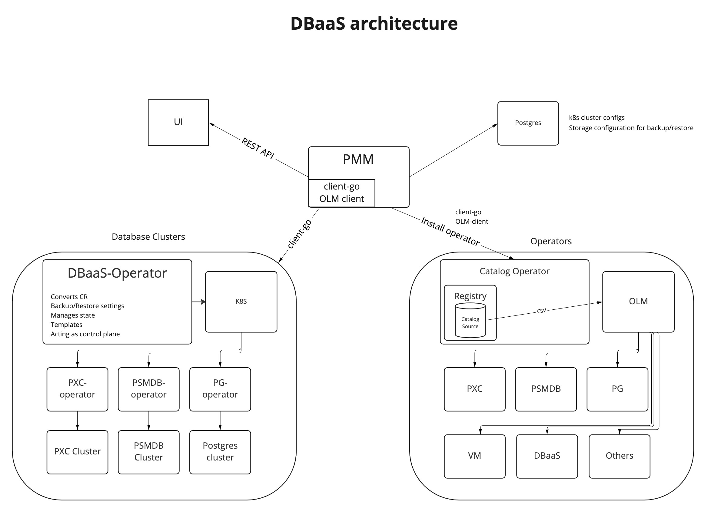
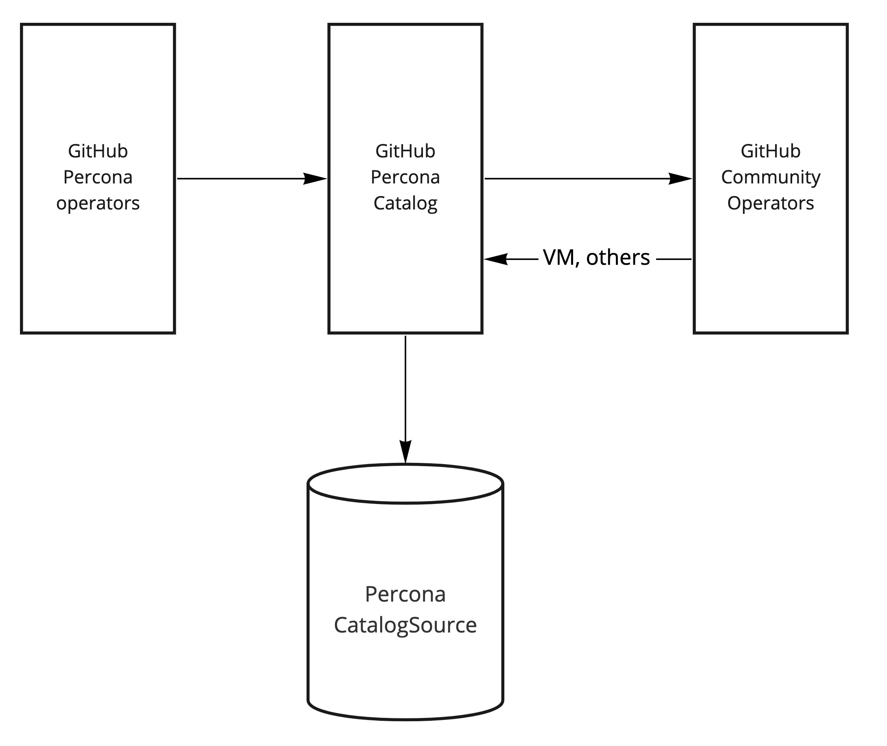
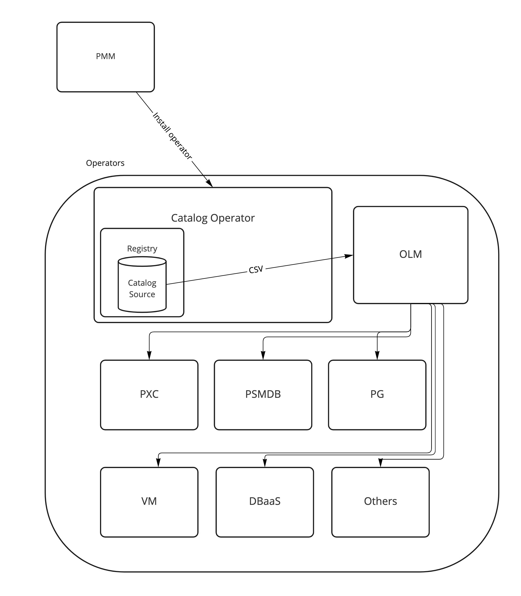

# DBaaS architecture

!!! caution alert alert-primary "Do not use for mission-critical workloads"
    DBaaS feature is deprecated. We encourage you to use [Percona Everest](http://per.co.na/pmm-to-everest) instead. Check our [Migration guide](http://per.co.na/pmm-to-everest-guide).

DBaaS is built on top of PMM and Kubernetes and the high-level architecture is shown below:

In DBaaS, the role of PMM is as follows:

1. Expose Public REST API
2. Provision Kubernetes cluster and install the following operators:
    1. OLM (Operator Lifecycle Manager)
    2. Percona Operator for MongoDB
    3. Percona Operator for MySQL
    4. DBaaS operator

## Operator Lifecycle Manager (OLM)

DBaaS uses [OLM](https://olm.operatorframework.io/docs/) to install and update operators. PMM installs OLM and Operator Catalog during the registration of the Kubernetes cluster.

An Operator catalog is a repository of metadata that Operator Lifecycle Manager (OLM) can query to discover and install Operators and their dependencies on a cluster. OLM always installs Operators from the latest version of a catalog and if a new version of an operator becomes available, OLM can upgrade it once the user has accepted the upgrade. DBaaS uses its own catalog for OLM that has the following operators:

1. DBaaS operator
2. PXC operator
3. PSMDB operator
4. Victoria Metrics operator

Percona Catalog is an OLM catalog that stores ClusterServiceVersions and CustomResourceDefinitions for creation in a cluster, and stores metadata about packages and channels. It's a source of truth for the available versions of operators ready to use in DBaaS

The installation of operators looks the following way

## DBaaS operator

DBaaS operator is responsible for creating and managing databases [following operator pattern](https://kubernetes.io/docs/concepts/extend-kubernetes/operator/) and depends on underlying operators for running database clusters. It provides a simplified API to manage database clusters via `kubectl`.

