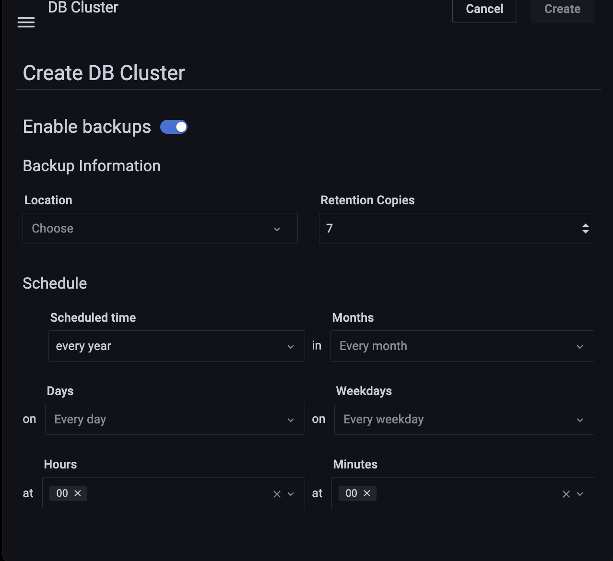
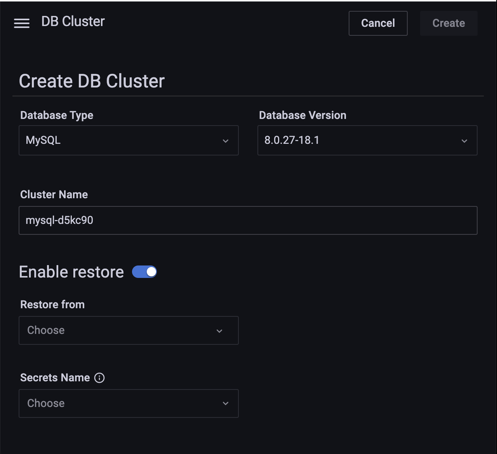

# DBaaS backup and restore

!!! caution alert alert-primary "Do not use for mission-critical workloads"
    DBaaS feature is deprecated. We encourage you to use [Percona Everest](http://per.co.na/pmm-to-everest) instead. Check our [Migration guide](http://per.co.na/pmm-to-everest-guide).

You can add a backup schedule while creating DB clusters in DBaaS. This feature is a fusion of backup management and DBaaS in PMM. Currently, DBaaS only supports scheduled backups, which can only be enabled when a database cluster is created.

To create a scheduled backup do the following:

**Prerequisites**

1. Enable Backup management: 

    From the main menu, navigate to {{icon.configuration}} *Configuration* → <i class="uil uil-setting"></i> *Settings* → *Advanced Settings* → *Backup  Management* to enable *Backup management*.

2. Add a backup storage location:

    !!! note alert alert-primary "Note"
        Currently, only S3 is supported.

    From the main menu, navigate to *Backups → Storage Locations → Add storage location* and enter all the required information to add a backup storage location. For details, see [Prepare a storage location](../get-started/backup/prepare_storage_location.md).

  
## Create a backup schedule

To create a backup schedule do the following:

1. From the main menu navigate to <i class="uil uil-database"></i> *DBaaS* → *DB Cluster*.

2. Click <i class="uil uil-toggle-off"></i> toggle in the *Enable backups* panel.

    

3. In the *Backup Information* panel, enter the backup details.

4. Set the schedule for when scheduled backups should take place:

    From the drop-down select the *Scheduled time* when you want the backup to take place.

5. Click *Create*.

## Restore backup

You can create a DBaaS cluster from a backup stored on S3. You can use backups from an existing cluster to spin up a new database cluster from this backup. 

To restore backup, do the following:

1. From the main menu navigate to <i class="uil uil-database"></i> *DBaaS* → *DB Cluster*.

2. Click <i class="uil uil-toggle-off"></i> toggle in the *Enable restore* panel.

    

3. Enter the information on the *Enable restore* panel.

4. Click *Create*.

