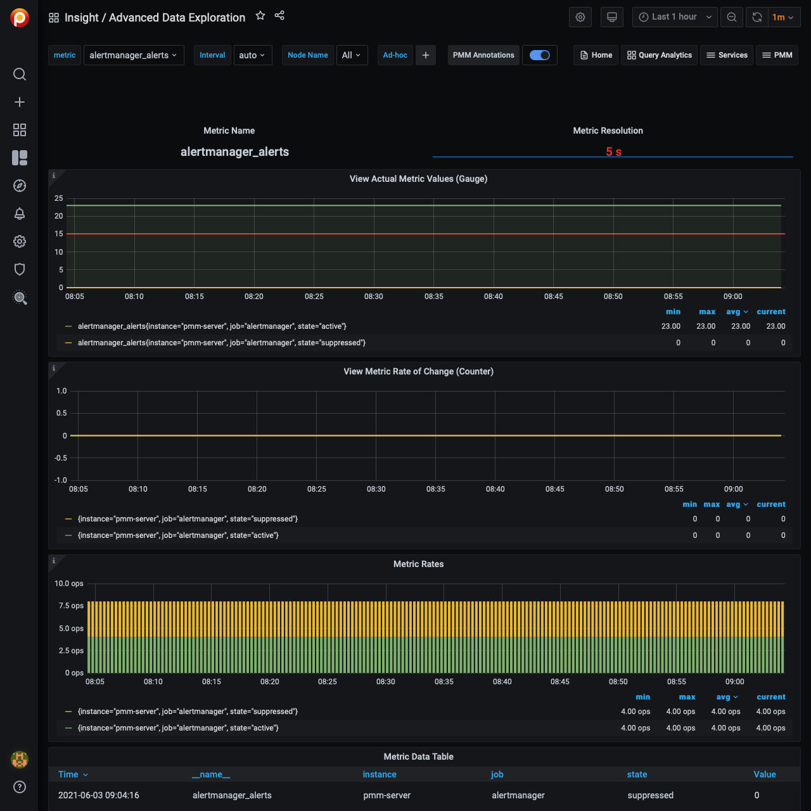

# Advanced Data Exploration

The *Advanced Data Exploration* dashboard provides detailed information about the progress of a single Prometheus metric across one or more hosts.

## View actual metric values (Gauge)

A gauge is a metric that represents a single numerical value that can arbitrarily go up and down.

Gauges are typically used for measured values like temperatures or current memory usage, but also "counts" that can go up and down, like the number of running goroutines.

## View Metric Rate of Change (Counter)

A counter is a cumulative metric that represents a single numerical value that only ever goes up. A counter is typically used to count requests served, tasks completed, errors occurred, etc. Counters should not be used to expose current counts of items whose number can also go down, e.g. the number of currently running goroutines. Use gauges for this use case.

## Metric Rates

Shows the number of samples Per second stored for a given interval in the time series.

This dashboard supports metrics related to NUMA. The names of all these metrics start with `node_memory_numa`.

