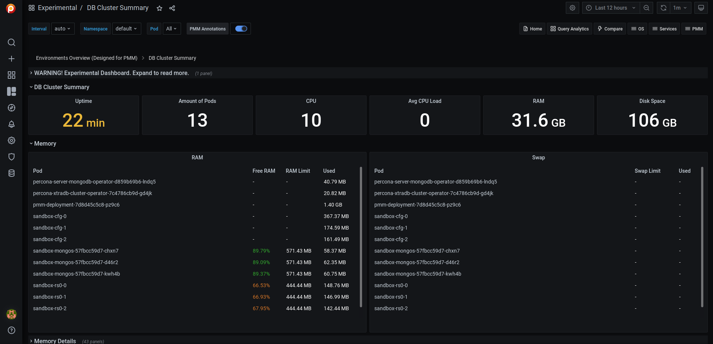

# DB Cluster Summary

!!! caution alert alert-warning "Disclaimer"
    This is an Experimental Dashboard that is not part of the official Percona Monitoring and Management (PMM) deployment and might be updated. We ship this Dashboard to obtain feedback from our users.

This Dashboard is a part of [DBaaS solution](https://www.percona.com/doc/percona-monitoring-and-management/2.x/get-started/dbaas.html) inside PMM.

This Dashboard is designed to show the resource consumption inside Kubernetes (K8s) Cluster.
